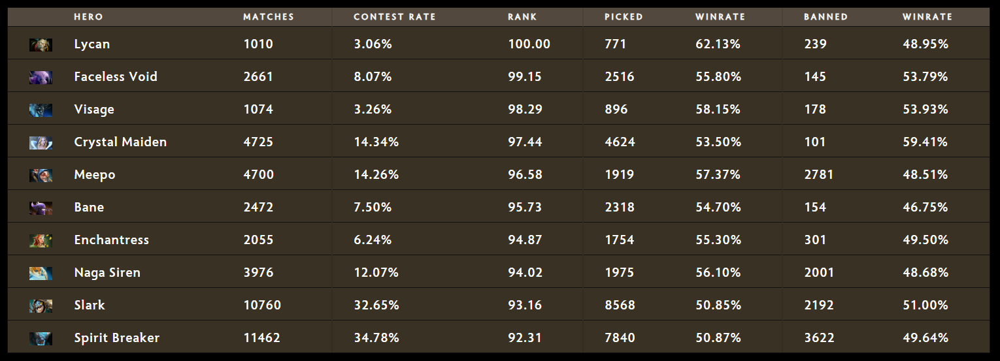
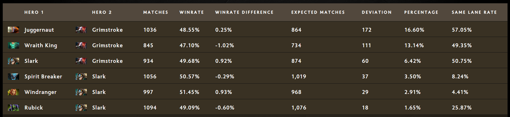

Published: https://luckbox.com/esports-news/article/7-22e-immortal-meta-trends

---

# 7.22e Immortal Meta Trends for TI9

One week into 7.22e, the last patch before TI9 is establishing the current meta that will take us to Shanghai and the biggest esports prize in history. It's unlikely we'll see any drastic shifts in ranked meta, but these Immortal-rank stats may well give us insights into popular strategies at The International.

This report is based on data collected during the first week of patch 7.22e. Data includes not only ranked matches, but stats of all matches with average rank equal to Immortal. Excluded matches are the ones that have abandons, ended in less than 10 minutes or had an insignificantly low score.

[The full and regularly-updated version of the report is available at Spectral.gg](https://stats.spectral.gg/lrg2/?league=imm_ranked_722e). You can find detailed data about Hero-vs-Hero performance, draft stages priorities, pairs and trios, positions stats and dire/radiant winrates, Meta Graph and region-specific data here.

## FAQ

* **Why REGION NAME has low number of matches?** It’s common for higher ranks to queue on closest popular region. I.e. EUW for RU players, USE for USW.
* **Where did you get data?** I've got match IDs manually extracted from leaderboards players' recent matches using STRATZ API. Then I fetch match data using OpenDota API.
* **Why there are only random draft matches played in China?** Chinese players just love playing Random Draft.
* **What is Hero Pairs Divergence?** It's the difference between expected pair's matches and real match number. Usually this difference is higher for better hero combos.
* **What is Hero Rank?** Think of it as of smart winrate sort. It considers popularity and winrate of heroes.
* **Is it strictly Immortal Rank?** Almost. I'm not checking all the matches by myself (it would take too much time, requesting every single match and checking it's average rank). I'm using STRATZ API filters for that, minimum match rank is set to 80 (immortal). In some cases uncalibrated players or those who got to play with nine immortal players in game may get through.

## Summary

* **Matches total:** 32,954
* **Individual players spotted in matches:** 33376 – The number includes Immortal players who lost their leaderboards rank
* **Radiant winrate:** 53.08%
* **Median match duration:** 34:57
* **Median hero picks:** 2,100
* **Median hero bans:** 276
* **Median hero GPM/XPM:** 429/552
* **Total buybacks:** 84,736

I'm leaving these median hero stats because it's good to understand the average values and comparing heroes is much easier using these numbers. It also leads to some interesting insights.

### Game Modes

* **Ranked All Pick:** 25,339
* **Random Draft:** 7,044
* **Captains Mode:** 419
* **Single Draft:** 144
* **All Pick:** 188

### Regions

* **Europe West:** 10,162
* **China:** 7,494
* **Southeast Asia:** 7,149
* **US East:** 3,190
* **Russia and CIS:** 1,691
* **Europe East:** 1,570
* **South America:** 682
* **Australia:** 571
* **Japan:** 195
* **US West:** 142
* **Peru:** 104
* **India:** 4

## Heroes

Despite the 7.22e patch being relatively light, meta changes are still significant enough to identify. Firstly there was a significant win-rate drop for Ember Spirit. The hero still remains the most-picked, but his win-rate dropped almost 8% over the last two patches. The same thing, surprisingly, happened to Wraith King, Huskar, Io, Shadow Shaman and Sand King. All of those heroes lost significant portion of their pick and win-rates, which was enough to drop their rank and knock them out of the top 10.

Some interesting things happened to Lycan and Visage. These two heroes have been niche picks for almost a year now and haven't had much attention. After the most recent buff Visage is now almost 50% of median picks (which is valuable by itself, but the number of hero's picks was only 27% of the median and just 6% of Ember Spirit’s number) with a respectable 58% winrate. Considering the meta of tanky melee cores being one of the worst nightmares for the hero, it’s quite surprising to not only see Visage rising in popularity, but also being quite successful. Together with Meepo and Lycan it may be a “pocket pick” for TI9.

Another hero worth noting is Enchantress. After several buffs in a row the hero was trending in Immortal games and one of the best off-lane picks today. Enchantress is a great example of a niche pick becoming an overall threat: a strong offlane and mid core, great laner and versatile hero may become one of the most popular picks at TI9, similar to offlane Wraith King a year ago.

The last hero worth mentioning from the top 10 is Faceless Void. It’s not a surprise to see this hero rising in popularity before TI since it was always one of the go-to choices at the event. However, it’s surprising to see the hero being so successful. The reason for that may be popularity of elusive cores like Slark and Ember Spirit. Similarly, Naga Siren is in the top 10 for the same reasons.

### Draft stats (sorted by rank)

### Hero Combos (sorted by deviation)

### Hero positions

#### Core Safelane

* **Juggernaut:** 8,016 (50.25% wr)
* **Slark:** 7,972 (51.14% wr)
* **Wraith King:** 5,458 (51.04% wr)
* **Lifestealer:** 4,528 (49.71% wr)
* **Sven:** 3,941 (49.96% wr)

Juggernaut continues to dominate the carry scene, but Lifestealer was finally dropped from second place, being replaced by Slark.

There are also some new and rising heroes worth mentioning: Naga Siren (1,578, 57.16% win-rate), Faceless Void (2,209, 55.91% win-rate) and... Pudge. Even though the butcher’s popularity isn’t really mirrored in hisstats, some of the top tier carry players recently started spamming safe-lane Pudge and being fairly successful with it. It may be one of the upcoming trends for pubs and TI.

Aside from safe-lane meta shifts, the statistics don't highlight many changes in the other lanes.

#### Core Midlane

* **Ember Spirit:** 6,696 (50.49% wr)
* **Outworld Devourer:** 5,568 (51.96% wr)
* **Storm Spirit:** 3,953 (46.34% wr)
* **Invoker:** 3,495 (49.53% wr)
* **Queen of Pain:** 3,280 (50.15% wr)

#### Core Offlane

* **Sand King:** 4,976 (51.61% wr)
* **Mars:** 4,476 (49.64% wr)
* **Pangolier:** 4,251 (49.21% wr)
* **Axe:** 3,400 (49.53% wr)
* **Legion Commander:** 3,180 (50.44% wr)

#### Support

* **Spirit Breaker:** 7,361 (51.01% wr)
* **Rubick:** 7,360 (49.48% wr)
* **Grimstroke:** 6,272 (47.37% wr)
* **Lion:** 5,847 (49.29% wr)
* **Warlock:** 5,710 (51.31% wr)
* **Shadow Shaman:** 5,490 (51.57% wr)
* **Crystal Maiden:** 4,431 (53.71% wr)
* **Earthshaker:** 4,355 (50.15% wr)
* **Ancient Apparition:** 3,197 (51.45% wr)
* **Jakiro:** 3,110 (49.74% wr)

## Legends of 7.22d

Concluding the 7.22e patch first week review, I’d like to close the book on 7.22d with some interesting global records noticed.

* **Highest GPM:** 1,506 by Bookssssss as Alchemist in a match [4893154003](https://dotabuff.com/matches/4893154003)
* **Highest XPM:** 1,269 by cky as Broodmother in a match [4896001001](https://dotabuff.com/matches/4896001001)
* **Most kills:** 42 by rato de bic as Ember Spirit in a match [4886313811](https://dotabuff.com/matches/4886313811)
* **Most deaths:** 36 by how to win dota2? as Shadow FIend in a match [4899601330](https://dotabuff.com/matches/4899601330)
* **Most assists:** 62 by Sel as Pudge in a match [4890133322](https://dotabuff.com/matches/4890133322)
* **Highest KDA with 0 deaths:** 48 by GGwpLanaya as Ember Spirit in a match [4887175559](https://dotabuff.com/matches/4887175559)
* **Highest KDA with 1+ deaths:** 54 by YOLOMEISTER as Puck in a match [4885384773](https://dotabuff.com/matches/4885384773)
* **Total Gold Earned:** 86,756 by Madara as Medusa in a match [4881945019](https://dotabuff.com/matches/4881945019)
* **Last Hits:** 1,349 by Madara as Medusa in a match [4881945019](https://dotabuff.com/matches/4881945019)
* **Damage to Heroes:** 186,616 by Isolation as Zeus in a match [4878211842](https://dotabuff.com/matches/4878211842)
* **Damage to Buildings:** 29,909 by LXVER as Lone Druid in a match [4884290203](https://dotabuff.com/matches/4884290203)
* **Hero healing:** 108,630 by DøubleEspressø as Dazzle in a match [4889867152](https://dotabuff.com/matches/4889867152)
* **Damage taken from heroes:** 189,830 by zxc as Meepo in a match [4882389361](https://dotabuff.com/matches/4882389361)
* **Observer wards placed:** 39 by AlcantarA as Dazzle in a match [4888017876](https://dotabuff.com/matches/4888017876)
* **Sentries placed:** 77 by Wings.Innocence as Oracle in a match [898481037](https://dotabuff.com/matches/4898481037)
* **Observer wards destroyed:** 18 by DOTAHORSE as Nyx Assassin in a match [4888245776](https://dotabuff.com/matches/4888245776)
* **Map pings:** 1,423 by zero motivation as Tusk in a match [4889574660](https://dotabuff.com/matches/4889574660)
* **Stuns:** 608.6 by Goth Angel Sinner as Techies in a match [4890721863](https://dotabuff.com/matches/4890721863)
* **Most courier kills by a player:** 5 by 搏一搏单车变摩托 as Bounty Hunter in a match [4884445653](https://dotabuff.com/matches/4884445653)
* **Biggest networth stomp by a team** (82,040) in a match [4892886800](https://dotabuff.com/matches/4892886800)
* **Biggest networth comeback by a team** (40,411) in a match [4882751128](https://dotabuff.com/matches/4882751128)
* **Most Roshan kills in a match** (7) in a match [4888152217](https://dotabuff.com/matches/4888152217)
* **Longest match** (1:37:32) was [4894464002](https://dotabuff.com/matches/4894464002)
* **Bloodbath with most kills combined** (161) was [4878715926](https://dotabuff.com/matches/4878715926)

Complete report for the patch 7.22d is [available at Spectral.gg](https://stats.spectral.gg/lrg2/?league=imm_ranked_722d&mod=records) as well.
