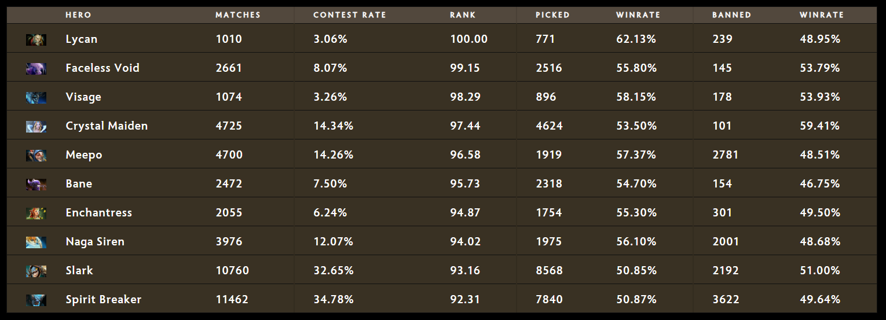

Published: https://vk.com/@spectraldota-trendy-titanov-nedelya-s-patchem-722e

---

# Тренды Титанов — Неделя с патчем 7.22e

Последний патч перед TI9 укрепляет позиции. Судя по всему, мы вряд ли увидим серьёзные изменения в рейтинговых игр. Но, глядя на статистику матчей на ранге Immortal, можно сделать предположения о том, что будет актуально на The International.

Этот отчёт основан на данных, собранных во время первой недели патча 7.22e. Выборка включает в себя не только рейтинговые матчи, но также все игры, средний ранг которых равен Immortal. Из выборки исключены те матчи, в которых кто-либо покинул игру, которые длились менее 10 минут или содержали слишком малое количество убийств.

[Полная и обновляемая версия отчёта доступна на Spectral.gg](https://stats.spectral.gg/lrg2/?league=imm_ranked_722e). Там вы сможете найти детальную информацию об исполнении героев друг против друга, приоритетах стадий драфта, парах и тройках героев, статистике на разных позициях, за разные стороны, граф меты и данные по регионам.

### ЧаВО

- **Почему у региона X так мало матчей?** Игроки на высоких рангах часто запускают поиск на ближайшем популярном регионе. Например, для России это Западная Европа, а для Восточной Америки — Западная Америка.
- **Откуда взяты данные?** ID матчей были собраны при обходе истории матчей каждого из игроков в таблице лидеров, используя Stratz API. После этого для сбора данных использовался OpenDota API.
- **Почему в Китае играют только Random Draft?** Китайские игроки просто любят играть в Random Draft!
- **Что такое «отклонение» у пар героев?** Это отклонение от рассчётного (ожидаемого) количества матчей для данной пары. Обычно чем выше отклонение, тем чаще героев стараются брать вместе намеренно (и чаще это хорошие комбинации).
- **Что такое Ранг героя?** Думайте об этом как об «умной сортировке по винрейту». Формула рассчёта ранга учитывает популярность героя и соотношение побед/поражений.
- **В выборке только ранг Immortal?** Почти. Я не проверяю все матчи вручную (это слишком затратно по времени — проверять средний ранг в каждом матче). Я использую фильтры Stratz API, минимальный ранг установлен на 80 (Immortal). Иногда игроки без ранга или отдельные 1-2 игрока с рангом Divine не влияют на средний ранг достаточно сильно.

### Сводка

- **Всего матчей:** 32 954
- **Игроков замечено в матчах:** 33 376 (включая и тех, кто уже не находится в таблице лидеров)
- **Побед Света:** 53.08%
- **Медианная продолжительность матча:** 34:57
- **Медиана пиков героев:** 2 100
- **Медиана банов героев:** 276
- **Медиана ЗВМ/ОВМ героев:** 429/552
- **Всего выкупов:** 84 736

Причина, по которой я указываю здесь медианные показатели — это хороший способ сравнения разных героев и заметить интересные особенности.

> Рассматривайте медианные значения как «границу», с которой можно сравнивать имеющиеся данные. Например, медиана пиков — 2100, а герой был выбран 1800 раз. Это значит, что он почти также популярен, как и 50% героев. С другой стороны, герой, который имеет 10000 пиков, будет сильно популярнее, чем 50% героев, на что и указывает различие с медианой.

### Режимы игры

- **Ranked All Pick:** 25 339
- **Random Draft:** 7 044
- **Captains Mode:** 419
- **Single Draft:** 144
- **All Pick:** 188

### Регионы

- **Западная Европа:** 10 162
- **Китай:** 7 494
- **Юго-Восточная Азия:** 7 149
- **Восток США:** 3 190
- **Россия и СНГ:** 1 691
- **Восточная Европа:** 1 570
- **Южная Америка:** 682
- **Австралия:** 571
- **Япония:** 195
- **Запад США:** 142
- **Перу:** 104
- **Индия:** 4

### Герои

Хоть в 7.22e не было представлено особо много изменений, сдвиги в мете достаточно заметны. Первое, что бросается в глаза — сильная потеря в проценте побед Ember Spirit. Герой всё ещё остаётся самым выбираемым, но его винрейт упал на 8% за последние два патча. Та же участь, как ни странно, ожидала Wraith King, Huskar, Io, Shadow Shaman и Sand King. Все эти герои потерпели достаточно большие потери частоты выбора и побед, чтобы их всех выбило из топ-10 героев по рангу.

Любопытные вещи происходят с Lycan и Visage. Эти два героя были нишевыми уже почти год и не получали достаточно много внимания. После недавних усилений Visage достиг почти 50% пиков в сравнении с медианой (что уже довольно значимо само по себе, но для сравнения стоит отметить, что в прошлом патче количество пиков составляло 27% медианы и лишь 6% от количества пиков Ember Spirit) с значительными 58% побед. Учитывая, что сейчас мета плотных коров ближнего боя, которая сама по себе является кошмаром для Visage, достаточно удивительно наблюдать рост популярности героя, который при этом сохраняет свою успешность. Вместе с Meepo и Lycan, он может стать одним из «внезапных» пиков для TI9.

Ещё один герой, которого стоит отметить — Enchantress. После нескольких баффов подряд герой стал трендовым в матчах на ранге Immortal, а также одним из лучших выборов для сложной линии на данный момент. Enchantress — прекрасный пример, как нишевый пик может превратиться во всеобщую угрозу: сильный герой для мида и оффлейна, сильный лейнер, да и в целом достаточно гибкий герой может стать одним из самых популярных пиков TI9, как это случилось с Wraith King год назад.

Последним из топ-10, кому хотелось бы уделить внимание, стал Faceless Void. Не удивительно наблюдать рост его популярности перед TI, ведь это всегда был один из востребованных и эффективных героев на чемпионате. Ещё одной причиной роста его популярности и эффективности могло стать засилье изворотливых героев основных позиций, вроде Slark и Ember Spirit. По схожим причинам в топ-10 оказалась и Naga Siren.

### Статистика драфтов (отсортирована по рангу)

### Комбинации героев (отсортированы по отклонению)

## Позиции

### Лёгкая линия

- **Juggernaut:** 8 016 (50.25% win-rate)
- **Slark:** 7 972 (51.14% win-rate)
- **Wraith King:** 5 458 (51.04% win-rate)
- **Lifestealer:** 4 528 (49.71% win-rate)
- **Sven:** 3 941 (49.96% win-rate)

Juggernaut продолжает доминировать среди керри, но Lifestealer наконец вывалился со своего второго места, уступив позиции Slark.

Также появились и новые герои, которые набирают обороты и достойны упоминания: Naga Siren (1 578, 57.16% win-rate), Faceless Void (2 209, 55.91% win-rate) и... Pudge. Хоть популярность Pudge не отражена в его статистике, многие керри игроки высокого уровня в последнее время начали спамить героя в качестве керри на лёгкой линии и были достаточно успешны в этом. Это может быть один из грядущих трендов для пабов и TI.

Помимо изменений на лёгкой линии, не особо много изменилось в статистике других линий.

### Центральная линия

- **Ember Spirit:** 6 696 (50.49% win-rate)
- **Outworld Devourer:** 5 568 (51.96% win-rate)
- **Storm Spirit:** 3 953 (46.34% win-rate)
- **Invoker:** 3 495 (49.53% win-rate)
- **Queen of Pain:** 3 280 (50.15% win-rate)

### Сложная линия

- **Sand King:** 4 976 (51.61% win-rate)
- **Mars:** 4 476 (49.64% win-rate)
- **Pangolier:** 4 251 (49.21% win-rate)
- **Axe:** 3 400 (49.53% win-rate)
- **Legion Commander:** 3 180 (50.44% win-rate)

### Поддержка

- **Spirit Breaker:** 7 361 (51.01% win-rate)
- **Rubick:** 7 360 (49.48% win-rate)
- **Grimstroke:** 6 272 (47.37% win-rate)
- **Lion:** 5 847 (49.29% win-rate)
- **Warlock:** 5 710 (51.31% win-rate)
- **Shadow Shaman:** 5 490 (51.57% win-rate)
- **Crystal Maiden:** 4 431 (53.71% win-rate)
- **Earthshaker:** 4 355 (50.15% win-rate)
- **Ancient Apparition:** 3 197 (51.45% win-rate)
- **Jakiro:** 3 110 (49.74% win-rate)

### Легенды 7.22d

Завершая обзор первой недели 7.22e, хотелось бы завершить историю 7.22d обзором интересных рекордов, установленных в патче.

- **Наивысший ЗВМ:** 1 506 от Bookssssss на Alchemist в матче [4893154003](https://vk.com/away.php?to=https%3A%2F%2Fdotabuff.com%2Fmatches%2F4893154003&cc_key=)
- **Наивысший ОВМ:** 1 269 от cky на Broodmother в матче [4896001001](https://vk.com/away.php?to=https%3A%2F%2Fdotabuff.com%2Fmatches%2F4896001001&cc_key=)
- **Убийства:** 42 от rato de bic на Ember Spirit в матче [4886313811](https://vk.com/away.php?to=https%3A%2F%2Fdotabuff.com%2Fmatches%2F4886313811&cc_key=)
- **Смерти:** 36 от how to win dota2? на Shadow FIend в матче [4899601330](https://vk.com/away.php?to=https%3A%2F%2Fdotabuff.com%2Fmatches%2F4899601330&cc_key=)
- **Помощь:** 62 от Sel на Pudge в матче [4890133322](https://vk.com/away.php?to=https%3A%2F%2Fdotabuff.com%2Fmatches%2F4890133322&cc_key=)
- **Наивысший KDA при 0 смертей:** 48 от GGwpLanaya на Ember Spirit в матче [4887175559](https://vk.com/away.php?to=https%3A%2F%2Fdotabuff.com%2Fmatches%2F4887175559&cc_key=)
- **Наивысший KDA при 1+ смертей:** 54 от YOLOMEISTER на Puck в матче [4885384773](https://vk.com/away.php?to=https%3A%2F%2Fdotabuff.com%2Fmatches%2F4885384773&cc_key=)
- **Заработано золота:** 86 756 от Madara на Medusa в матче [4881945019](https://vk.com/away.php?to=https%3A%2F%2Fdotabuff.com%2Fmatches%2F4881945019&cc_key=)
- **Добито крипов:** 1 349 от Madara на Medusa в матче [4881945019](https://vk.com/away.php?to=https%3A%2F%2Fdotabuff.com%2Fmatches%2F4881945019&cc_key=)
- **Урон по героям:** 186 616 от Isolation на Zeus в матче [4878211842](https://vk.com/away.php?to=https%3A%2F%2Fdotabuff.com%2Fmatches%2F4878211842&cc_key=)
- **Урон по строениям:** 29 909 от LXVER на Lone Druid в матче [4884290203](https://vk.com/away.php?to=https%3A%2F%2Fdotabuff.com%2Fmatches%2F4884290203&cc_key=)
- **Лечение:** 108 630 от DøubleEspressø на Dazzle в матче [4889867152](https://vk.com/away.php?to=https%3A%2F%2Fdotabuff.com%2Fmatches%2F4889867152&cc_key=)
- **Урон от героев:** 189 830 от zxc на Meepo в матче [4882389361](https://vk.com/away.php?to=https%3A%2F%2Fdotabuff.com%2Fmatches%2F4882389361&cc_key=)
- **Вардов установлено:** 39 от AlcantarA на Dazzle в матче [4888017876](https://vk.com/away.php?to=https%3A%2F%2Fdotabuff.com%2Fmatches%2F4888017876&cc_key=)
- **Сентри установлено:** 77 от Wings.Innocence на Oracle в матче [898481037](https://vk.com/away.php?to=https%3A%2F%2Fdotabuff.com%2Fmatches%2F4898481037&cc_key=)
- **Вардов разрушено:** 18 от DOTAHORSE на Nyx Assassin в матче [4888245776](https://vk.com/away.php?to=https%3A%2F%2Fdotabuff.com%2Fmatches%2F4888245776&cc_key=)
- **Миганий по карте:** 1 423 от zero motivation на Tusk в матче [4889574660](https://vk.com/away.php?to=https%3A%2F%2Fdotabuff.com%2Fmatches%2F4889574660&cc_key=)
- **Контроль:** 608.6 секунд от Goth Angel Sinner на Techies в матче [4890721863](https://vk.com/away.php?to=https%3A%2F%2Fdotabuff.com%2Fmatches%2F4890721863&cc_key=)
- **Больше всего убийств курьера от игрока:** 5 от 搏一搏单车变摩托 на Bounty Hunter в матче [4884445653](https://vk.com/away.php?to=https%3A%2F%2Fdotabuff.com%2Fmatches%2F4884445653&cc_key=)
- **Самая большая доминация по золоту** (82 040) в матче [4892886800](https://vk.com/away.php?to=https%3A%2F%2Fdotabuff.com%2Fmatches%2F4892886800&cc_key=)
- **Самый большой камбек по золоту** (40 411) в матче [4882751128](https://vk.com/away.php?to=https%3A%2F%2Fdotabuff.com%2Fmatches%2F4882751128&cc_key=)
- **Больше всего убийств Рошана** (7) в матче [4888152217](https://vk.com/away.php?to=https%3A%2F%2Fdotabuff.com%2Fmatches%2F4888152217&cc_key=)
- **Самый долгий матч** (1:37:32) — [4894464002](https://vk.com/away.php?to=https%3A%2F%2Fdotabuff.com%2Fmatches%2F4894464002&cc_key=)
- **Больше всего убийств в сумме** (161) было в матче [4878715926](https://vk.com/away.php?to=https%3A%2F%2Fdotabuff.com%2Fmatches%2F4878715926&cc_key=)

Полный отчёт по патчу 7.22d также **доступен на Spectral.gg**.

---

**Автор:** @Leamare для Spectral.gg и Luckbox.com

**Английская версия:** [https://luckbox.com/esports-news/article/7-22e-immortal-meta-trends](https://vk.com/away.php?to=https%3A%2F%2Fluckbox.com%2Fesports-news%2Farticle%2F7-22e-immortal-meta-trends&cc_key=)