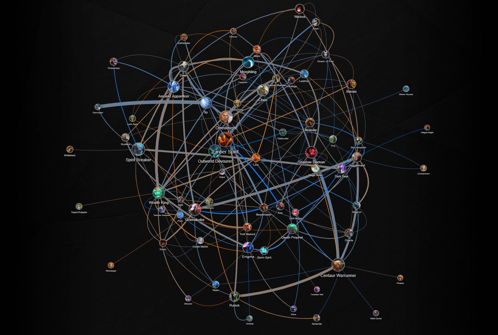

Published: https://luckbox.com/esports-news/article/ti9-qualifiers-dota-2-meta-hero-stats

---

# Competitive Trends of The International Qualifiers

The International 2019 is on its way. The biggest tournament in Dota 2 is less than a month away and the best way to know what to expect from the TI9 meta is to look over recently concluded regional qualifiers.

## Summary

* **Total matches played:** 268
* **Teams:** 48
* **Radiant winrate:** 50.75%
* **Median match duration:** 37:08
* **Heroes contested:** 116 - 105 picked and banned, 8 only picked, 3 only banned
* **Heroes uncontested:** 1 - Pudge
* **Creeps murdered:** 574,388

## Tanks for the support

The meta is still forming and, even since the conclusion of the TI9 qualifiers, we already have a new Dota 2 patch that will to reshape it once more. Although the pros already established some of the essential trends of this patch, the most valuable heroes tend to be tanky cores who can make allies stronger (not only by making them tankier, but also by providing useful auras).

(Above: Hero combinations during TI9 regional qualifiers)

The most popular cores of the patch are Sven, Wraith King, Centaur Warrunner and Omniknight (who is also great to have in any composition just because he can make any core tanky).

One notable mention is Pudge. The butcher didn't get any attention during TI9 qualifiers, but he is pretty popular in the Immortal bracket right now and TI attendees are practising the hero as position 3, 2 and even 1 core. There are many other heroes who do the same thing in a different way (such as Spirit Breaker, Warlock, Io, Grimstroke), but the overall idea stays the same.

## Star performers

The next trend is a natural answer to the first: What's good against these heroes? It turns out there are a lot of interesting solutions that can either abuse opponents tankiness - like Outworld Devourer and Slark - or mitigate their most valuable buffs and make enemy heroes much easier to kill, like Ancient Apparition, Warlock and Shadow Demon.

The last layer of heroes is far less populated, but as valuable as others: percentage-based damage and pure damage. All heroes who were good enough before turned out to be great in a meta of beefy cores. Notable mentions in this category are Enigma, Death Prophet and Lifestealer.

A final notable mention is Ember Spirit. The hero was picked (and banned) the most and has a considerably high winrate of 56.52%. There are a lot of reasons for his popularity. He was buffed bit-by-bit, but 7.22 introduced a new, and very effective, Aghanim's upgrade for Ember Sprit.

The item turns Ember into an uncatchable monster by removing his limitations, while the hero itself is solid even without a sceptre upgrade. The hero is so popular it feels like everything connects to him and wraps around the idea of Ember Spirit being picked.

| Hero               | Matches | Contest rate | Rank   | Picked | Winrate | Banned | Winrate |
| ------------------ | ------- | ------------ | ------ | ------ | ------- | ------ | ------- |
| Outworld Devourer  | 181     | 67.54%       | 100.00 | 42     | 59.52%  | 139    | 56.12%  |
| Ancient Apparition | 159     | 59.33%       | 99.14  | 69     | 52.17%  | 90     | 63.33%  |
| Wraith King        | 164     | 61.19%       | 98.28  | 91     | 52.75%  | 73     | 54.79%  |
| Ember Spirit       | 236     | 88.06%       | 97.41  | 92     | 56.52%  | 144    | 41.67%  |
| Beastmaster        | 77      | 28.73%       | 96.55  | 41     | 65.85%  | 36     | 44.44%  |
| Slark              | 64      | 23.88%       | 95.69  | 31     | 58.06%  | 33     | 66.67%  |
| Grimstroke         | 172     | 64.18%       | 94.83  | 84     | 48.81%  | 88     | 56.82%  |
| Shadow Demon       | 161     | 60.07%       | 93.97  | 74     | 50.00%  | 87     | 55.17%  |
| Juggernaut         | 116     | 43.28%       | 93.10  | 67     | 53.73%  | 49     | 57.14%  |
| Spirit Breaker     | 191     | 71.27%       | 92.24  | 75     | 48.00%  | 116    | 51.72%  |

## Popular pairs

The most popular hero pairs tend to work great around the formula "tanky hero and enabler". It's interesting to see Ancient Apparition with Wraith King and Sven to be picked a lot which may be because teams tend to take Apparition for themselves first to be in a safe position to take heroes like Sven, Wraith King or Omniknight.

| Heroes                           | Matches | Winrate | Winrate difference | Expected matches | Deviation | Deviation percentage | Same lane rate |
| -------------------------------- | ------- | ------- | ------------------ | ---------------- | --------- | -------------------- | -------------- |
| Gyrocopter + Io                  | 24      | 58.33%  | 2.22%              | 2                | 22        | 91.67%               | 87.50%         |
| Shadow Shaman + Omniknight       | 14      | 50.00%  | 0.00%              | 5                | 9         | 64.29%               | 21.43%         |
| Dark Seer + Spirit Breaker       | 14      | 50.00%  | 1.00%              | 5                | 9         | 64.29%               | 50.00%         |
| Shadow Demon + Centaur Warrunner | 20      | 60.00%  | 10.56%             | 12               | 8         | 40.00%               | 50.00%         |
| Sven + Omniknight                | 14      | 64.29%  | 16.79%             | 6                | 8         | 57.14%               | 14.29%         |
| Wraith King + Ancient Apparition | 19      | 47.37%  | -5.09%             | 12               | 7         | 36.84%               | 68.42%         |
| Rubick + Centaur Warrunner       | 18      | 44.44%  | -3.53%             | 11               | 7         | 38.89%               | 61.11%         |
| Sven + Leshrac                   | 11      | 54.55%  | 13.30%             | 4                | 7         | 63.64%               | 18.18%         |
| Juggernaut + Magnus              | 10      | 40.00%  | -15.13%            | 3                | 7         | 70.00%               | 0.00%          |

## SA region breaking the mould

One interesting thing to note is regional meta. Usually "western" meta forms overall meta in such reports while other regions being a bit different in their overall trends. This time there weren't much differences tho: the only standout region turned out to be South America with a bit more attention to flashy caster cores, especially Queen of Pain.

## Leading teams and players

* **Team with most matches played:** Natus Vincere (19)
* **Team with the highest winrate:** Forward Gaming (93.33%)
* **Team with the widest hero pool:** The Final Tribe (46)
* **The most diverse player:** TFT.Chessie (13 heroes in 16 matches)

## Records

### Players

* **Highest GPM:** paiN.hFn as Alchemist (1260) in a match [4890149021](https://dotabuff.com/matches/4890149021) against Team Ham
* **Highest XPM:** Vega.cAtfiSh as Anti-Mage (1150) in a match 
* **Most kills:** HAM.skiter as Morphling (23) in a match [4890440666](https://dotabuff.com/matches/4890440666) against Gorillaz-Pride
* **Most deaths:** Na`Vi.W_Zayac as Techies (18) in a match [4895242023](https://dotabuff.com/matches/4895242023) against Vega Squadron
* **Most assists:** paiN.Lelis as Dark Seer (39) in a match [4894403418](https://dotabuff.com/matches/4894403418) against Infamous
* **KDA with 0 deaths:** paiN.4dr as Ember Spirit (35) in a match [4890149021](https://dotabuff.com/matches/4890149021) against Team Ham
* **KDA with 1+ deaths:** 682.Wish- as Tinker (43) in a match [4899420396](https://dotabuff.com/matches/4899420396) against Bald
* **Total gold earned:** Newbee.Sccc as Medusa (83386) in a match [4898481037](https://dotabuff.com/matches/4898481037) against EHOME
* **Last hits:** paiN.hFn as Gyrocopter (1212) in a match [4894403418](https://dotabuff.com/matches/4894403418) against Infamous
* **Damage to heroes:** paiN.hFn as Gyrocopter (145475) in a match [4894403418](https://dotabuff.com/matches/4894403418) against Infamous
* **Damage to buildings:** Vega.cAtfiSh as Troll Warlord (25118) in a match [4889981518](https://dotabuff.com/matches/4889981518) against FlyToMoon
* **Hero healing:** AMPLFY.BDz as Io (36784) in a match [4890768096](https://dotabuff.com/matches/4890768096) against Team Jinesbrus
* **Damage taken from heroes:** EHOME.430 as Arc Warden (130558) in a match [4898481037](https://dotabuff.com/matches/4898481037) against Newbee
* **Observer wards placed:** EHOME.y as Oracle (38) in a match [4898481037](https://dotabuff.com/matches/4898481037) against Newbee
* **Sentries placed:** EHOME.y as Oracle (77) in a match [4898481037](https://dotabuff.com/matches/4898481037) against Newbee
* **Observer wards destroyed:** EHOME.y as Ancient Apparition (12) in a match [4898963307](https://dotabuff.com/matches/4898963307) against Team Aster
* **Map pings:** infamous.Scofield as Earthshaker (541) in a match [4894403418](https://dotabuff.com/matches/4894403418) against Pain Gaming
* **Stuns:** Vega.so bad as Dark Willow (326.46) in a match [4893206092](https://dotabuff.com/matches/4893206092) against Natus Vincere

### Matches

* **Biggest networth stomp:** 47673 gold in a match [4898079807](https://dotabuff.com/matches/4898079807) - Xolotl vs Complexity
* **Biggest networth comeback:** 24428 gold in a match [4897840279](https://dotabuff.com/matches/4897840279) - Beastcoast vs Complexity
* **Longest match and most Roshan kills:** 1:31:31 and 7 Roshan kills in a match [4898481037](https://dotabuff.com/matches/4898481037) - EHOME vs Newbee
* **Shortest match:** 13:10 in a match [4897617647](https://dotabuff.com/matches/4897617647) - Vega vs Winstrike
* **Most kills combined:** 94 in a match [4891494163](https://dotabuff.com/matches/4891494163) - Vega vs Na`Vi

If you are willing to check all the stats yourself, including hero positions data, detailed summaries, team profiles and hero combos information, there is [a full report waiting for you](https://stats.spectral.gg/lrg2/?league=ti9_quali) at Spectral hub.
