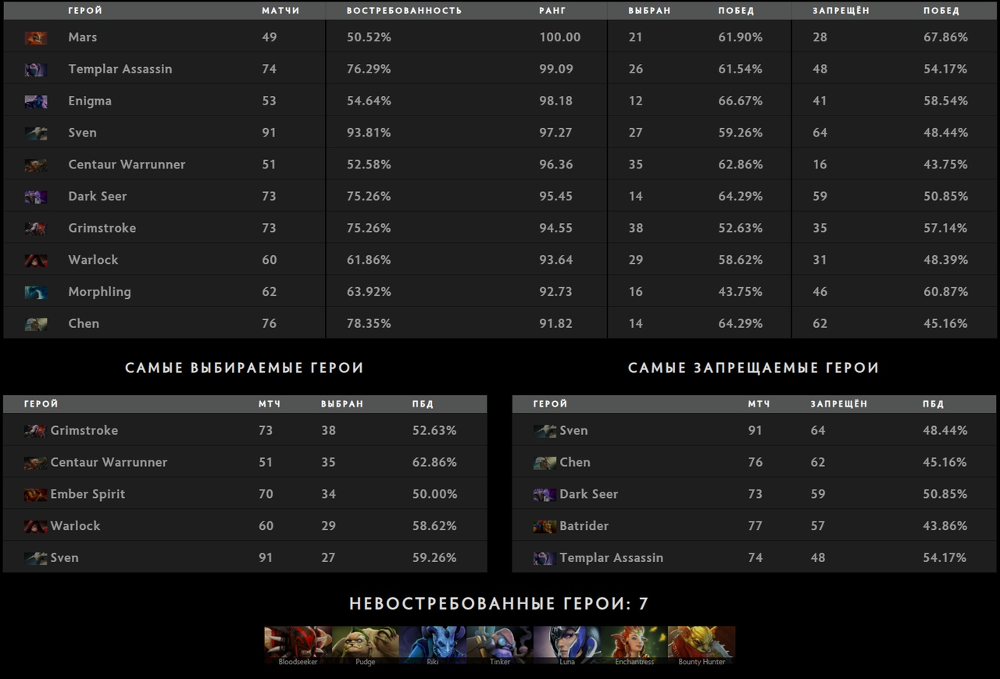
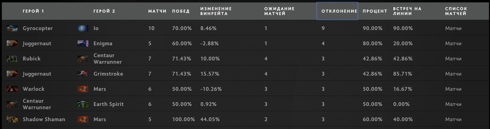
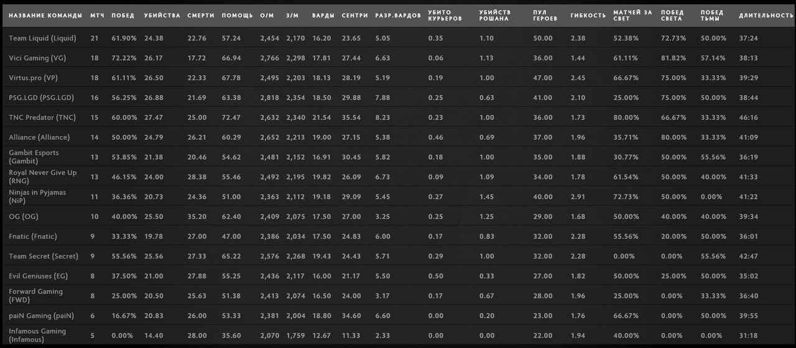

Published: https://vk.com/@spectraldota-trendy-i-cifry-epicenter-major

---

# Тренды и цифры Epicenter Major

Epicenter Major подошёл к концу и для него уже доступен большой отчёт с множеством полезных и интересных для изучения данных, которые есть в [полном отчёте на Spectral.gg (по вот этой ссылке)](https://stats.spectralalliance.ru/lrg2/?league=epicenter_major_2019_lan). В тексте же ниже мне бы хотелось немного рассказать о том, что интересного произошло на турнире и что могут рассказать числа.

## Мета

Медленно, но верно средняя продолжительность игр поднялась с показателей около 30-33 минут (такие показатели были после выхода патча 7.21) к более привычным и знакомым 38-40.

Но, помимо этого, начал проявляться и другой тренд, о котором говорили ещё в первые дни после выхода 7.22: большая вариативность пиков. Причинами тому стали некоторое понижение значимости раннего давления и усиление строений, из-за чего многие герои, которые не могли найти себе места на карте раньше, получили достаточно времени и пространства, чтобы себя показать. К тому же, появление множества интересных аганимов также повлияло и на эффективность некоторых героев (вроде Ember Spirit), так и дало право на существование некоторым необычным стратегиям (не только сами аганимы, но и возросшая продолжительность игр).

На Epicenter Major эти тренды отразились, пожалуй, сильнее всего. Тут намного чаще, чем раньше, встречались вариативные в плане ролей герои, но также больше героев были выбраны в целом. При этом медианы пиков и банов остались на том же уровне, что и на ESL One Birmingham 2019, в рамках которого было проведено на десяток матчей меньше. Или, говоря проще, герои были плавнее распределены по своей популярности, так что и больше героев были актуальны в рамках турнира.

Вместе с возросшей продолжительностью матчей герои, которые проводят командные драки лучше других, стали актуальными как никогда. Тут можно выделить и Mars (21 пик, 28 банов, 61.9% побед), и Enigma (12 пиков, 41 бан, 66.7% побед), и Warlock (29 пиков, 31 бан, 58.6% побед), и Centaur Warrunner (35 пиков, 16 банов, 62.9% побед). Отдельное внимание также стоит уделить Sven и Templar Assassin: они хоть и не так хороши в командных драках, но отлично вписываются в другие тренды патча 7.22 - актуальность плотных фронтлайнеров и важность быстрого убийства Рошана.

Отдельного внимания также заслуживают Omniknight (17 пиков, 20 банов, 58.8% побед), ставший отличным дополнением в многих пиках на любой позиции, благодаря своей актуальности в поздней игре и возможности превратить любого героя в плотного фронтлайнера, а также Gyrocopter + Io (13 пиков, 61.5% побед), попадающие, пожалуй, на все тренды сразу. Впрочем, это в большей степени заслуга Io (которого забанили 32 раза, в то время как Gyrocopter был запрещён целых 0 раз).

> Самые востребованные герои

Новым трендом, характерным для этого турнира, стало "создание возможностей" и "выигрывание времени". Самым ярким примером героя, способного на подобное, стал, конечно же, Arc Warden, который позволял затягивать игры, сдерживать натиск оппонента и выигрывать достаточно времени для команды. Другим подобным примером может служить Earth Spirit.

Учитывая возрастающую актуальность подобных героев, на TI9 могут стать популярными стратегии с традиционно "долгими" героями, вроде Spectre, Anti-Mage, Medusa, и классической игрой в формате 4+1.

> Самые популярные комбинации турнира

Полные версии всех таблиц, а также данные по позициям, списки матчей и детальную информацию по стадиям драфтов можно изучить в [соответствующем разделе полного отчёта](https://stats.spectralalliance.ru/lrg2/?league=epicenter_major_2019_lan&mod=heroes). Там же есть и небольшая сводка средних показателей по героям.

## Команды

Ничто не предвещало беды: уже глядя на список коллективов-участников Epicenter Major было примерно ясно, чем всё закончится. Однако этот турнир явно показал, что расклад сил ещё может измениться.

Довольно неожиданным показалось исполнение Team Secret: ранее на всех турнирах, на которых коллектив участвовал, команда занимала одно из первых мест по проценту побед и занимала первые места. Что ещё можно ожидать от лидера по DPC очкам! Но команда быстро закончила своё исполнение на турнире, чему может быть несколько причин. Вполне вероятно, что другие коллективы, приближаясь к The International 2019, будут огромное внимание уделять именно игре против Team Secret, так что может повториться прошлогодняя ситуация с Virtus.pro.

При этом любопытно себя показали Team Liquid. Хоть бывшие чемпионы и занимают пятое место по DPC очкам, да ещё и произвели замену прямо перед турниром, судя по всему, эта замена как минимум не является плохим решением. Стиль игры w33 не только отлично вписался в коллектив, но и позволил Miracle- показать себя с неожиданной для многих стороны.

Но кому нужны эти фавориты? Двумя самыми интересными коллективами на турнире стали, пожалуй, TNC Predator, Alliance и Gambit Esports. Данные коллективы никто не называл в качестве главных претендентов на победу. По итогам Epicenter Major именно эти коллективы подарили наиболее запоминающиеся матчи, а также заняли шестое, восьмое и десятое места по [Elo рейтингу на datDota](https://www.datdota.com/ratings). Gambit, к сожалению, не укрепиться в топ-12 и получить приглашение на The International 2019, однако именно этот коллектив является главным претендентом на победу в СНГ квалификациях. TNC же и Alliance укрепили свои позиции в таблице благодаря своему отличному исполнению и получили прямые приглашения на главный турнир года.

Но самыми грозными соперниками грядущего TI выглядят Vici Gaming. Китайский коллектив не только занимает третье место в DPC таблице, но и первое место по Elo рейтингу на datDota. Стратегии команды, её стиль игры и действующая игровая мета на данный момент идеально сочетаются друг с другом. Это может стать причиной повышенного внимания именно к этой команде и попыткам найти "ключик" именно к ним, но даже в этом случае у VG отличные шансы если не на чемпионство в этом году, то как минимум на топ-3.

Полную статистику команд (в том числе профили с детальной информацией по драфтам каждой из команд-участниц на турнире и графы) можно изучить в [разделе "Команды" полного отчёта](https://stats.spectralalliance.ru/lrg2/?league=epicenter_major_2019_lan&mod=teams-profiles).

## Рекорды и интересные матчи

Закончить хотелось бы списком наиболее интересных матчей с любопытными рекордами, стратегиями и просто интересными матчами.

### Рекорды игроков в матчах

- **Золото в минуту:** PSG.LGD.小可 на Alchemist (1104) в матче против NiP ([4859786676](https://www.dotabuff.com/matches/4859786676/))
- **Опыт в минуту:** FWD.Yawar на Sven (979) в матче против Vici Gaming ([4859704889](https://www.dotabuff.com/matches/4859704889/))
- **Убийства:** OG.ana на Ursa (22) в матче против TNC Predator ([4859570068](https://www.dotabuff.com/matches/4859570068/))
- **Смерти:** RNG.LaNm на Earthshaker (17) против Team Secret ([4857772290](https://www.dotabuff.com/matches/4857772290/))
- **Помощь:** Secret.Puppey на Bane (39) против RNG ([4857772290](https://www.dotabuff.com/matches/4857772290/))
- **KDA при 0 смертей:** NiP.Fata на Ember Spirit (33) против PSG.LGD ([4860601984](https://www.dotabuff.com/matches/4860601984/))
- **KDA при 1+ смертей:** PSG.LGD.Ameame на Gyrocopter (30) против OG ([4870027903](https://www.dotabuff.com/matches/4870027903/))
- **Заработано золота:** RNG.Monet на Leshrac (66921) против TNC Predator ([4863759163](https://www.dotabuff.com/matches/4863759163/))
- **Добито крипов:** RNG.Monet на Leshrac (**1077**) против TNC Predator ([4863759163](https://www.dotabuff.com/matches/4863759163/))
- **Урон по героям:** Secret.Nisha на Arc Warden (**103 036**) против RNG ([4857772290](https://www.dotabuff.com/matches/4857772290/))
- **Полученный от героев урон:** VP.No[o]ne- на Meepo (95 816) против Alliance (https://www.dotabuff.com/matches/4859701030/))
- **Урон по строениям:** Liquid.Miracle- на Gyrocopter (**23 282**) против PSG.LGD ([4861909497](https://www.dotabuff.com/matches/4861909497/))
- **Лечение:** TNC.eyyou на Oracle (33 451) против RNG ([4863759163](https://www.dotabuff.com/matches/4863759163/))
- **Установлено вардов:** RNG.- ah fu - на Omniknight (30) против TNC ([4863759163](https://www.dotabuff.com/matches/4863759163/))
- **Установлено сентри:** Gambit.Fng на Grimstroke (**58**) против Alliance ([4870534464](https://www.dotabuff.com/matches/4870534464/))
- **Разрушено вардов:** NiP.peterpandam на Winter Wyvern (10) против Pain Gaming ([4862437928](https://www.dotabuff.com/matches/4862437928/))
- **Контроль:** Alliance.Taiga на Dark Willow (265 секунд), а также Morphling с аганимом и Dark Willow в одном пике и один из самых долгих матчей турнира, всё это в игре против Gambit ([4870534464](https://www.dotabuff.com/matches/4870534464/))
- **Пинги по карте:** Fnatic.iceiceice на Mars (414) против Pain Gaming ([4857833444](https://www.dotabuff.com/matches/4857833444/))

### Рекорды матчей

- **Убито курьеров:** 3 в игре RNG против Alliance ([4866434168](https://www.dotabuff.com/matches/4866434168/))
- **Убийств Рошана:** 5 в игре Virtus.pro против Alliance ([4860390602](https://www.dotabuff.com/matches/4860390602/))
- **Самая большая доминация:** 32726 золота в матче RNG против Secret ([4857772290](https://www.dotabuff.com/matches/4857772290/))
- **Самый большой камбек:** 31955 золота в матче VG против Liquid ([4875616323](https://www.dotabuff.com/matches/4875616323/)) -- Это также один из самых длинных матчей турнира и одна из самых интересных игр как финала, так и турнира в целом
- **Самый длинный матч:** 1 час 16 минут в игре RNG против TNC ([4863759163](https://www.dotabuff.com/matches/4863759163/))
- **Самый короткий матч:** 18 минут и также игра RNG против TNC ([4863981969](https://www.dotabuff.com/matches/4863981969/))
- **Кровавая баня:** 101 убийство от обеих команд в матче RNG против Secret ([4857772290](https://www.dotabuff.com/matches/4857772290/))

### Показатели участников

- **Больше всего сыграно матчей:** Team Liquid (21)
- **Наибольшая частота побед:** Vici Gaming (72.22%)
- **Самый большой пул героев:** VP.No[o]ne- (14)
- **Самый маленький пул героев:** pain.444 (3)
- **Самый гибкий игрок:** NiP.Ace (9 уникальных героев за 11 матчей)
- **Самый большой пул героев среди команд:** Team Liquid (50)
- **Самый маленький пул героев среди команд:** Infamous Gaming (22)

### Наилучшие средние

- **Убийства:** OG.ana (10.9), PSG.LGD.小可 (9.69), TNC.Gabbi (9.33)
- **Меньше всего смертей:** Gambix.Daxak (2.15), VG.Paparazi (2.28), VG.Ori (2.5)
- **Больше всего смертей:** OG.Sockshka (9.2), RNG.- ah fu - (8.46), OG.JerAx (8.3)
- **Помощь:** TNC.Tims (17.4), TNC.eyyou (17), VG.Fade (16.28)
- **KDA:** VG.Paparazi (8.29), VG.Ori (7.04), VP.RAMZEs (6.66)
- **Золото в минуту:** TNC.Armel (655), VP.RAMZEs (653), VG.Paparazi (652)
- **Опыт в минуту:** PSG.LGD.小可 (704), PSG.LGD.Ameame (693), VG.Paparazi и Fnatic.Abed (оба с 655.11)
- **Крипов в минуту:** Secret.Nisha (9.73), PSG.LGD.Ameame (9.6), Alliance.mICKe (9.59)

Полная сводка по средним показателям, а также прочая информация по игрокам [также есть в полном отчёте.](https://stats.spectralalliance.ru/lrg2/?league=epicenter_major_2019_lan&mod=players)