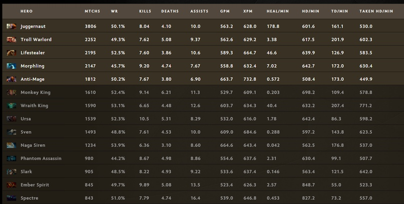

Published: https://vk.com/@spectraldota-dorogoi-nam-nuzhno-pogovorit-o-patche-722

---

# Дорогой, нам нужно поговорить (о патче 7.22)

...Ну привет. Кажется, с прошлого раза прошло достаточно много времени, но пора бы немного вернуться к старому формату. В скором времени в паблике будут некоторые крупные и любопытные изменения, но, наверное, самое важное -- я постараюсь вернуться ближе к формату личного блога о доте. В том числе -- в меру возможности писать мысли о патчах и всё подобное.

Ну и в целом, да, не трудно догадаться, что этот пост будет больше размышлениями на тему патча, без особого упора на какие-то числа. В качестве какой-либо статистики, думаю, лучше всего подойдут отчёты [Immortal Rank Meta Trends 7.22](https://stats.spectral.gg/lrg2/?league=imm_ranked_722) и [ESL One Birmingham 2019](https://stats.spectral.gg/lrg2/?league=esl_one_birmingham_2019_lan). Оба доступны [в общем хабе](https://stats.spectral.gg/lrg2/).

## Что поменялось?

Перечислять все изменения я не собираюсь, хочу просто сказать пару слов про то, как поменялись игры.

Во-первых, сразу после прочтения патча мне показалось, что станет сложнее «пойти и закончить», потому что и пушить в целом стало сложнее, и в целом разрыв в плане преимущества несколько снизился. Что забавно, средняя продолжительность игр в итоге не сильно поменялась, но, думаю, слабым на ранних этапах героям стало всё же проще играть (и в итоге на первом же турнире мы увидели в больших количествах Arc Warden и Spectre).

Во-вторых, мета обещает быть очень разнообразной. И не столько даже в плане пула героев, сколько в плане разнообразия позиций этих самых героев. Введение многих новых аганимов уже поспособствовало добавлению ряда новых интересных стратегий и «перемешиванию» героев между позициями.

Ну и интересное следствие из двух пунктов выше: в затяжных играх можно будет очень часто увидеть, как роли будут меняться по ходу игры: первые позиции начнут уходить на второй план, в то время как какой-нибудь саппорт пятой позиции, получивший аганим и нужные таланты, стал намного более важной фигурой в игре и опасной угрозой.

Хорошими примерами таких героев, которые могут возникнуть на нестандартных позициях, либо стать основными фигурами ближе к концу игры — Silencer, Dark Willow, Grimstroke, Shadow Shaman, Crystal Maiden, Warlock, Jakiro. Да, только несколько из них получили новые аганимы, но суть скорее в общем тренде и в том, что у таких героев будет намного больше шансов полностью реализоваться в игре.

По этим же причинам наблюдать за драфтами станет также намного интереснее как на профессиональном уровне, так и в более-менее высокоуровневых пабах: всё чаще порядок не будет соответствовать какому-то чёткому правилу «сначала пятёрки» или устоявшимся правилам меты, но, наоборот, будет опираться на какие-то конкретные мысли и идеи в плане стратегии. Хотя, конечно, подобные вещи мы будем наблюдать не в каждой игре и не на каждом шагу.

## Чо там по героям?

Ох, мякотка пошла.

Вообще можно было бы сказать, у кого хорошие аганимы, но там также придётся расписывать, а почему эти аганимы хороши (или плохи). Поэтому я уделю больше внимания тому, кто вообще сейчас сильный и почему.

### Chen

Герой номер один, потенциально новый Io или новый Visage. Пассивная способность. которая делает сильнее всех его прирученных крипов, да и вообще всех союзников, да и его самого. Этот герой уже одним своим присутствием делает любую линию сильнее, потому что даёт эквивалент Vladimir's Offering на ранних этапах игры. Размениваться на линии против Chen просто невыгодно. При этом герой может быть очень силён и в качестве основы в тех стратегиях, где можно пойти и закончить игру за 20 минут. Самое вкусное в новом Чене — не нужно быть гением микроконтроля, чтобы играть на герое и извлекать какую-то пользу. Для начала можно уже просто взять героя и быть недалеко от линии, иногда нажимать кнопки.

### Sand King

Его патч вообще никак не затронул, но героя приподнимали и до этого. После выхода 7.22 в мету вышли те герои, с которыми ему приятно иметь дело, и в целом ему стало сильно проще стоять на линии.

### Luna

Мало того, что её сделали сильнее на линии, а также дали потенциальное время для разгона. Это был также один из тех героев, который был очень не против купить аганим ближе к концу игры (и он был очень неплох для этого героя), но не было лишнего слота.

### Ember Spirit

Когда патч только вышел, не все сразу поняли, насколько страшный аганим у этого героя. Да, Эмбер и без того был очень неплохим кором, но теперь у него есть настолько сильный апгрейд, что зачастую его берут первым-вторым предметом, а сам герой становится практически таким же неуловимым, как и его брат Шторм.

### Pangolier

Очень противный герой на линии, очень душный герой по игре, очень страшный аганим. Требует хорошего понимания героя и умения на нём играть, но среди всех «скилловых» героев он, пожалуй, самый простой.

### Стоит обратить внимание

**Io и Meepo**

Оба героя были достаточно сильными, Meepo вообще получил прямые баффы. Главное — на них надо уметь играть.

**Rubick**

С вводом множества новых аганимов — вполне логично, что для него это огромный простор для творчества.

**А также**

**Tier 2** — Crystal Maiden, Dark Willow, Grimstroke, Silencer, Lion, Lina, Pudge, Bloodseeker, Lifestealer, Abaddon

**Tier 3** — Wraith King, Templar Assassin, Spectre, Arc Warden, Oracle, Ancient Apparition, Skywrath Mage, Weaver, Warlock

**Tier 4** — Jakiro, Night Stalker, Dark Seer, Faceless Void, Keeper of the Light, Tinker, Enchantress, Anti-Mage

Ну и, да, не стоит обманываться на счёт Morphling: его порезали, его аганим не так хорош, как хотелось бы, да и вообще водичка протекла.

## Ах, да, на тему керри

Я выше вот написал небольшие а-ля тирлисты, но на самом деле всё зависит от конкретной игры, позиции и всё вот это вот. И по этой причине то, что я скажу ниже, не противоречит тому, что я написал ранее.

Сейчас в мете будут популярны плотные керри, ещё лучше — которые могут сделать жирнее свою команду или в целом как-то её усилить. Хорошими вариантами будут Lone Druid (Radiance), Spectre (Radiance), Sven (щит), Luna (Lunar Blessing), Juggernaut (Healing Ward), Wraith King (Vampiric Aura). Можно даже привести в пример Troll Warlord, который хоть и не очень успешен, но является одним из самых популярных героев патча именно по этой причине.

Что говорит статистика?

Если смотреть на статистику патча 7.22 на ранге Immortal за 7 июня, там получается такая вот картина.

**Core Safelane:**

**Core Midlane:**

**Core Offlane:**

Особенно советую обратить внимание на Pudge, у него огромный потенциал из-за того, как сильно поднимали его пассивку за последние патчи.

**Support:**

Для полноты картины можно ещё взглянуть на статистику последнего (и первого крупного) турнира в этом патче — ESL One Birmingham 2019. Там ситуация чуть иная, конкретные числа можете [посмотреть сами на странице статистики по позициям](https://stats.spectral.gg/lrg2/?league=esl_one_birmingham_2019_lan&mod=heroes-positions). Я же перечислю только топ-5 самых популярных героев на каждой из ролей (10 для саппортов).

**Core Safelane:** Sven, Troll Warlord, Wraith King, Spectre, Morphling

**Core Midlane:** Templar Assassin, Ember Spirit, Leshrac, Storm Spirit, Medusa

Ещё дальше идут Outworld Devourer и Morphling, при чём у последнего на лёгкой линии винрейт около 72%, а в миде — около 30%.

**Core Offlane:** Dark Seer, Sand King, Batrider, Mars, Troll Warlord

Отдельно отмечу, что Batrider часто появляется как пятая позиция в последнее время, а Sand King чаще других оказывается на лёгкой линии (то есть при свапе лайнами).

**Support:** Earth Spirit, Shadow Shaman, Nyx Assassin, Warlock, Earthshaker, Rubick, Chen (и топ 1 по рангу на турнире при востребованности почти во всех матчах), Grimstroke, Abaddon, Ancient Apparition

## Чо там по Спектре

Ну и под конец отвечу на ряд вопросов, которые мне часто задавали после выхода патча.

> **Q: Чо там, как Спектра? Норм в патче? Чо про аганим думаешь?**
>
> A: Спектра норм, не так сильно душат, играть можно. Аганим отличный, но не первым слотом. Лучше всего смотрится где-то после 30-35 минуты, когда в инвентаре уже должны быть Radiance и Manta Style. Обычно к этому времени Haunt используется, чтобы кого-то зацепить, быстро убить и пойти пушить. При таком раскладе часто в последующей драке Haunt может быть недоступен, а это очень сильный скилл для драки, не говоря уже о том, что всегда можно плохой ситуации улететь на базу, похилиться и вернуться назад с Haunt.
>
> Наличие возможности напасть на одну конкретную цель, не затрачивая при этом Haunt, даёт очень много. Но, само собой, нужно своей головой думать в данном случае, когда брать стоит сразу после манты, а когда лучше повременить.

> **Q: А Арк Варден там чо? Чо по аганиму у него?**
>
> A: В новом патче ещё лучше смотрится возможность взять типичного керри героя на позицию саппорта. Арк — как раз из таких. Конечно, я часто практикую его на 3-4-5 позиции в последние года полтора и это сильно отражается на моём винрейте (всё же на кор Арке выиграть проще, да и никто не тильтует), но в целом по ощущениям стало проще играть.
>
> Если брать мид — тоже стало как-то проще играть, во многом потому что у героя стало больше возможностей по игре: ты не теряешь актуальность, если проиграл линию, а можешь просто пойти подраться и вернуться в игру, да и линию настолько сильно ты уже не проиграешь. К тому же, это отличный герой, чтобы затягивать игры и «одевать» команду.
>
> Что же касается аганима… На бумаге звучало красиво. Многие думали, что это круто, можно «одевать» команду, собирая руны богатства. На практике же проблема в том, что этот аганим имеет смысл покупать только когда в инвентаре уже есть все остальные слоты, и то, только потому что можно его купить и почему бы и нет. Практическая польза от него слишком нестабильная. Даже для арка 3/4 позиции это смотрится как-то не слишком полезно. Может быть в каких-нибудь особых стратегиях.

> **Q: А Визаж как?**
>
> A: В паре с Ченом прикольно, но вообще всё ещё говна кусок.
>
> Героя переработали так, что он стал в первую очередь кором, а в качестве саппорта ему просто нечего делать. Его потенциал в качестве кора слишком сильно зависит от ранних уровней, конкретно от 6 уровня, 10 уровня и получения Vladimir's Offering. Линию он чаще всего проигрывает, но раньше можно было что-то делать за счёт возможности быстро кого-либо убивать и пушить.
>
> В мете сейчас коры-милишники, которые все покупают щиток, который блочит 20 урона. Фамильяры первого уровня наносят 20 урона. Пушить стало сложнее. Получается, извлечь какую-либо пользу из ульта первого уровня можно только при пуше Т1 вышек и фарме. Это сильно замедляет героя, оттягивает его дальнейшие ключевые точки на кривой силы и в итоге чудесным образом оказывается, что герой хорошо работает только в очень маленьком наборе условий.
>
> Короче говоря, Визажа сделали хорошим кором и никчёмным саппортом, а потом всё, что делало его хорошим кором (и героем в целом) на протяжении нескольких патчей убивали: нерф Владимира, нерф урона фамильяров, осложнение пуша, изменение формулы брони.

> **Q: Dark Willow?**
>
> A: Когда патч только вышел, все побежали закупать Аганим, в итоге случился напрашивавшийся очень давно нерф — анимация атаки стала хуже. Обидно, конечно, но это было ожидаемо, и не только из-за аганима.
>
> Вообще я всё ещё считаю, что герой в целом хороший, но стоит вспомнить про DW на 2 и 3 позициях. Там и аганим можно купить вполне естественно, и сам по себе Shadow Realm не столько скилл для урона, сколько скилл для эскейпа в первую очередь (а на Bedlam идёт намного больший акцент).

> **Q: На а Энча-то, что с Энчой?**
>
> A: Охренительный герой. Беру на все позиции и имею много веселья.

---

Такие вот дела!

А что делать со всей этой информацией — решайте сами. Я просто хотел высказать свои мысли.

~Leamare