Published: https://vk.com/@spectraldota-putevoditel-po-komandam-the-international-2018

---

# Путеводитель по командам The International 2018

The International уже на пороге. Главное событие года для всех игроков и фанатов Dota 2 вот-вот начнётся, а это значит, что скоро всех нас будет ждать прекрасное зрелище. Дабы облегчить просмотр турнира, я подготовил небольшой обзор команд-участниц турнира на основе данных официальных матчей начиная с 1 апреля (а полную статистику за этот период вы можете [прочитать по ссылке](https://stats.spectral.gg/lrg2/?league=pre_ti8), как всегда). О том, чем команды любят играть, их успехах и провалах за этот период, а также других интересных особенностях — в тексте ниже.

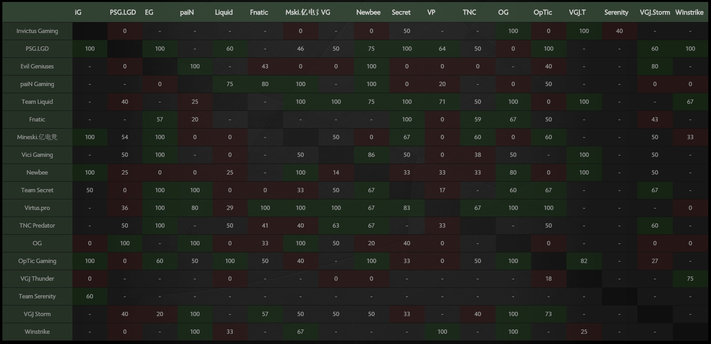

А на затравку — сетка побед команд друг против друга — https://spectralalliance.ru/reports/?league=pre_ti8&mod=teams-grid

> UPD: Небольшая пометка к теме того, как читать графы (это написано на страницах графов, но всё же). Размер узла соответствует количеству матчей, в которых герой был востребован. Всего на графах присутствуют все частые для связей команды герои, а также гарантированно присутствуют 35% самых востребованных героев команды (вне зависимости от их частоты комбинаций с другими героями). Связи характеризуют комбинации, чем толще линия между узлами, тем чаще данная пара героев появлялась в играх. Цвет обводки узла и цвет связи отражает винрейт: серый цвет соответствует 50% побед, ближе к оранжевому — ближе к 0%, а синие оттенки — ближе к 100% (яркий оранжевый и яркий голубой — чисто 0% или 100%). Используемые для создания графов данные ограничены по количеству матчей, чтобы избежать отображения незначительных связей. На значение этого ограничителя влияет количество матчей команды (чем меньше матчей команды, тем ниже ограничитель, что может иногда приводить к более запутанным графам).

## OpTic Gaming

### Игроки: Pajkatt, CCnC, 33, zai, ppd

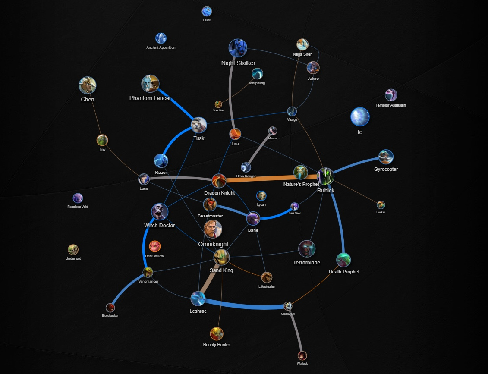

Эта команда славится своим упорством, и не зря: за рассматриваемый период они сыграли больше всего матчей. К сожалению, по всем прочим показателям коллектив находится на средних позициях: коллектив не отличается широким пулом героев, сильными вардами, большим показателем убийств в среднем или чем-то ещё.

Впрочем, за этот период они имеют достаточно неплохой процент побед, даже против команд-участниц TI8. Главными их соперниками могут оказаться Virtus.рro (0 побед и 6 поражений), PSG.LGD (0-3) и VGJ.Storm (3-8).

В числе их самых любимых героев числятся Sand King (19 матчей, 58% побед), Rubick (19, 58%), Leshrac (18, 56%) и Dragon Knight (17, 64%). Сильнее всего выделяется, пожалуй, Sand King: самые любимые комбинации команды почти всегда включают именно его, а также именно этот герой пикается в первой стадии чаще всего (хоть именно на первой стадии в руках этой команды он наименее успешен). В свете этого не кажется удивительным и тот факт, что в большинстве случаев в первой стадии пикается именно герой для zai.

Слабыми же местами команды можно выделить две вещи: Nature's Prophet (71% побед против OpTic) и традиционные герои ppd, вроде Witch Doctor или Warlock, которые будучи «отобранными» у OpTic часто приводят к поражению команды. Главным же страхом может стать воровство Rubick: будучи пикнутым во второй стадии против OpTic, этот великий маг имеет 100% побед за 7 матчей (занимая при этом 4-5 место по количеству матчей).

## PSG.LGD

### Игроки: Ame, Somnus丶M, Chalice, xNova, fy

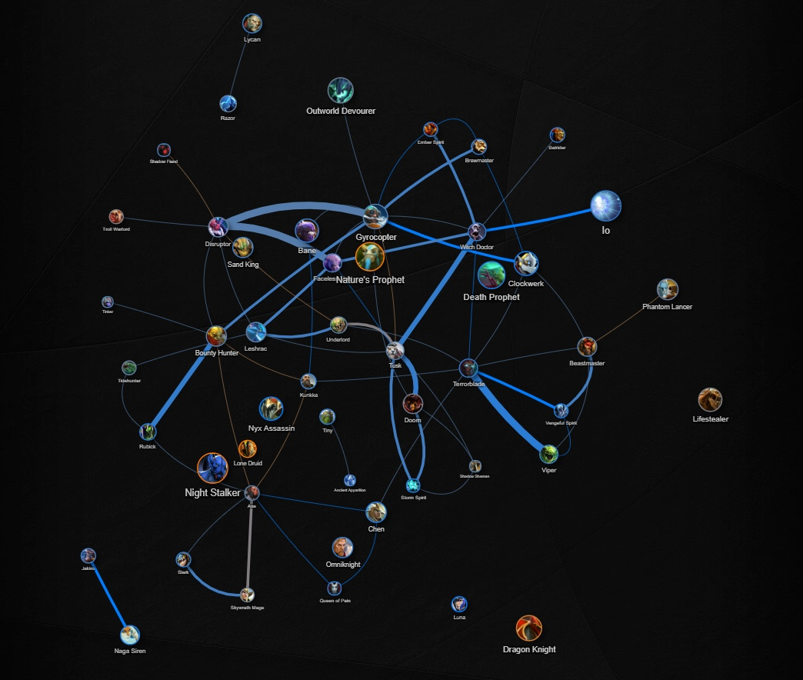

Китайский коллектив является одним из главных претендентов на победу в этом году, что не удивительно: у PSG.LGD второе место по количеству сыгранных матчей за рассматриваемый период и первое место по проценту побед. Против каждой из команд-участниц TI8 у китайской команды процент побед если не выше 50%, то держится на этой отметке. Единственное исключение составляет команда OG: против неё китайцы сыграли лишь один матч и проиграли. Впрочем, это же говорит о том, что этот матч мало что значит.

Интересной особенностью команды является тот факт, что в большинстве игр на второй стадии берутся герои 1-2 позиции (как, впрочем, и на последней стадии. Chalice же на всех трёх стадиях драфта находится ровно в середине по частоте пиков героев для него. У него же и самый широкий пул героев в команде.

Коллектив больше всего любит Gyrocopter (19, 68%), а также Disruptor (15, 60%), Terrorblade (15, 80%) и Bounty Hunter (15, 67%). Самые же излюбленные герои для комбинаций у команды достаточно предсказуемы: уже на графе отчётливо видно треугольник Disruptor-Gyrocopter-Sand King.

## VGJ.Storm

### Игроки: Resolut1on, YS, Sneyking, MSS-, SVG

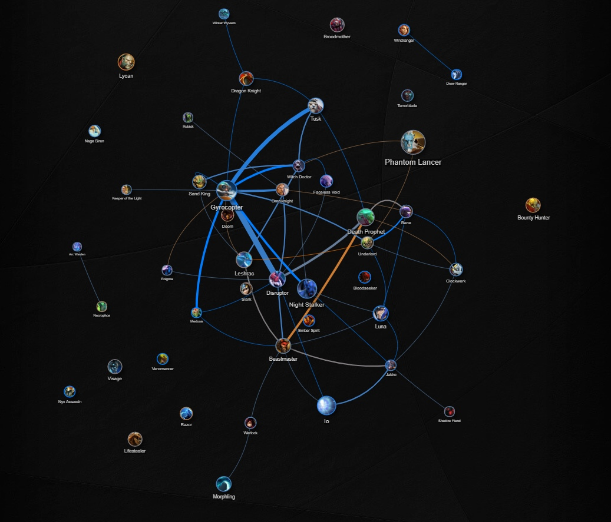

Коллектив хоть и не занимает первые места по каким-либо показателям, но довольно часто находится близко к высоким значениям: команда имеет много матчей и высокий процент побед, они любят забирать Рошана, а также имеют один из самых высоких винрейтов за Свет. Впрочем, против других команд-участниц всё выглядит уже не так радужно: проценты побед против каждой держатся близко к 50%, а самих матчей против подобных команд в выборке достаточно мало.

Среди излюбленных героев VGJ.Storm также стоит отметить Gyrocopter (24, 83%) и Disruptor (21, 67%), к которым также добавляются Death Prophet (20, 55%) и Beastmaster (16, 63%). Наиболее популярные комбинации героев у команды также довольно очевидны, хотя, в отличие от PSG.LGD, у коллектива из США всё же получается значительно успешнее игра с Gyrocopter и Disruptor. Другим важным полюсом графа является Death Prophet, но она уже далеко не так успешна.

## Fnatic

### Игроки: EternaLEnVy, Abed, Universe, DJ, pieliedie

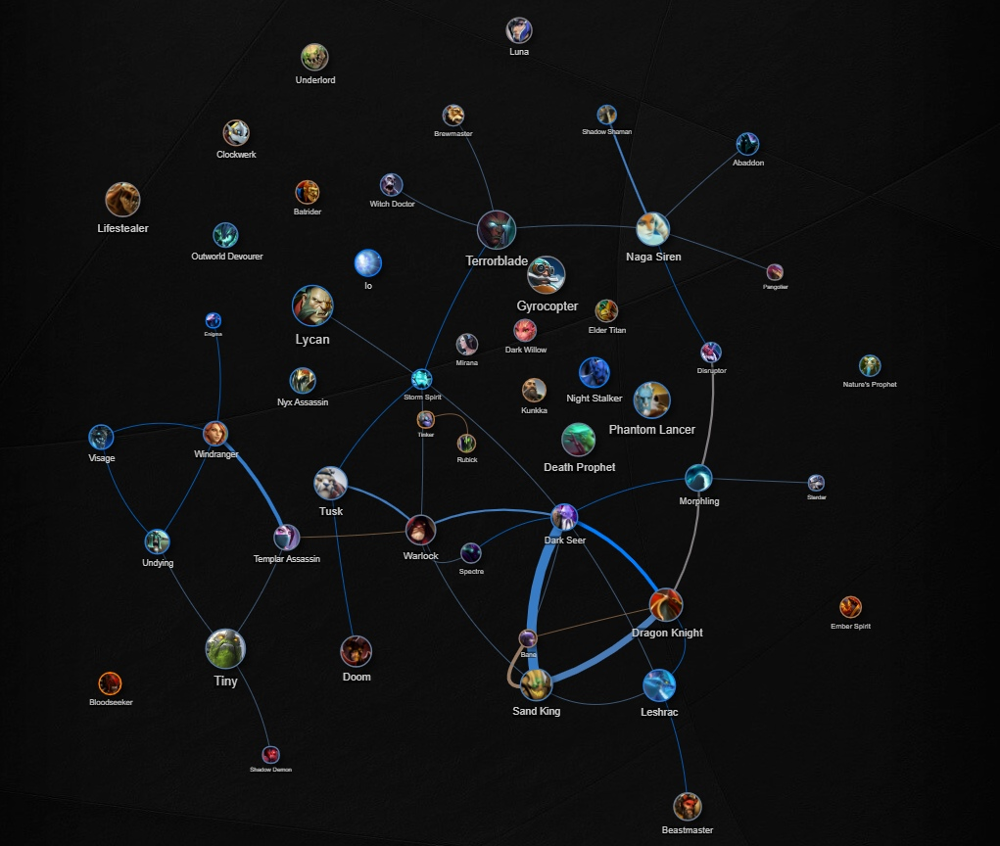

Эту команду можно по праву назвать миксом легенд: каждый игрок этого коллектива уже успел стать по-своему легендарным игроком. Также команда отметилась вторым местом по средней продолжительности матча (42 минуты), первым местом по средним убийствам курьеров, вторым местом по средним убийствам Рошана, третьим местом по среднему количеству установленных за игру сентри вардов, вторым местом по среднему количеству установленных ща игру вардов и самым большим пулом героев в данной выборке.

Нестандартность команды можно заметить и в очерёдности пиков. Почти всегда на первой стадии берётся герой для DJ, но на втором месте за ним стоит Universe. На второй же стадии чаще всего берутся герои для pieliedie и Abed. В последнем же пике, впрочем, нет ничего интересного: его, как обычно, между собой делят игроки первой и второй позиций.

Самыми любимыми героями Fnatic оказались Sand King (15, 73%), Dragon Knight (14, 64%), Dark Seer (13, 85%) и Warlock (12, 58%). В эпицентре графа героев команды опять выделяется Sand King, однако совсем рядом с ним виднеются Dark Seer и Dragon Knight, с которыми хоть и не так много комбинаций, но они значительно успешнее. Слабым же местом команды можно выделить «давящие» стратегии: наиболее успешными героями против Fnatic являются Visage, Lycan, Gyrocopter, Beastmaster, Razor.

## VGJ Thunder

### Игроки: Sylar, Freeze, Yang, ddc, Fade

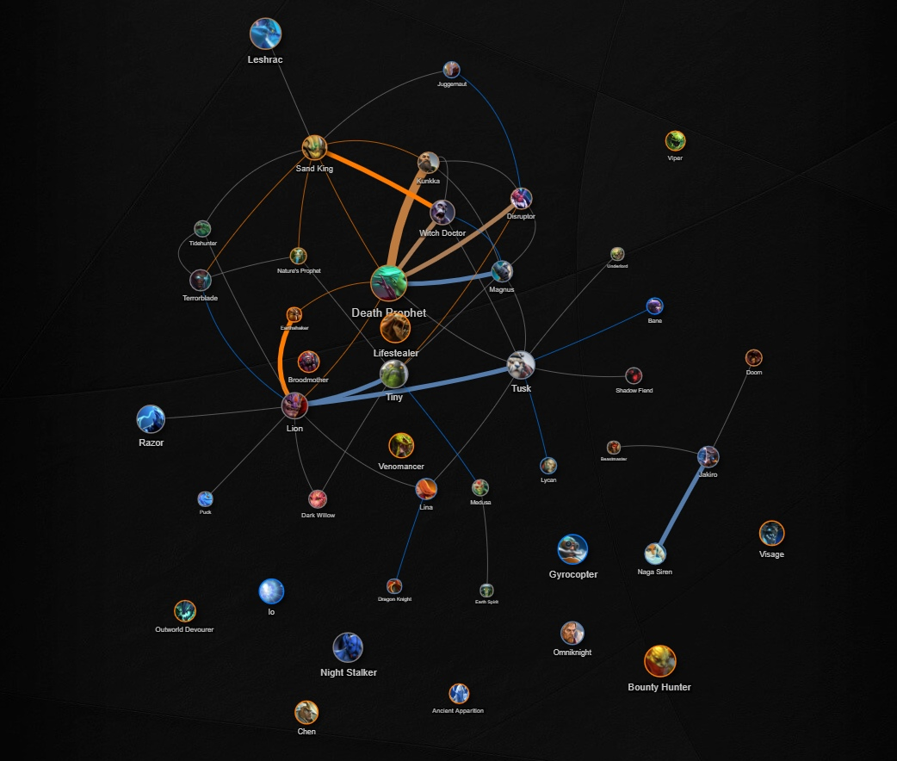

Громовая команда оказалась наименее успешной во всей выборке: 42% побед за 36 матчей. Единственной командой, против которой у этого коллектива процент побед хотя бы выше 20% оказалась Winstrike (3-1). Впрочем, процент побед за Свет у VGJ Thunder составляет 70%, так что, возможно им просто не везло на нужную сторону.

Обратить внимание стоит на две вещи: один из самых маленьких пулов героев среди команд и довольно частая смена ролей между игроками первой и второй позиции. Также стоит отметить, что команда очень любит играть с Death Prophet, с которой также и большая часть комбинаций команды, однако число побед этого героя в руках данной команды — всего 18% за 11 матчей. Возможно, если не дать VGJ Thunder взять Death Prophet, шансы на их победу резко возрастут (на что косвенно указывает тот факт, что за 15 банов DP против данной команды, забанившие этого героя оппоненты выиграли только в 40% случаев), а может дело в том, что на неё оказывали слишком большой фокус в каждой игре.

## OG

### Игроки: ana, TOPSON, Ceb, JerAx, n0tail

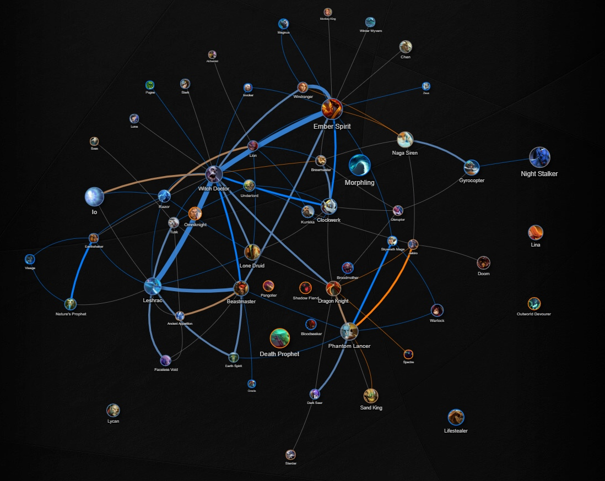

Незадолго до TI8, OG успели сменить состав, из-за чего неизвестно, как сильно их исполнение на главном турнире года будет отличаться от ожиданий, основанных на статистике. Впрочем, однозначно можно сказать, что самый любимый герой команды, сигнатурный Ember Spirit от ana, точно останется на месте. Самые любимые герои команды — Ember Spirit (14, 71%), Witch Doctor (17, 71%), Leshrac (13, 69%) и Beastmaster (11, 73%) — достаточно часто фигурируют в одном пике друг с другом и при этом являются очень успешными в руках команды и сами по себе.

Впрочем, несмотря на отличные показатели и успешные комбинации, у OG всё ещё есть проблема: лишь против четырёх команд-участниц TI8 процент побед OG превышает 40% (против одной — 50%). Это, наряду с недавним изменением состава, подаёт тревогу и порождает сомнения в том, что команда хорошо покажет себя на турнире.

## paiN Gaming

### Игроки: hFn k3 ♥ M, w33, tavo, Kingrd, Duster

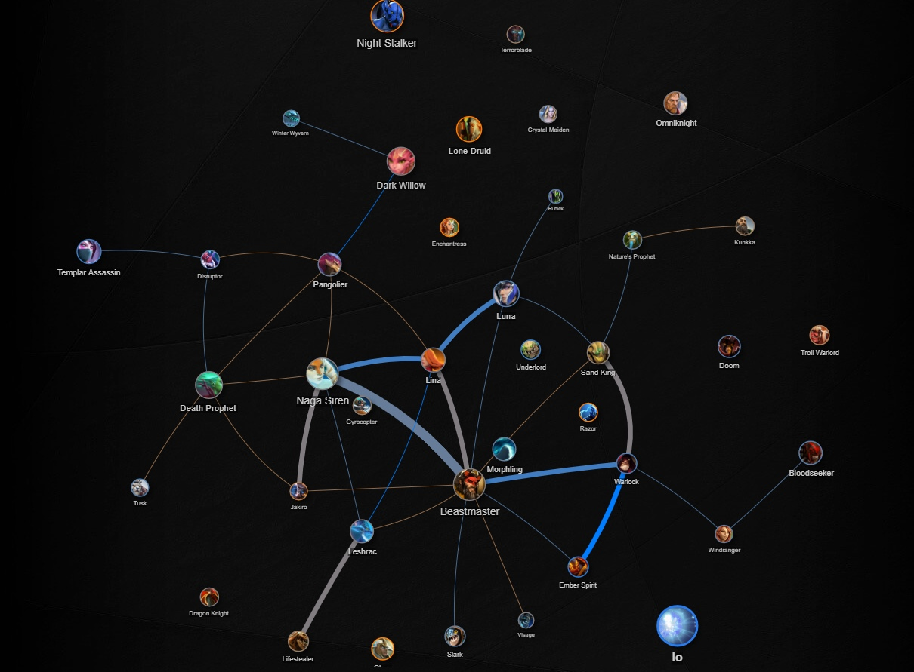

У paiN есть две интересных особенности: у них высокий показатель средных смертей и низкий показатель средней помощи. Хотя, учитывая низкий процент побед команды, возможно это лишь следствие их поражений, как и третье место по самой низкой продолжительности матчей в среднем. С другой стороны, глядя на самых любимых героев paiN, можно сказать, что оба этих момента могут быть следствием их «all-in» стратегий на быстрое давление и пуш, которые часто могут обернуться плачевно для исполнителей, но в любом случае игры редко будут долгими.

Но это лишь одна из особенностей. Второй же особенностью можно выделить потрясающее исполнение w33 на Meepo и Visage, из-за чего последний оказывался в бане против данного коллектива в 43 играх из 61.

Как и у некоторых других команд, у paiN выделяется страсть к Sand King и Death Prophet, успешность которых далеко не впечатляет. Впрочем, можно заметить и другого явного фаворита команды: Beastmaster (14 матчей, 50% побед), большинство комбинаций с которым имеют процент побед сильно выше 50%. Также стоит отметить три самые любимые пары героев paiN: Beastmaster + Naga Siren (5, 60%), Ember Spirit + Warlock (4, 100%) и Lina + Luna (4, 75%).

## TNC Predator

### Игроки: Raven, Armel, SamH, Tims, Kuku

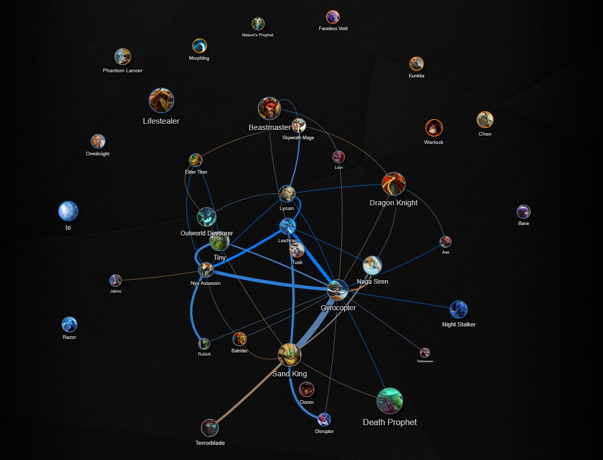

Первое, что приходит на ум, когда речь заходит о TNC Predator — их керри Raven, которого многие аналитики считают одним из лучших. Это и не удивительно: как говорится, хороший керри должен мало умирать, а Raven из раза в раз ставит рекорды по самому низкому показателю средних смертей.

Однако не одним Raven хорош коллектив. У TNC не только один из самых низких показателей средних смертей среди команд, но также третье место по количеству устанавливаемых в среднем вардов, второе — по количеству устанавливаемых сентри и третье — по количеству разрушаемых за игру вражеских вардов. Также стоит отметить и третье место по самой большой продолжительности матчей в среднем.

Среди самых популярных героев команды можно выделить Gyrocopter (24, 67%), Sand King (22, 50%), Nyx Assassin (16, 75%) и Leshrac (16, 88%). На них же и основаны все излюбленные комбинации команды. Также стоит отметить Lycan (14, 86%) и Beastmaster (9, 67%, а также 21 бан) среди излюбленных героев. Ну а против TNC наилучшим образом себя показывают Doom (11, 64%), Kunkka (6, 67%), Bane (11, 73%) и Gyrocopter (8, 88%).

Также интересной особенностью может являться и тот факт, что в большинстве случаев героя для Raven берут на первой или второй стадии (с примерно равным количеством матчей в обоих случаях), а последний пик остаётся для героя Armel.

## Mineski.亿电竞

### Игроки: Mushi, Moonn, 冰冰冰, Jabz, ninjaboogie

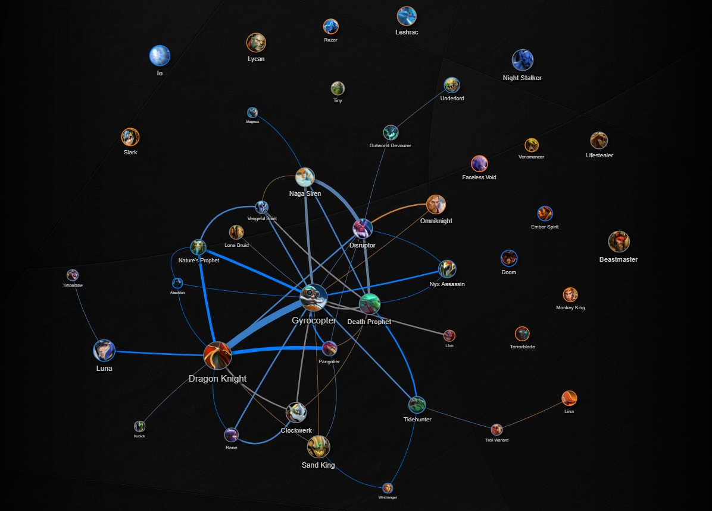

Несмотря относительно средний процент побед (56%), все их показатели держатся сильно выше среднего. Отдельно стоит отметить среднее количество разрушаемых за игру вардов (первое место среди команд) и средний показатель Рошанов за игру (третье место).

Самыми популярными героями команды стали Gyrocopter (25, 64%), Disruptor (15, 60%), Dragon Knight (21, 62%) и Death Prophet (15, 60%). Также стоит обратить внимание на Pangolier (11, 73%, а также 44 бана со стороны оппонентов Mineski), Naga Siren (13, 46%) и Nyx Assassin (10, 80%). Любимые же комбинации команды напрашиваются сами собой: Dragon Knight + Gyrocopter (9 - 78%), Dragon Knight + Pangolier (6, 100%), Disruptor + Naga Siren (6, 67%).

## Newbee

### Игроки: Moogy, Sccc, kpii, Faith, kaka

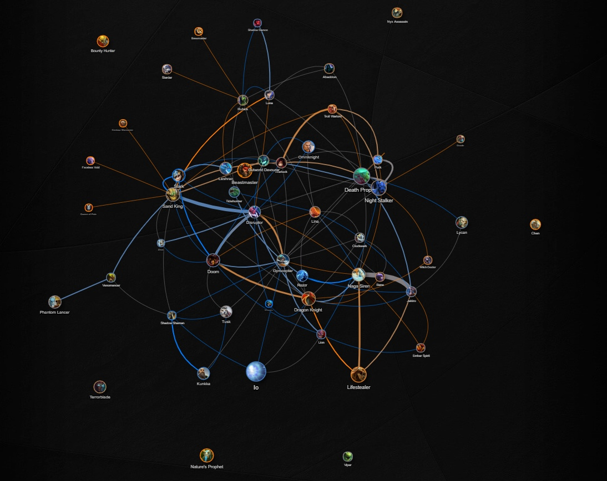

Будучи полуфиналистами прошлого года, сейчас Newbee могут похвастаться лишь 45% побед и очень низкие показатели против большинства команд. Единственный показатель команды, который привлекает внимание — довольно высокая средняя продолжительность матчей (почти 40 минут в среднем).

В качестве самых любимых героев коллектива можно отметить всё тех же знакомых Sand King (16, 50%), Disruptor (13, 54%), Dragon Knight (13, 38%) и Gyrocopter (12, 50%). С самыми часто пикаемыми парами героев всё немного интереснее: в топе нет классической пары Naga Siren + Disruptor, но зато есть Jakiro + Naga Siren (8, 50%), Sand King + Disruptor (6, 67%) и Doom + Disruptor (5, 60%).

## Virtus.рro

### Игроки: RAMZES666, No[o]ne-, 9pasha, Rodjer, Solo

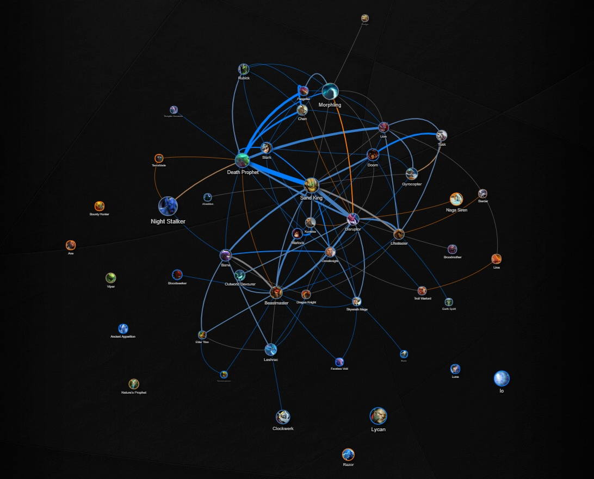

Команда медведей по мнению многих аналитиков и талантов является основным претендентом на победу в этом году (судя по предсказаниям в компендиумах). Оно и не удивительно: безоговорочные лидеры первого сезона Pro Circuit, почти каждый средний показатель команды если не находится в топ 3, то близок к этому. Отдельно стоит выделить, что VP — одна из немногих команд, у которых процент побед за Тьму выше, чем за Свет: 71% против 62%.

Что же касается их любимых героев — тут видно всё тех же Death Prophet, Sand King, Beastmaster и Disruptor. Самые любимые пары героев — Death Prophet + Sand King (8, 100%), Sand King + Disruptor (7, 71%) и Death Prophet + Pangolier (5, 100%). Стоит отметить также, что это один из тех коллективов, которые умеют правильно применять Sand King и успешны с ним: почти все связи с ним, которые видно на графе, голубые, да и сам по себе герой имеет 74% побед.

Из интересных наблюдений можно отметить, что VP любят брать героя для 9pasha в первой стадии. Также стоит отметить некоторых героев, которые имеют высокий процент побед против VP при достаточном количестве игр: Naga Siren (8, 63%), Slark (5, 60%), Luna (4, 75%) и Visage (но только в первой стадии: 4, 75%).

## Team Liquid

### Игроки: MATUMBAMAN, Miracle-, MindControl, Gh, KuroKy

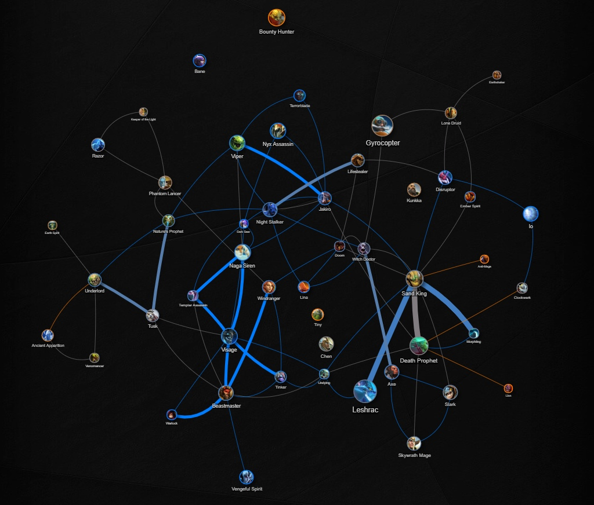

Team Liquid, чемпионы прошлого года, по различным оценкам являются одной из сильнейших команд TI8. Это не удивительно: их опыт и холодный рассчёт уже принесли им победу год назад и на протяжении года после этого они показывали стабильно достойное исполнение. Впрочем, из их показателей в первую очередь в глаза бросаются второе место по самой маленькой средней продолжительности матчей и третье место по показателю разнообразия героев (1.13 или 81 герой за 58 матчей).

Первая тройка их любимых героев в выборке достаточно типичная — Beastmaster, Death Prophet и Sand King (с которым, впрочем, все связи не сверкают высоким процентом побед), однако после них появляется Nature's Prophet (9, 67%). Также стоит обратить внимание на Visage (8, 86%), которого иногда берут для MATUMBAMAN на первую позицию, Jakiro (8, 88%). Среди комбинаций выделяются Morphling + Sand King, Sand King + Leshrac и Death Prophet + Sand King. Отдельно стоит выделить также пары Templar Assassin + Visage (высокий физический урон), Beastmaster + Visage (аура и фамильяры) и Visage + Tinker (много магического урона и постоянный обзор на противников, а также сильный пуш от Visage).

## Winstrike

### Игроки: Silent, Iceberg, nongrata, Nofear, ALWAYSWANNAFLY

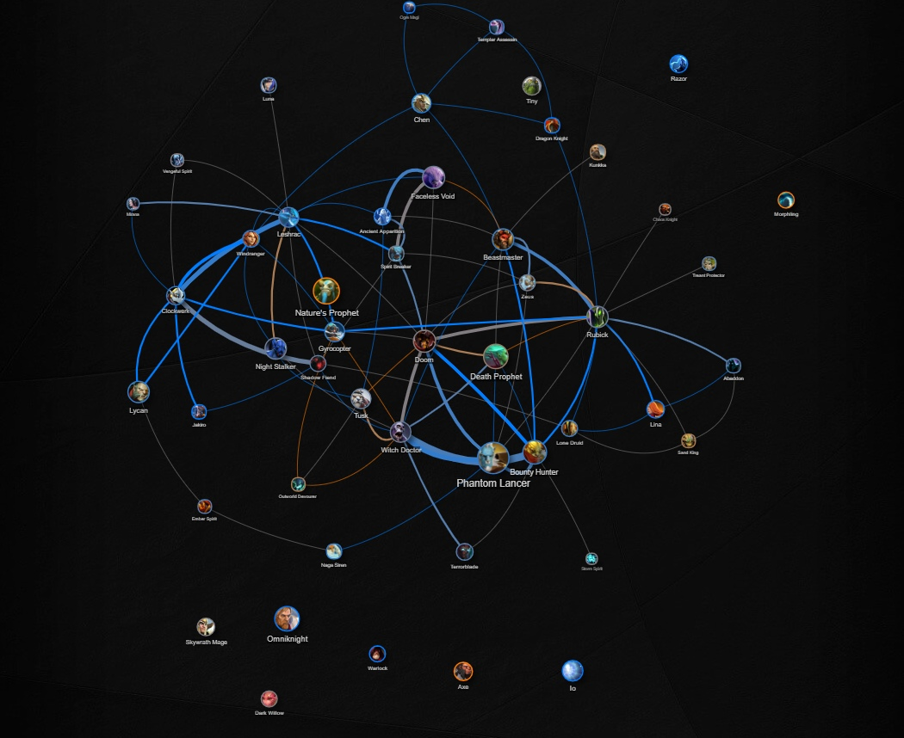

Взлетевшие до Луны ребята из Winstrike удивили всех, став новой звездой профессиональной доты. Это отразилось и на их показателях: второе место по самому высокому проценту побед, первые места по количеству убийств и помощи, второе место по опыту в минуту, первое место по золоту в минуту, второе место по убийствам курьеров, первое место по убийствам Рошана. Стоит также отметить, что процент побед Winstrike за Свет значительно выше, чем за тьму: 87% против 55%.

Что же касается их героев — наконец мы не увидим всё ту же пятёрку героев. В пуле этих ребят любимчиками стали Rubick (14, 57%), Doom (12, 50%), Witch Doctor (12, 58%), Clockwerk (11, 82%). Также стоит отметить Leshrac (11, 73%), Phantom Lancer (10, 80%), Beastmaster, Gyrocopter (оба 9 матчей и 78% побед), Windranger (8, 88%, причём половина игр была на центральной линии), но самый важный герой, на которого стоит обратить внимание — Bounty Hunter (10, 80%). Самые излюбленные комбинации команды — Witch Doctor + Bounty Hunter (7, 71%), Shadow Fiend + Clockwerk (5, 60%), Phantom Lancer + Witch Doctor (5, 80%) и Clockwerk + Leshrac (5, 80%). Отдельного внимания также заслуживает Tinker и очевидная комбинация с Bounty Hunter. Этого героя они не могли брать часто, однако эта комбинация явно является их козырем в рукаве.

## Team Secret

### Игроки: Ace, MidOne, Fata, YapzOr, Puppey

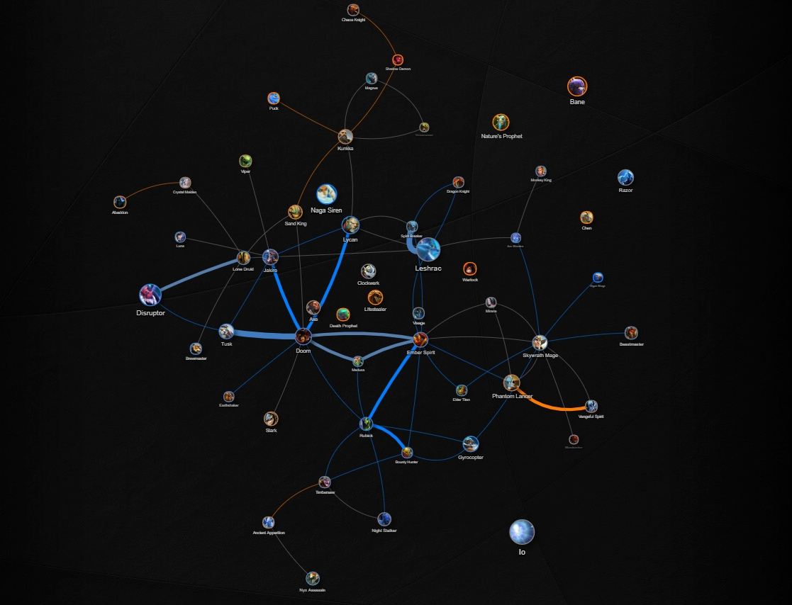

Микс легендарных игроков, уважаемый тег, множество фанатов — первое, что приходит на ум, когда речь заходит о Team Secret. К сожалению, нельзя выделить с их стороны выдающееся исполнение или высокие показатели, кроме их разнообразия в героях: 90 уникальных героев за 56 матчей. Также стоит отметить, что процент побед команды держится на среднем уровне, однако во многом из-за того, что их процент побед за Тьму сильно ниже, чем за свет: 43.3% против 65.4%.

Среди любимых героев и связок коллектива можно увидеть совсем неожиданных гостей: Doom (13, 77%), Ember Spirit (11, 73%), Kunkka (9, 33%), Lone Druid (9, 67%), а также пары Doom + Tusk (4, 75%), Leshrac + Spirit Breaker (4, 75%) и Rubick + Ember Spirit (3, 100%). Также стоит отметить Lycan (7, 86%), Skywrath Mage (9, 67%) и троицу Disruptor + Gyrocopter + Bounty Hunter (у каждого 5 игр и 80% побед).

## Evil Geniuses

### Игроки: rtz YB\`a, Suma1l, s4, Fly, Cr1t-

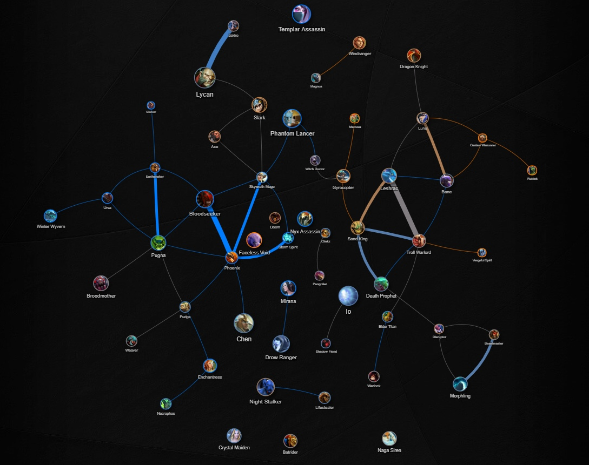

Ещё один коллектив чемпионов, которым, однако, нечем особо похвастаться в плане выдающихся средних показателей. Больше всего бросается в глаза высокое разнообразие пикаемых героев: 89 героев за 53 матча. Также стоит отметить, что, как и OG, коллектив совсем недавно сменил состав, что может сказаться на их стиле игры и исполнении.

Что же касается героев — тут тоже более интересная ситуация, чем у большинства команд: Phoenix (8, 100%), Leshrac (8, 38%), Bloodseeker (7, 100%), Sand King (29%). Самые же любимые пары героев команды — Bloodseeker + Phoenix (4, 100%), Leshrac + Troll (4, 50%) и Lycan + Jakiro (4, 75%). Также стоит отметить и много разных связок с Sand King, однако процент побед выше 50% только в комбинации с Death Prophet.

Интересной особенностью команды можно отметить, что герой s4 почти всегда уходит на первой стадии драфта, а герою Suma1l почти всегда достаётся последний пик.

## Vici Gaming

### Игроки: Paparazi灬, Ori, eLeVen, LaNm, Fenrir

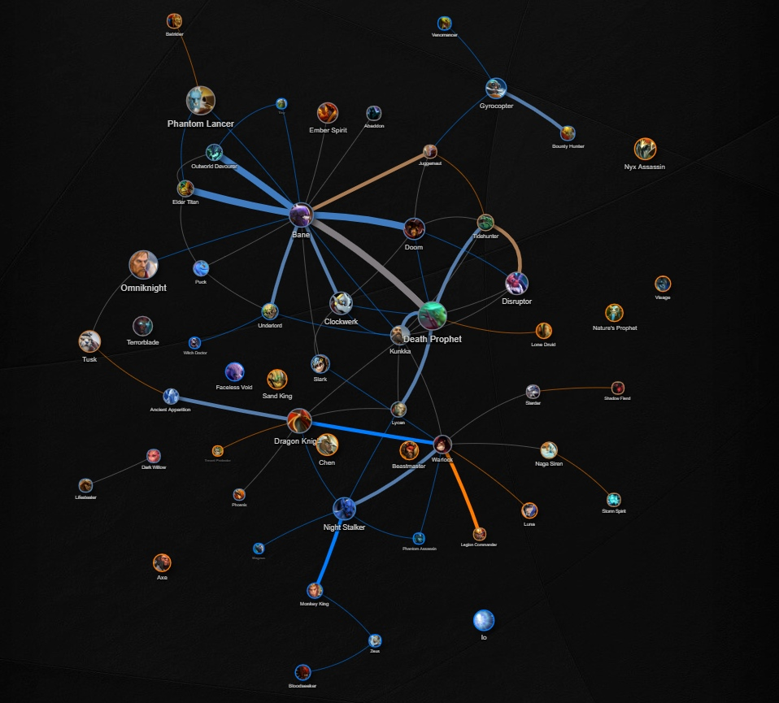

Главные рекордсмены по продолжительности игры — 42:30 в среднем от VG — отличились не только этим: второе место по средней помощи, первое место по вардам и второе место по средним разрушенным вардам. В остальном, впрочем, коллектив держится в основном ближе к середине.

Среди любимых героев Vici Gaming сильно выделяется Bane: 15 матчей и 67% побед, а также три самые популярные пары с ним — Doom, Outworld Devourer и Elder Titan. Остальные любимчики команды более стандартные: Death Prophet (11, 55%), Night Stalker (10, 80%), Dragon Knight (10, 60%). Помимо этого VG любят побаловаться пиком Warlock (9, 56%), Kunkka (8, 63%), Doom (7, 72%) и Underlord (7, 86%).

## Invictus Gaming

### Игроки: Agressif, Xxs, Srf, BoBoKa, Q

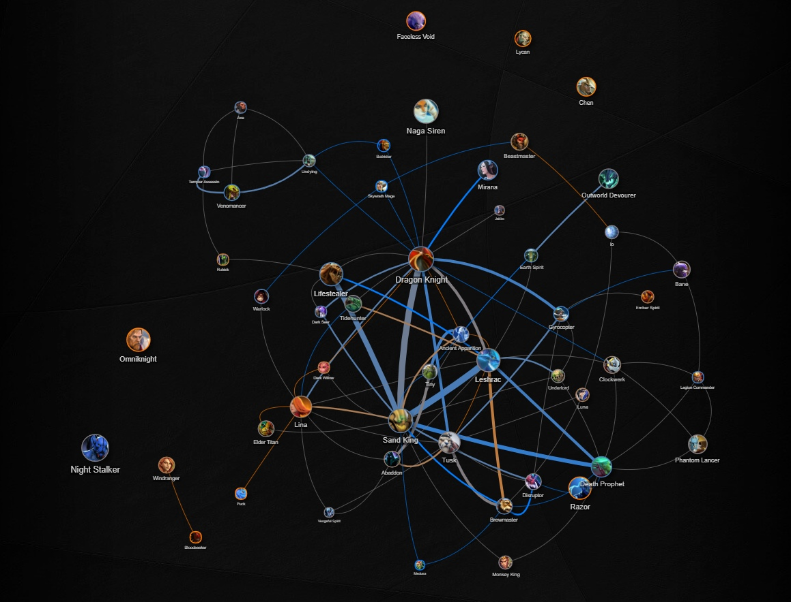

iG — ещё одна команда легендарных игроков, от которой, судя по показателям, не придётся ждать высококлассного исполнения. Все средние показатели команды держатся если не на средних, то на низких уровнях, а особенно выделяется один из самых низких показателей разнообразия героев. Впрочем, есть и хорошая новость: iG занимают последнее место по количеству смертей в среднем (говоря проще — меньше всех умирают).

В числе любимых героев коллектива всё те же старые знакомые: Sand King (17, 64%), Leshrac (17, 47%) и Dragon Knight (15, 67%), к которым также добавились Tusk (10, 50%) и Lina (10, 40%). Любимые комбинации команды также не отличаются особым разнообразием: первые места занимают связки с Sand King. Впрочем, такая любовь к скорпиону не удивляет: коллектив достаточно успешно исполняет с этим героем. Также среди популярных героев стоит отметить Death Prophet (7, 71%), Mirana (4, 75%) и Lifestealer (7, 71%).

## Team Serenity

### Игроки: zhizhizhi, Zyd, XinQ, XCJ, Pyw

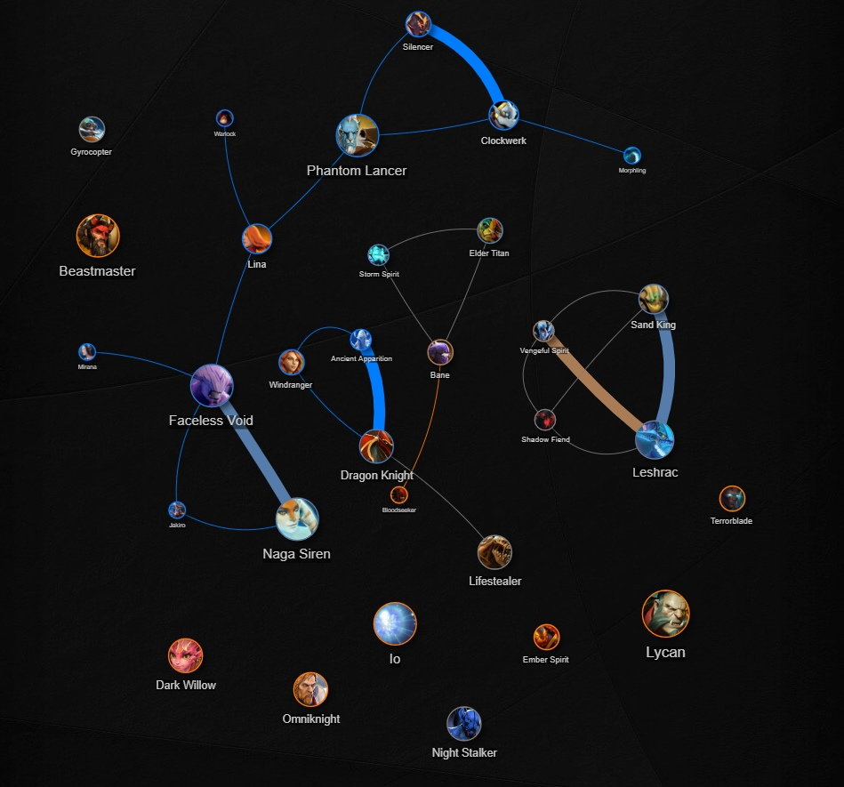

И на закуску — самая загадочная команда TI8. Кто-то считает их главными претендентами на вылет, кто-то — новыми Wings. Они появились на профессиональной сцене совсем недавно (из-за чего они имеют самый низкий пул героев и низкое количество матчей), однако с тех пор они успели наиграть себе на второе место по проценту побед. Впрочем, все остальные показатели держатся на среднем уровне.

Главные любимчики коллектива — Leshrac (5, 60%), Faceless Void (5, 80%), Silencer (4, 100%), Clockwerk (4, 100%), Lina (4, 100%), Windranger (4, 100%) и Phantom Lancer (4, 100%). Среди комбинаций можно выделить Clockwerk + Silencer (3, 100%), Dragon Knight + Ancient Apparition (3, 100%) и Faceless Void + Naga Siren (3, 67%).

Также стоит выделить интересную особенность: в большинстве случаев последним пиком берётся герой для XinQ, оффлейнера команды, запомнившегося многим как «та самая Акаша с блинком».

И под конец хотелось бы добавить следующее: лучше изучить данные самим, ведь это — лишь малая часть того, что там можно найти. Полный отчёт, как уже упоминалось, [можно посмотреть по этой ссылке](https://stats.spectral.gg/lrg2/?league=pre_ti8). И не поленитесь поставить лайк [под записью в нашей группе Spectral Alliance](https://vk.com/wall-111585510_2374) и подписаться. Это очень важно для нас как знак того, что подобные материалы интересны читателям и стоит продолжать работать в этом направлении.

Любите числа и счастливого вам интернешнла!

---

*Leamare для Spectral Alliance и TheCyberSport*

*Отдельное огромное спасибо **Speedy Gonzales** за подписку на Patreon*
