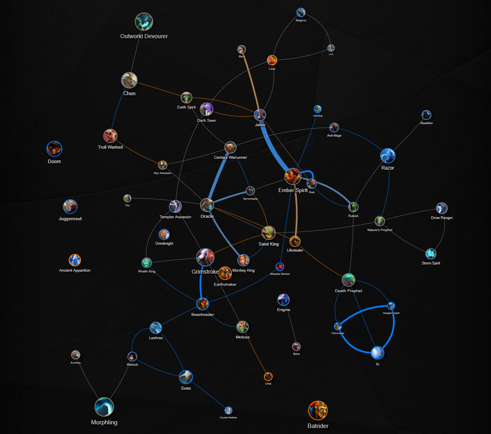
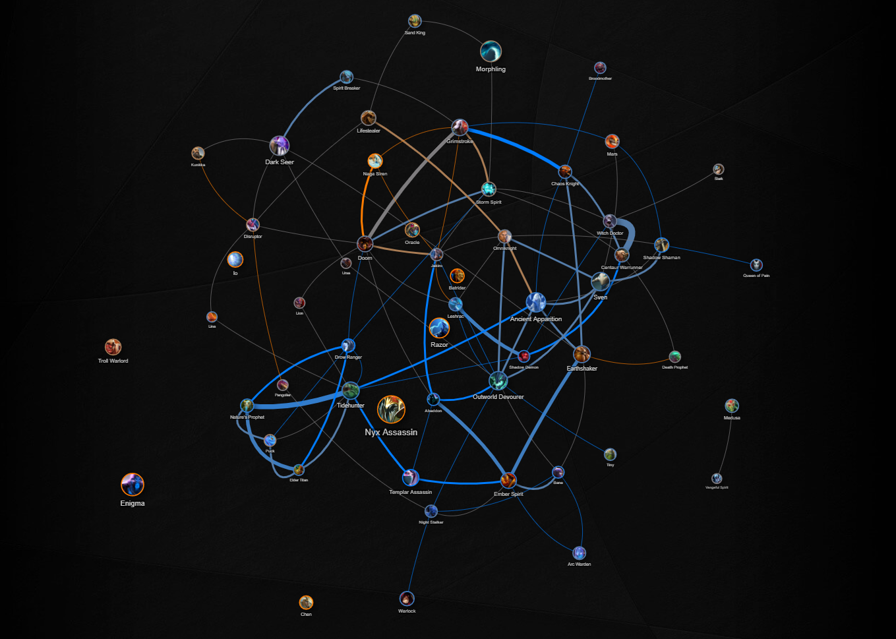
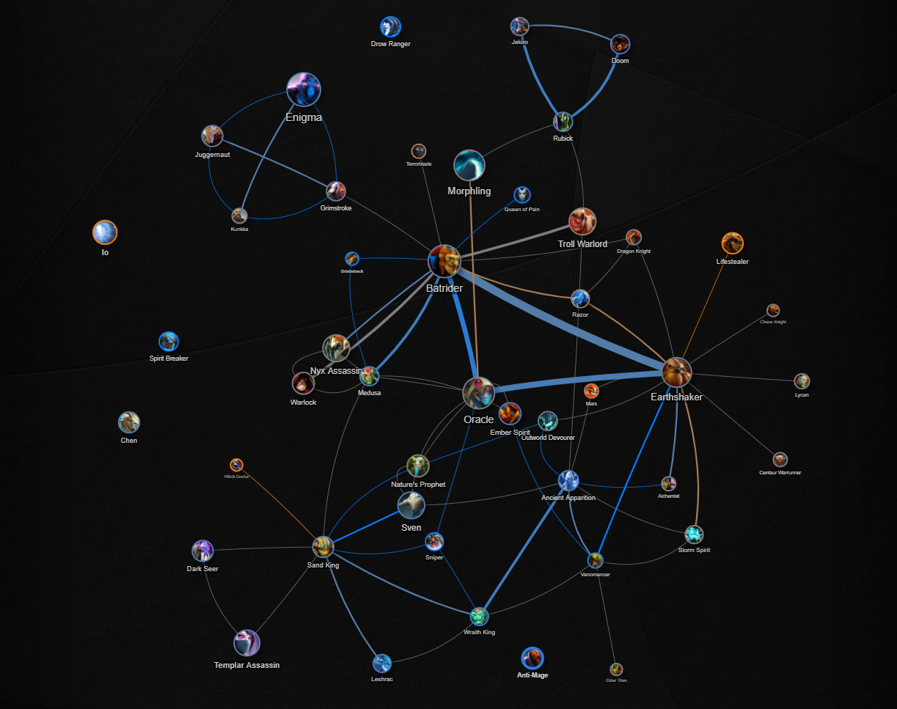
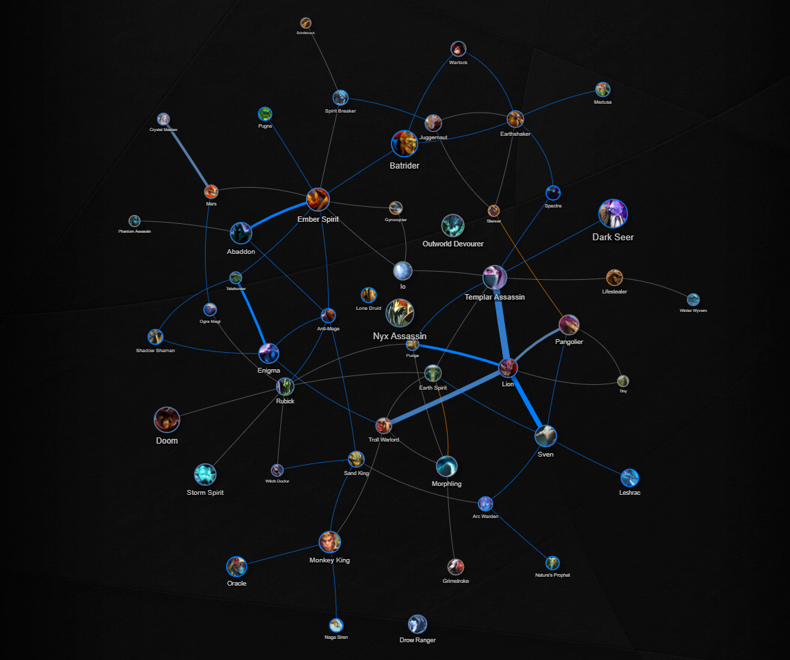
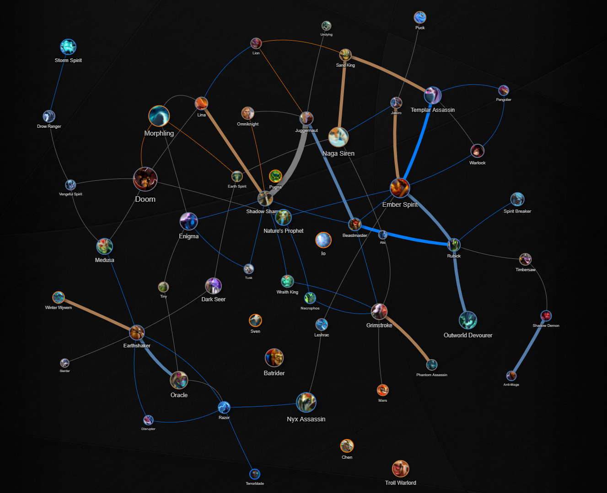
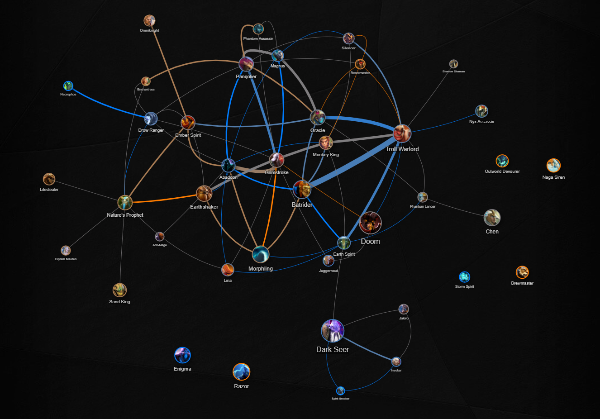

Published:
- NA, SA, CIS - https://luckbox.com/esports-news/article/the-international-2019-team-analysis-na-sa-cis?tags=dota-2,ti9
- China & SEA - https://luckbox.com/esports-news/article/the-international-2019-team-analysis-china-and-sea?tags=dota-2,ti9
- Europe - https://luckbox.com/esports-news/article/the-international-2019-team-analysis-europe?tags=dota-2,ti9

---

# The International 2019 team analysis

The International 2019 stage is set and the time for talking is almost over. With the TI9 action about to click off in Shanghai, Dota 2 statistician Leamare looks at the stats from the past three months to explore each team's favoured playing style. First up, it's teams from the North America, South America and CIS regions.

> Team vs Team winrates

## North America

### Evil Geniuses

* **Players:** rtz, SumaiL, s4, Cr1t-, Fly
* **Matches recorded:** 60, 65% winrate

Evil Geniuses, champions of The International 2015, are still a strong team. They had no changes after getting to the third place at The International 2018 and proved to be a threat and the best team of NA region during the last Pro Circuit season.

The most picked heroes of EG are Doom (15, 66.7%), Sven (14, 92.9%), Lifestealer (12, 58.3%), Leshrac (11, 90.9%) and Dark Seer (10, 70%). It also seems like the team favors Dark Seer a lot since all the picks happened during the first draft stage and the hero showed up in two hero pairs of the team.

The team's most favorite hero combos are Lifestealer + Dark Seer (4, 100%), Sven + Dark Seer (4, 100%), Shadow Shaman + Abaddon (4, 75%), Leshrac + Lifestealer (4, 75%) and Doom + Silencer (4, 50%).

The most effective picks against EG tend to be based either around stealing a hero, like Leshrac (5 picks, 80% winrate and 10 bans), Shadow Shaman (6 picks, 83.3% winrate) or Dark Seer (9 picks, 44.4% winrate and 13 bans), or playing around enemy cores, making them immobile and turning their strength into advantage with heroes like Shadow Demon (4 picks, 100% winrate and 4 bans), Enigma (4 picks, 75% winrate and 16 bans) and Morphling (7 picks, 42.9% winrate and 11 bans).

### Newbee (ex-Forward Gaming)

- **Players:** YawaR, CCnC, Sneyking, MSS, PieLieDie
- **Matches recorded:** 54, 56% winrate

While Newbee didn’t play that much matches during the last three months, the team has one of the widest hero pools across all the TI attending teams. Both of these factors make it very hard to prepare against the team and build any expectations.

One of the most interesting aspects of the team is playstyle. Newbee drafts are always greatly balanced, but what’s more interesting is their approach to game that seems to have a lot in common with CIS teams. The team is usually building its strategies on early to midgame aggression and teamfights, while also playing around objectives as much as possible. The most picked heroes of Newbee are Ember Spirit (13, 61.54%), Oracle (10, 50%), Jakiro (10, 60%), Beastmaster (9, 100%), Centaur Warrunner (9, 55.56%), Grimstroke (8, 62.5%).

There aren’t much heroes successful heroes against Newbee to note, however overall pattern seems to be similar to VP. Newbee’s main threat seems to be elusive heroes who can slow down the team’s momentum, like Templar Assassin, Oracle, Batrider, Pangolier.

## South America

### Infamous (ex Anvorgesa)

* **Players:** K1, Chris Luck, Wisper, Scofield, Stinger
* **Matches recorded:** 17, 82% winrate (TI9 Qualifiers) and 13, 38% winrate (competitive season)

Infamous is a bit of a mistery. The first time the team was spotted is actually the last minor of the season. Team Anvorgesa at the time managed to get to the tournament from the open qualifier, but didn’t get too far. However, the team managed to show a great performance during the TI qualifier and it turned out to be their ticket to Shanghai.

The most interesting thing about Infamous is actually the South America meta itself. Like I pointed out in [ranked meta trends analysis of 7.22e](https://luckbox.com/esports-news/article/7-22e-immortal-meta-trends), the region is the most unique in terms of inner meta right now. And it is perfectly reflected in the team’s playstyle.

The first thing to note is that Infamous values brawling a lot. The team’s drafts always have a lot of emphasis on fights and aggression – a trend that’s often used to describe the region’s playstyle as a whole. The second thing to note is the team’s most picked heroes list – it looks a lot like ranked meta trends of the region as well: Lifestealer (7, 100%), Queen of Pain (6, 83.33%), Silencer (6, 83.33%), Wraith King (4, 75%), Monkey King (4, 100%), Nyx Assassin (4, 100%).

The other side of the coin for this kind of approach is obvious: any team with a much better focus on map control and objectives may be a tough opponent for Infamous. However, this kind of playstyle and hero pool looks unique enough to create a bit of chaos on the tournament and give a big advantage for SA warriors.

## CIS

### Natus Vincere

- **Players:** Crystallize, MagicaL, Blizzy, Zayac, SoNNeikO
- **Matches recorded:** 66, 61% winrate

It’s been a while since the good days of Na`Vi ended. Slowly but surely all remaining sparks of hope faded as team didn’t get much success. This time, however, it seems like the team has a great chance to show off what they were working on.

Na`Vi’s strategy is usually based around getting map control (usually with scouting, but there are always some *explosive* ways to control the map) and trying to get pickoffs to get a good opportunity for objectives later on. The team’s most picked heroes are usually the solid and strong ones, but it seems like the team gives a lot of attention to heroes who can reset fights and control positioning of both teams during the battle: Disruptor (22, 63.64%), Wraith King (14, 78.57%), Templar Assassin (14, 92.86%), Centaur Warrunner (13, 64.54%), Ember Spirit (12, 75%), Dark Seer and Nyx Assassin (12, 83.33%). 

Aside from overwhelmingly successful Templar Assassin played by MagicaL, there is also one interesting hero who isn’t one of the most picked, but can be found in the most popular pairs list – Winter Wyvern. In top pairs list of Na`Vi there are a lot of combos with Disruptor, and the top 3 pairs are Disruptor + Ember Spirit (6, 83.33%), Wraith King + Nyx Assassin (5, 100%) and Templar Assassiin + Winter Wyvern (5, 80%).

Na`Vi’s weak spot seems to be in cases when opponents can force a long lasting fight or reset a teamfight by themselves. Some notable mentions are Omniknight (7, 85.71%), Shadow Shaman (6, 66.67%), Bane (7, 71.43%), Storm Spirit (4, 75%), Disruptor (7, 57.14%).

### Virtus.pro

- **Players:** RAMZES, No[o]ne-, 9pasha, RodjER, Solo
- **Matches recorded:** 57, 63% winrate

Virtus.pro finished previous competitive season with the first place while looking like an unbeatable beast. Even tho their run at TI8 didn’t look as impressing, the team didn’t change the roster and decided to take a second chance to win The International. The team finished with the second place in Pro Circuit ranking and showed impressive performance over the season, even tho it looked more like they tried to test as much strategies before TI as possible.

When talking about Virtus.pro, it’s usually associated with aggressive strategies and “deathball”, but it’s only partially true these days. Over the time Virtus.pro tried more and more new ideas and polished their playstyles, turning generic “CIS deathball” into something unique. Modern VP looks more like a cold-hearted machine. Usually the team’s strategies are based around getting all the heroes to their early power spikes as soon as possible and start getting objectives with precise attacks and map movement (and, funnily enough, this approach seems a lot like how OpenAI plays the game). 

Ideal heroes to pick are usually the ones who come online relatively early. There are also some exceptionally great heroes like Earthshaker and other crowd controlling heroes with massive zone of impact. The most picked heroes of VP are Earthshaker (14, 64.29%), Enigma (10, 50%), Sven (10, 70%), Ember Spirit (9, 55.56%), Disruptor (9, 55.56%), while the most frequently occurring pairs are usually based around Earthshaker. It’s also worth to note that the team’s hero diversity value is considerably high, so there are a lot of heroes who are more spread out in terms of their pick rate.

If we’re going to look over the most effective heroes against VP, there aren’t much outstanding discoveries to be made. Most of the heroes picked against VP are those who were “stolen” from them. Altho there are some interesting cases like Templar Assassin (12, 58.33%), Nyx Assassin (9, 55.56%), Juggernaut (4, 75%), Disruptor (7, 42.86%), who are able to interrupt the team’s momentum and force the plan to fall apart.

## China

### Vici Gaming

- **Players:** Paparazi, Ori, Yang, Fade, Dy
- **Matches recorded:** 58, 64% winrate

Vici Gaming right now are the unstoppable beast of China. The team wasn’t in a necessarily great shape at first but quickly started gaining the critical mass after the new competitive season started and rOtK joined the squad as a coach. VG ended up with the third place in DPC ranking this season and proved to be one of the most favorable teams to win TI9.

The team prioritizes playing around objectives and usually builds its game around midlaner. While Ori gets his heroes picked last and his heroes are usually flashy and hard to stop, which naturally translate into unstoppable snowball. Heroes for other positions get to be picked relatively early in the draft. Naturally, all those heroes are usually generally strong meta picks or something versatile.

The most picked heroes of the team demonstrate this trend perfectly: Shadow Shaman (14, 85.71%), Disruptor (12, 66.67%), Leshrac (11, 72.73%), Centaur Warrunner (11, 81.82%), Templar Assassin (10, 80%). It’s a bit harder to talk about VG’s pairs: the three most popular pairs are Rubick + Centaur (5, 80%), Doom + Grimstroke (5, 60%) and Warlock + Centaur (4, 100%), while the next five combos on the list include Shadow Shaman.

The most successful heroes against VG are the ones who are capable to slow down the snowball our turn it around with the most successful and popular heroes against the team being Shadow Shaman (7, 57.14%), Jakiro (7, 71.43%), Nature’s Prophet (8, 75%), Sven (8, 62.5%). Arc Warden wasn’t picked as much (2, 100%), but deserves a mention since he’s possibly one of the best heroes to deal with this kind of snowballing strategies.

### PSG.LGD

- **Players:** Ame, Somnus丶M, Chalice, fy, xNova
- **Matches recorded:** 60, 63% winrate

While being vice champions of TI8, PSG.LGD haven’t been as exciting in terms of performance during this competitive season. But even while the team usually got around 4th and 6th places, overall stats of the team still look pretty decent.

LGD’s playstyle may be described as “Classic Chinese Dota”: every attack is precise, every action serves a purpose and everything looks methodical and well-trained. The team loves to play relatively fast, while playing around strong lategame cores and trying their best to get them to their critical points as soon as possible. It’s interesting to note that positions 3 to 5 of the team all act as supports, creating space and getting ready to play around teamfights later on. These positions are always utility type heroes and it’s rare to see a common for other regions three core lineup.

The most picked heroes list is mostly populated with offlane utility cores, while the cores of the team are usually more versatile: Nature’s Prophet (14, 71.43%), Shadow Shaman (13, 61.54%), Pangolier (12, 83.33%), Sven (11, 81.82%), Storm Spirit (11, 81.82%), Doom (10, 70%). With the only cores in the top-6 list being Sven and Storm Spirit, it’s also worth to note that a bit lower in the list there are Dark Seer and Batrider who are also the heroes with the highest draft ranks of the team. Another thing worth mentioning is Pangolier who is usually played as position 4 support by the team which became a visit card of PSG.LGD.

The heroes who naturally work great against PSG.LGD are the ones who are able to either interrupt the team’s tempo or turn it into advantage. There aren’t much interesting cases since heroes picked against the team are a bit more spread out in terms of popularity, but some heroes worth mentioning are Mars (2, 100%), Sven (4, 100%), Spirit Breaker (3, 100%), Templar Assassin (7, 42.86%).

### KEEN GAMING

- **Players:** old chicken, yi, eLeVeN, kaka, dark
- **Matches recorded:** 76, 61% winrate

A team of Chinese legends who had an impressive run at The International 2018 has returned. KEEN Gaming didn’t show as great performance during competitive season this time, but they still had enough highlights and achievements to get a direct invite to The International 2019 by getting to the top-12 in Pro Circuit ranking.

The team’s playstyle seems a lot like a classic Dota right from 2012, but shifted a bit towards currently popular heroes. There aren’t much to talk about in terms of KEEN Gaming signature picks since a lot of their most beloved heroes are just some of the most popular heroes both competitively and in ranked: Doom (15, 46.67%), Sand King (14, 57.14%), Ember Spirit (14, 71.43%), Disruptor (14, 64.29%), Troll Warlord (14, 64.29%), Razor (13, 61.54%). 

However, the team not only knows how to perform with those heroes, but also has a relatively high versatility. Some of the combos worth noting are Razor + Disruptor (5, 80%), Sand King + Leshrac (5, 60%) and Doom + Disruptor (5, 60%). Another hero to look after is Puck: the most favorable pair of the team is Doom + Puck and the hero has relatively high pick rate. However, Puck isn’t that interesting because of its great success, but because of having overwhelming 25% winrate over 8 matches.

The team’s strategy is usually based around getting a pick off and forcing an objective. Naturally, their most banned hero is Oracle (47 bans). Some of the most successful heroes against KEEN at the same time are either elusive and can force enemy movement around the map like Nature’s Prophet (6, 83.33%), Templar Assassin (10, 70%), Lone Druid (4, 100%) or can initiate first and turn the fight around like Sven (6, 83.33%), Doom (11, 63.64%), Earth Spirit (6, 83.33%) and Disruptor (10, 60%).

### Royal Never Give Up

* **Players:** Monet, Setsu, Flyby, LaNm, - ah fu -
* **Matches recorded:** 63, 65% winrate

RNG is the Chinese dark horse and the team of legendary players. The team didn't have much success during the Pro Circuit season. For a long time the team wasn't even considered as a possible TI Attendee. But the team has shown some great performance after all.

RNG's most favorite heroes are Tidehunter (14, 78.6%), Outworld Devourer (12, 75%), Grimstroke (11, 63.6%), Ember Spirit (11, 81.8%), Earthshaker (10, 70%) and Doom (10, 60%). One thing that comes to mind after seeing all those heroes together is playing around big cooldowns and teamfights. The most notable hero combos are Witch Doctor + Centaur Warrunner (6, 66.7%), Tidehunter + Nature's Prophet (5, 80%) and Chaos Knight + Grimstroke (4, 100%), all three of them being a brawling type of hero paired with somebody who can provide a lockdown.

The most successful heroes against RNG are Centaur Warrunner (12, 58.3%), Shadow Shaman (12, 66.7%), Storm Spirit (4, 75%), Grimstroke (13, 53.9%) and Sven (6, 66.7%). It seems like the best way to get around RNG's strategy is to just get some heroes who can turn prolonged games to their advantage.

## South-East Asia

### Fnatic

- **Players:** Jabz, Abed, iceiceice, DJ, DuBu
- **Matches recorded:** 31, 52% winrate

Current Fnatic roster is one of the most unique and exciting to watch teams on professional Dota 2 scene. The reason to that is the team’s approach to play around iceiceice and DJ, the space creating duo, while also playing for Abed. This roster is also famous for being unpredictable in drafts, being able to set the game tempo and being a great spectacle overall.

The team’s most picked heroes list is mirroring this approach pretty well. The list is mostly populated by position 3 and 4 heroes and cores who don’t need to actively engage – Sand King (8, 50%), Leshrac (7, 57.14%), Nature’s Prophet (6, 50%), Drow Ranger (6, 83.3%), Rubick (6, 66.67%). The only exception is probably Ember Spirit: while the hero is popular overall, it doesn’t really work with Fnatic playstyle and has 28.57% winrate across 7 matches.

The team is usually looking for a pickoff to later on use the advantage to get an objective. Of course, the only reliable thing to hold this kind madness is to use “fight resetters”, however another approach is to get heroes who can punish opponents for being too agressive and making even a slightest mistake. Grimstroke (5, 80%), Batrider (6, 66.7%) and Templar Assassin (5, 60%) are probably the best heroes to get in this kind of situation.

### TNC Predator

- **Players:** Gabbi, Armel, Kuku, Tims, Eyyou
- **Matches recorded:** 52, 58% winrate

TNC Predator started to shine this season, thanks to Lee “Heen” Seung Gon who joined the squad as a coach. Lee has shown a way to TI champioship once while being a coach of Team Liquid. Now it seems like he has all the chances to try it again, making TNC Predator stronger than ever before.

It seems like the team doesn’t make as much emphasis on core positions and their impact, but is focusing on map control, creating space and shutting enemy down instead, which seems a lot like Team Liquid from 2017. The most picked heroes of TNC are Batrider (19, 63.16%), Earthshaker (19, 57.89%), Oracle (13, 53.85%), Sand King (10, 60%), Ancient Apparition (10, 70%). All the heroes at the top of the list are “jacks of all trades” who can be good at teamfighting, picking enemy off or just controlling the map. However, a bit below in the list there are hard-farming heroes (Sven, Wraith King, Medusa, Templar Assassin) as well as heroes like Nature’s Prophet and Dark Seer. All of them are good at either using map control advantage or creating it.

Enemy picks against TNC look a bit more chaotic and spread out, but it’s no surprise to see better fighters and “group up” type heroes to be the most successful: Warlock (4, 100%), Beastmaster (4, 75%), Disruptor (5, 60%), Earth Spirit (7, 42.86%). It’s hard to find any gems in draft stats against TNC because of much more chaotic picture, but some of the heroes who took my attention are Dark Seer (6, 66.67%), Winter Wyvern (4, 75%) and Centaur Warrunner (6, 50%) who may be successful because of ability to reset teamfights and use enemy networth lead against it.

## Europe

### Chaos Esports Club

* **Players:** vtFaded, MATUMBAMAN, Khezu, MiLAN, misery
* **Matches recorded:** 19, 74% winrate

Chaos is the most intriguing team of the tournament. The team changed its roster just before the qualifiers and didn't play much games. It was hard to prepare against the team during qualifiers: there were no publicly available data about their matches. And even now the team still has the lowest number of matches during the last three months. But their outstanding performance during qualifiers is more than enough for us to get a picture of the team's meta.

One interesting thing that is unusual to see is the draft order of Chaos. Usually MATUMBAMAN's hero gets picked the last (in 10 matches out of 19), but what's more interesting is tendency to pick safelane core during the second draft stage – vtFaded's heroes were picked 4 times during the first draft stage and 14 times during the second stage.

It's also worth to mention the most favorable heroes of Chaos: Dark Willow (6 out of 19 matches, 83.3% winrate), Morphling (5, 80%), Dazzle (5, 80%), Death Prophet (4, 100%). It's surprising that scary Morphling + Dark Willow that was shown in its full beauty during CIS qualifiers didn't get past valuable pairs threshold of the team. But there are still some other combos to mention: Juggernaut + Dazzle (3, 66.7%), Morphling + Omniknight (3, 66.7%) and Axe + Juggernaut (3, 66.7%).

This picture together shows the team's emphasis on stronger lanes and its snowbally nature. The theory seems to get along with the Death Prophet as popular pick from the team and the most popular ban against the team. And the most impactful heroes against the team (those heroes who have more than 1 matches and were relatively successful) are Doom, Enigma, Ancient Apparition and Dazzle - the heroes who seems to be decent at winning some time, delaying games and being able to actually hold off against deathball strategies.

### Team Secret

* **Players:** Nisha, MidOne, zai, YapzOr, Puppey
* **Matches recorded:** 57, 72% winrate

Puppey is the legendary player in DotA world. He is playing the game at the highest level for at least nine years and is one of the two players to attend every single tournament in The International series. During the Pro Circuit season Team Secret has shown outstanding performance and is one of the most possible candidates to win the tournament, based on stats and various rankings.

The most loved heroes of Team Secret are Ember Spirit (12, 75%), Lion (12, 83.3%), Templar Assassin (11, 63.6%), Rubick (11, 72.7%) and Sven (10, 90%). Altho the team has a lot of matches and is pretty versatile. While those heroes remain the most popular, there are a lot of picks that don't attract as much attention, but are stull valuable enough, like Arc Warden, Earthshaker, Monkey King or Enigma.

The combos of the team are pretty straight forward: Lion + Templar Assassin (5, 80%), Sven + Lion (4, 100%), Templar Assassin + Rubick (4, 75%), Lion + Troll Warlord (4, 75%). It's interesting to note that the team has a lot of combos based around Lion or similar heroes. It seems like the main idea wraps around being able to control the fight let Nisha and MidOne do the rest with their flashy damage dealers. On the other hand, the most successful heroes against the team are the ones who tend to break team's positioning or mitigate the teamfight control effect: Sven (11, 63.6), Shadow Shaman (6, 66.7%), Storm Spirit (3, 66.7%), Mars (3, 66.7%).

### Ninjas in Pyjamas

- **Players:** Ace, Fata, 33, Saksa, ppd
- **Matches recorded:** 95, 59% winrate

NiP is an interesting team, to say the least. Every single player of it had a lot of great moments during lifetime, most of them were TI attendees in the past and Peter “PPD” Pandam was part of a team that won TI. Times have passed, but people still acknowledge Peter’s success by calling him a drafting genius.

A lot of NiP’s success is based on the team’s ability to adapt and play almost any lineup while also having great drafts a lot of the time. It’s interesting to note that NiP’s most picked heroes are mostly teamfight oriented: Sand King (26, 65.38%), Shadow Shaman (22, 72.73%), Abaddon (18, 66.67%), Rubick (14, 57.14%), Ember Spirit (13, 53.85%), Razor (13, 53.85%), Enigma (13, 76.92%). However, the team’s hero pool is way less spread out which can be seen on the graph above and in variability of the team’s picks.

This strategy is vulnerable against heroes who can turn teamfights around: Chen (7, 85.71%), Batrider (8, 75%), Centaur Warrunner (10, 70%), Earthshaker (9, 66.67%). It’s also worth to mention Nyx Assassin (9, 55.56%) and Enigma (1, 100%), who can achieve the same goal, but weren’t picked as much against NiP, as well as heroes like Lone Druid (8, 62.5%), Troll Warlord (11, 54.55%) and Leshrac (11, 54.55%) who are naturally hard to fight against as well as good at dodging fights completely.

### Team Liquid

- **Players:** Miracle-, w33, MinD_ControL, gh, KuroKy
- **Matches recorded:** 75, 57% winrate

Ever since Team Liquid suddenly made a roster change right before the season ended, the move seemed controersial. However, EPICENTER Major proved it to be a right decision. Moving Miracle to the first position and replacing MATUMBAMAN with w33 has opened a lot of new possibilities for the team and for Miracle- specifically, changing playstyle and hero pool of the team for the better.

The team’s overall playstyle remained the same: early domination leading to map control and creating space. It can be seen in most popular picks list: Sand King (17, 58.82%), Earthshaker (16, 50%), Nature’s Prophet (14, 57.14%), Morphling (13, 53.85%), Nyx Assassin (11, 63.64%). There are also some notable heroes who didn’t appear as much but were successful or became stable picks of the team just recently: Arc Warden (4, 75%), Beastmaster (6, 100%), Chen (10, 90%), Shadow Shaman (10, 80%), Axe (4, 100%). There are also some newer heroes added to the pool with w33 addition, the most notable being Windranger (8, 62.5%) and Visage (1, 100%).

The best heroes heroes against Team Liquid seem to be good at punishing split push and dealing with summons: Medusa (6, 100%), Brewmaster (8, 75%), Sven (7, 71.43%), Sand King (8, 62.5%), Monkey King (10, 60%).

### Mineski

- **Players:** Nikobaby, Moon, kpii, Bimbo, ninjaboogie
- **Matches recorded:** 68, 54% winrate

Mineski, while being one of the strongest SEA teams and probably one of the most interesting teams to watch during TI, the team wasn’t in great shape during the competitive season. However, the team still has one of the most interesting and unique playstyles on the tournament while also being able to impress viewers during regional qualifiers.

The team’s playstyle, unlike other teams, favors teamfights a lot, while also having wide hero pool of 88 hero picks in 64 matches. It also helps the team to create a unique identity: a lot of heroes who got picked a lot by Mineski weren’t as appreciated by other teams. There are a lot of heroes to note, but it’s worth putting your attention into Naga Siren (11, 36.36%), Outworld Devourer (9, 66.67%), Juggernaut (10, 60%), Enigma (7, 57.16%).

The team also has a lot of interesting combos to look after. Some of the most notable ones are Phantom Assassin + Grimstroke (3, 33.3%), Juggernaut + Beastmaster (3, 66.7%), Juggernaut + Shadow Shaman (4, 50%), Anti-Mage + Shadow Demon (3, 66.7%).

In enemy draft stats there are four heroes who work exceptionally well against Mineski: Nyx Assassin (9, 66.7%), Leshrac (10, 60%), Necrophos (6, 83.3%) and probably the most important one – Sand King (17, 52.94).

### Alliance

- **Players:** miCKe, qojqva, Boxi, Taiga, iNSaNiA
- **Matches recorded:** 84, 54% winrate

While current Alliance roster seems to be a bit too fresh, a lot of viewers pointed out that this team is not only exciting to watch, but is also great in terms of performance. And, what may be even more important at TI – unique.

The team has a lot of interesting picks that were either made meta by them or rare to see at all these days: Position 5 Grimstroke (16, 50%), Position 4 Dark Willow (9, 77.78%), Lone Druid (9, 66.67%). Even the most picked heroes of the team turn out to be underappreciated by other teams: Storm Spirit (21, 57.14%), Juggernaut (18, 50%). Adding even more to that, it seems like the team favors playing around these heroes since their most picked pairs are usually based around Juggernaut and a bit less Troll and Storm Spirit.

The most effective heroes against the team, as you might expect, are the ones who work well against this trio. The most notable mentions are Sven (10, 70%), Shadow Shaman (11, 72.73%), Omniknight (4, 100%), Warlock (10, 60%) and Lifestealer (7, 57.14%).

### OG

- **Players:** ana, Topson, Ceb, JerAx, N0tail
- **Matches recorded:** 50, 52% winrate

OG, the champions of The International 2018, weren’t in a good shape for the most part of the season. However, after all the vacations and lost time, the team made a comeback and suddenly appeared in top-12 of the Pro Circuit ranked, getting a direct invite to The International 2019. While the team still looks unstable, it’s also what people said about the team even before TI8. And, considering the team’s unnique approach to the game, it’s not a good idea to underestimate what the team can do.

In a way OG’s playstyle is a mix of different approaches to the game. While enemies tend to ban Magnus against the team, it’s hard to note anything exceptionally strong against them. It’s hard to note a pettern in OG’s picks as well.

One thing that you’ll probably notice by just looking at the most picked heroes of OG is that it’s different. You still can notice Ember Spirit (10, 50%) and Batrider (11, 63.64%), but there are also a bunch of heroes that you didn’t see all that much from other teams: Troll Warlord (16, 62.5%), Pangolier (12, 58.3%), Nature’s Prophet (12, 33.3%), Abaddon (10, 70%), Earth Spirit (9, 66.7%), Magnus (8, 75%).

This list by itself looks like it’s made of different strategies and ideas and it is the big idea behind OG – finding new ways to play and adapting to circumstances. It already proved to be a working strategy, but we are yet to see will it be as successful as before.
