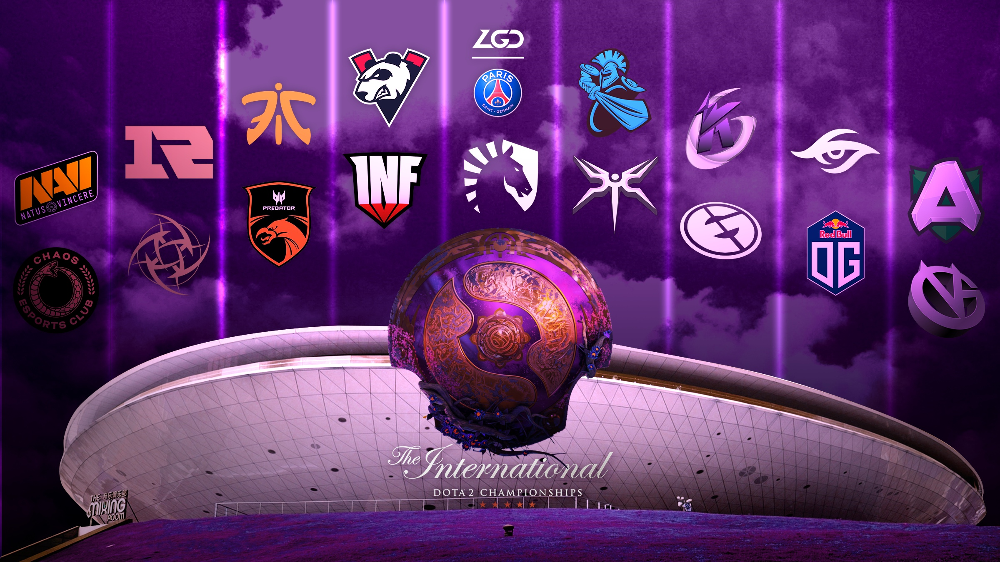

Published: https://vk.com/@spectraldota-the-international-2019-putevoditel-po-komandam

---

#  The International 2019: Путеводитель по командам

Что, думали я оставлю вас без этого материала в этом году? Как бы не так!

Год назад уже был подобный материал с разбором внутренней меты и анализом стиля игры каждой из команд. В этом году я написал аналогичный материал в сотрудничестве с Luckbox.com. Англоязычная версия выйдет на их портале в трёх частях ([все материалы будут тут](https://luckbox.com/esports-news/author/darien), материалы выйдут по одному в день с понедельника), ну а для вас я специально подготовил цельную русскоязычную версию.

> Арт от /u/NiceGuyArthas — https://www.reddit.com/r/DotA2/comments/col6b1/ive_made_ti9themed_wallpaper_hope_you_will_like_it/

*Что это вообще за материал?* Ну, как не трудно догадаться по написанному выше, это детальный разбор команд на основе статистики. Что пикали команды, что банили, какие связки брали чаще всего, что работало против них наиболее эффективно — всё это и по каждой из команд. Своего рода путеводитель по командам-участницам TI9. Достижения команд за сезон тут мало что значат: все они так или иначе прошли на The International, а значит все они сильнейшие.

В основу всего разбора был взят [Pre-TI9 отчёт на Spectral.gg](https://stats.spectral.gg/lrg2/?league=pre_ti9), в котором собрана статистика всех команд-участниц TI9 за последние 3-4 месяца, в том числе квалификации, турниры DPC и всё остальное. Ну и, да, подобные отчёты я делаю каждый год. по ним можно изучать команды, искать закономерности, даже выбирать героев и игроков для предсказаний в компендиуме.

Ну и ещё к разбору каждой команды прикладывается «граф меты» этой самой команды. Интерактивные версии этих графов есть в отчёте, в профиле каждой команды — там вы можете подвигать героев, увеличивать граф и вообще играться с ним как душе угодно. Сам же граф показывает наиболее востребованных для данной команды героев, а ещё связи между ними. Больше портрет героя — больше его пикали и/или банили. Толще линия между героями — чаще их брали вместе. Синий цвет линии и рамки портрета — винрейт ближе к 100%, серый — к 50%, оранжевый — 0%. Ну и, конечно же, тут есть немного хитрой математики, о которой вы можете поискать информацию [в паблике](https://vk.com/spectraldota), если вам любопытно.

> А это — сетка винрейтов команд на основе встреч их друг против друга

Если вы уже приготовились к большому количеству текста и поняли, что вас ждёт — приготовьте себе чаю, усаживайтесь поудобнее и присоединяйтесь к нашему путешествию в мир TI9.

## Европа

### Chaos Esports Club

- **Игроки:** vtFaded, MATUMBAMAN, Khezu, MiLAN, misery
- **Матчей в выборке:** 19, 74% winrate

Chaos — пожалуй самая любопытная команда турнира. Незадолго до квалификаций они изменили состав и не успели сыграть достаточно много. К ним было тяжело подготовиться: банально не было публично доступных данных. И даже сейчас у команды самое маленькое количество матчей (по сравнению с другими участниками TI) за последние три месяца. Но их потрясающего исполнения на квалификациях более чем достаточно, чтобы составить представление о внутренней мете команды.

Интересно, что у Chaos порядок драфта отличается от стандартного. Обычно героя MATUMBAMAN берут последним (в 10 матчах из 19), но что любопытнее — керри в основном берётся во второй стадии (14 раз), либо в первой (4 раза).

Стоит отметить и любимчиков Chaos: Dark Willow (6 из 19 матчей, 83.3% побед), Morphling (5, 80%), Dazzle (5, 80%), Death Prophet (4, 100%). Занятно, что страшное комбо Morphling + Dark Willow, которое мы могли видеть во всей красе во время СНГ квалификаций, не прошло порог значимых пар команды. Впрочем, здесь есть и другие достойные комбо: Juggernaut + Dazzle (3, 66.7%), Morphling + Omniknight (3, 66.7%), Axe + Juggernaut (3, 66.7%).

Всё вместе это показывает упор команды на сильные линии и «сноуболлящую» натуру. Это предположение хорошо сочетается с Death Prophet в качестве популярного пика команды и самого популярного бана против коллектива. Самые успешные герои против команды (те, у кого было больше одного матча и кто имеет более-менее хороший винрейт) — Doom, Enigma, Ancient Apparition и Dazzle — герои, которые хорошо выигрывают время, затягивают игры и способны сдержать давящие стратегии.

### Team Secret

- **Игроки:** Nisha, MidOne, zai, YapzOr, Puppey
- **Матчей в выборке:** 57, 72% winrate

Puppey — легендарный игрок в мире доты. Он играет на высшем уровне вот уже девять лет и является одним из двух игроков, посетивших все турниры серии The International в качестве игрока. В ходе соревновательного сезона Team Secret продемонстрировали выдающееся исполнение и на данный момент являются одним из самых вероятных кандидатов на победу в чемпионате, если верить статистике и различным ранкингам.

Самые любимые герои Team Secret — Ember Spirit (12, 75%), Lion (12, 83.3%), Templar Assassin (11, 63.6%), Rubick (11, 72.7%) и Sven (10, 90%). Впрочем, у команды сыграно достаточно большое количество матчей и высокий показатель вариативности пула героев (учитывая, опять же, количество матчей). Хоть данные герои и остаются самыми любимыми, есть и много пиков, которые не привлекают так много внимания, но всё ещё важны, вроде Arc Warden, Earthshaker, Monkey King, Enigma.

Комбо команды достаточно очевидны: Lion + Templar Assassin (5, 80%), Sven + Lion (4, 100%), Templar Assassin + Rubick (4, 75%), Lion + Troll Warlord (4, 75%). Любопытно, что у команды в целом достаточно много различных комбинаций, которые основаны на Lion и подобных героях. Похоже, основная идея крутится вокруг возможности контроллировать драку, чтобы дать Nisha и MidOne сделать всё остальное на их эффектных героях с кучей урона. С другой стороны, наиболее успешные герои против команды — те, кто обычно нарушают позиционку противника или нивелируют эффект от контроля за дракой: Sven (11, 63.6%), Shadow Shaman (6, 66.7%), Storm Spirit (3, 66.7%), Mars (3, 66.7%).

### Team Liquid

- **Игроки:** Miracle-, w33, MinD_ControL, gh, KuroKy
- **Матчей в выборке:** 75, 57% winrate

С самого момента анонса решение о внезапной смене ростера Team Liquid выглядело противоречиво. Впрочем, EPICENTER Major наглядно показал, что это было верное решение. Замена MATUMBAMAN на w33 и смещение Miracle- на первую позицию открыли много новых возможностей для команды и в особенности для Miracle-, меняя стиль игры и пул героев команды к лучшему.

В целом стиль игры команды остался тем же: ранняя доминация, переходящая в контроль за картой и создание пространства. Это может быть хорошо заметно по списку их самых популярных пиков: Sand King (17, 58.82%), Earthshaker (16, 50%), Nature's Prophet (14, 57.14%), Morphling (13, 53.85%), Nyx Assassin (11, 63.64%). Также есть ряд героев, которые появлялись не настолько часто, но были достаточно успешны или стали заметными пиками команды лишь недавно: Arc Warden (4, 75%), Beastmaster (6, 100%), Chen (10, 90%), Shadow Shaman (10, 80%), Axe (4, 100%). Также есть и несколько новых героев, добавившихся к пулу с появлением w33, самыми интересными из которых являются Windranger (8, 62.5%) и Visage (1, 100%).

Лучшими героями против Team Liquid, судя по всему, являются те, кто хорошо наказывают за сплитпуш и разбираются с саммонами: Medusa (6, 100%), Brewmaster (8, 75%), Sven (7, 71.43%), Sand King (8, 62.5%), Monkey King (10, 60%).

### Alliance

- **Игроки:** miCKe, qojqva, Boxi, Taiga, iNSaNiA
- **Матчей в выборке:** 84, 54% winrate

Хоть текущий ростер Alliance кажется немного сыроватым, многие зрители отметили, что за этой командой не только интересно наблюдать, но и также коллектив показывает хорошее исполнение. И, что может быть даже важнее на TI — уникальное.

У команды есть много интересных пиков, которые либо стали метой благодаря Alliance, либо вообще нынче редкость: Grimstroke на 5 позиции (16, 50%), Dark Willow на 4 позиции (9, 77.78%), Lone Druid (9, 66.67%). Даже самые выбираемые герои команды получают сильно меньше внимания со стороны других команд: Storm Spirit (21, 57.14%), Juggernaut (18, 50%). Более того, судя по тому, что все пары основаны на Juggernaut и, в меньшей степени, Troll Warlord и Storm Spirit, команда очень любит играть вокруг этих героев.

Наиболее эффективные герои против команды, как можно ожидать, те, кто хорошо работает против этой троицы. В первую очередь хочется отметить Sven (10, 70%), Shadow Shaman (11, 72.73%), Omniknight (4, 100%), Warlock (10, 60%) и Lifestealer (7, 57.14%).

### OG

- **Игроки:** ana, Topson, Ceb, JerAx, N0tail
- **Матчей в выборке:** 50, 52% winrate

OG, чемпионы The International 2018, были не в самой лучшей форме большую часть сезона. Впрочем, после всех отпусков и потерянного времени, команда вернулась в игру и внезапно залетела в топ-12 Pro Circuit ранкинга, заработав прямой инвайт на TI9. Хоть команда и выглядит нестабильной, то же самое люди говорили и перед TI8. И, учитывая уникальный подход к игре, не стоит недооценивать OG.

В каком-то смысле стиль OG — смесь разных подходов к игре. Хоть противники и банят Magnus против команды, в целом сложно найти что-то действительно сильное против них. Впрочем, как и найти какую-то закономерность в пиках OG.

Что легко заметить, глядя просто на список самых пикаемых героев команды — они очень разные. Там всё также есть Ember Spirit (10, 50%) и Batrider (11, 63.64%), но там есть и те герои, которых не часто увидишь у других команд: Troll Warlord (16, 62.5%), Pangolier (12, 58.3%), Nature's Prophet (12, 33.3%), Abaddon (10, 70%), Earth Spirit (9, 66.7%), Magnus (8, 75%).

Сам по себе этот список уже выглядит так, будто в него накидали разных стратегий и идей, да и сама по себе главная фишка OG — искать новые пути играть и адаптироваться к обстоятельствам. Этот подход уже хорошо показал себя, но нам ещё предстоит увидеть, будет ли он всё также хорош, как и раньше.

### Ninjas in Pyjamas

- **Игроки:** Ace, Fata, 33, Saksa, ppd
- **Матчей в выборке:** 95, 59% winrate

NiP — любопытная команда, не сказать больше. Каждый игрок тут имел свою минуту славы в прошлом, большинство были игроками на TI в прошлом, а PPD и вовсе был частью команды, победившей на TI. Прошло много времени, но люди всё ещё признают успех Питера и зовут его гением драфта.

Большая часть успеха NiP стоится на умении адаптироваться под любой лайнап, при этом почти всегда имея отличные драфты. Стоит отметить, самые пикаемые герои NiP в основном ориентированы на тимфайты: Sand King (26, 65.38%), Shadow Shaman (22, 72.73%), Abaddon (18, 66.67%), Rubick (14, 57.14%), Ember Spirit (13, 53.85%), Razor (13, 53.85%), Enigma (13, 76.92%). При этом пул героев команды в меньшей степень раскинут по популярности, что видно и по графу выше, и по вариативности пиков команды.

Подобная стратегия уязвима перед героями, кто может перевернуть ход тимфайта: Chen (7, 85.71%), Batrider (8, 75%), Centaur Warrunner (10, 70%), Earthshaker (9, 66.67%). Также стоит отметить Nyx Assassin (9, 55.56%) и Enigma (1, 100%): они могут достичь той же цели, но их не особо часто брали против NiP. Также хороши Lone Druid (8, 62.5%), Troll Warlord (11, 54.55%) и Leshrac (11, 54.55%), потому как с ними и тяжело драться, и они сами по себе хороши, чтобы избегать драк вообще.

## СНГ

### Virtus.pro

- **Игроки:** RAMZES, No[o]ne-, 9pasha, RodjER, Solo
- **Матчей в выборке:** 57, 63% winrate

Virtus.pro закончили прошлый соревновательный сезон с первым местом в рейтинге DPC и выглядели как непобедимый зверь. Хоть их путешествие по TI8 не выглядело столь же впечатляюще, команда не изменила состав и решила попытаться ещё раз выиграть The International. В этот раз команда закончила соревновательный сезон с вторым местом в рейтинге и показала достойное исполнение по ходу сезона, хотя в этот раз выглядело всё так, будто они просто тренируются перед TI.

Когда речь заходит о VP, обычно сразу на ум приходят агрессивные стратегии и «шар смерти», но нынче это правда лишь отчасти. Со временем VP пробовали всё больше и больше новых идей, полировали свой стиль игры, превращая стандартный «шар смерти СНГ» в что-то более уникальное. Современные VP выглядят больше как расчётливые хладнокровные машины. Обычно стратегии команды основаны на достижении всеми героями их ранних скачков силы как можно раньше, чтобы после этого перейти к атаке на постройки, точным атакам и передвижениям по карте (и, что забавно, этот подход очень похож на игру OpenAI).

Идеальные герои для пика — обычно те, кто становятся активными относительно рано. Сюда подходят и особенно сильные герои, вроде Earthshaker и прочие герои с массовым контролем и большой зоной действия. Самые выбираемые герои VP — Earthshaker (14, 64.29%), Enigma (10, 50%), Sven (10, 70%), Ember Spirit (9, 55.56%), Disruptor (9, 55.56%). Стоит также отметить, что значение разнообразия героев у VP достаточно высокое, так что много герои сильно растянуты в плане пикрейтов.

Если мы посмотрим на самые эффективные стратегии против VP, можно будет мало что обнаружить. В основном это те герои, которых «украли» у VP. Впрочем, есть и ряд любопытных случаев, вроде Templar Assassin (12, 58.33%), Nyx Assassin (9, 55.56%), Juggernaut (4, 75%), Disruptor (7, 42.86%) — они могут притормозить VP и разрушить их планы на игру.

### Natus Vincere

- **Игроки:** Crystallize, MagicaL, Blizzy, Zayac, SoNNeikO
- **Матчей в выборке:** 66, 61% winrate

Уже много воды утекло с тех пор, как закончились славные деньки Na\`Vi. Медленно, но верно, любая оставшаяся искра надежды потухала, пока команда не добивалась успехов. С этим составом надежда вновь вернулась в сердца фанатов Рождённых Побеждать: сейчас команда имеет большие шансы показать, на что они способны.

Стратегии Na\`Vi обычно основаны на получении контроля за картой (обычно с помощью разведки, но есть и некоторые другие, **взрывные**, способы это сделать) и вылавливании одиночек, чтобы построить на этом возможность получения объектов на карте. Самые выбираемые герои команды — как правило в целом сильные и неплохие в мете, но при этом команда, судя по всему, придаёт большое значение возможности «сбросить» файт (то есть свести к минимуму эффект всего, что сделал противник, отходя назад с минимальными потерями) и контроллировать позиционку обеих команд во время драки: Disruptor (22, 63.64%), Wraith King (14, 78.57%), Templar Assassin (14, 92.86%), Centaur Warrunner (13, 64.54%), Ember Spirit (12, 75%), Dark Seer и Nyx Assassin (оба 12, 83.33%).

Помимо безумно успешной Templar Assassin от MagicaL, также есть ещё один герой, которого берут не так часто, но его легко заметить в списке самых популярных пар — Winter Wyvern (некоторые хорошо помнят сигнатурку SoNNeikO). В списке самых частых пар Na\`Vi также можно заметить много комбо с Disruptor, а три самых частых комбо — Disruptor + Ember Spirit (6, 83.33%), Wraith King + Nyx Assassin (5, 100%) и Templar Assassin + Winter Wyvern (5, 80%).

Слабым местом Na\`Vi, судя по всему, являются ситуации, когда противник может сам сбросить драку или же навязать затяжную. Особенно хочется выделить Omniknight (7, 85.71%), Shadow Shaman (6, 66.67%), Bane (7, 71.43%), Storm Spirit (4, 75%), Disruptor (7, 57.14%).

## Китай

### Royal Never Give Up

- **Игроки:** Monet, Setsu, Flyby, LaNm, - ah fu -
- **Матчей в выборке:** 63, 65% winrate

RNG — тёмная лошадка Китая и состав из легендарных игроков. Коллектив не достиг большого успеха по ходу соревновательного сезона. Долгое время их даже не рассматривали как возможного участника TI. Тем не менее, команда в итоге получила шанс показать себя.

Самые любимые герои RNG — Tidehunter (14, 78.6%), Outworld Devourer (12, 75%), Grimstroke (11, 63.6%), Ember Spirit (11, 81.8%), Earthshaker (10, 70%) и Doom (10, 60%). Первое, что приходит на ум от подобного списка — все эти герои играют вокруг тимфайтов и больших кулдаунов. Самые частые комбинации героев у команды — Witch Doctor + Centaur Warrunner (6, 66.7%), Tidehunter + Nature's Prophet (5, 80%) и Chaos Knight + Grimstroke (4, 100%): все три пары состоят из героя-бойца и кого-то с сильным контролем.

Наиболее успешные герои против RNG — Centaur Warrunner (12, 58.3%), Shadow Shaman (12, 66.7%), Storm Spirit (4, 75%), Grimstroke (13, 53.9%) и Sven (6, 66.7%). Судя по всему, лучший способ справиться с RNG — просто взять героев, способных поворачивать затянутые игры в свою сторону.

### Vici Gaming

- **Игроки:** Paparazi, Ori, Yang, Fade, Dy
- **Матчей в выборке:** 58, 64% winrate

На данный момент Vici Gaming — неостановимый монстр из Китая. Команда была не в самой лучшей форме, но быстро набрала критическую массу по ходу соревновательного сезона, когда rOtK присоединился к составу в качестве тренера. VG закончили сезон с третьим местом в рейтинге DPC и стали одними из главных фаворитов TI9.

Команда уделяет большое внимание игре вокруг объектов и обычно выстраивает игру вокруг мидера. Пока Ori достаётся ластпик, а его герои обычно эффектные и неостановимые, всё это естественным образом переходит в снежный ком, который тяжело остановить. Герои на других позициях появляются относительно рано в драфте и, закономерно, это обычно просто сильные метовые пики или что-то гибкое

Этот тренд легко демонстрируется самыми выбираемыми героями: Shadow Shaman (14, 85.71%), Disruptor (12, 66.67%), Leshrac (11, 72.73%), Centaur Warrunner (11, 81.82%), Templar Assassin (10, 80%). Немного сложнее говорить о любимых парах VG: три самых частых комбинации — Rubick + Centaur (5, 80%), Doom + Grimstroke (5, 60%) и Warlock + Centaur (4, 100%), в то время как следующие пять пар включают в себя Shadow Shaman.

Самые успешные герои против VG — способные замедлить снежный ком или повернуть его в обратную сторону: Shadow Shaman (7, 57.14%), Jakiro (7, 71.43%), Nature's Prophet (8, 75%), Sven (8, 62.5%). Arc Warden не пикался настолько часто (2, 100%), но также достоин упоминания как, пожалуй, один из лучших героев, чтобы справляться с подобным сноуболлом.

### PSG.LGD

- **Игроки:** Ame, Somnus丶M, Chalice, fy, xNova
- **Матчей в выборке:** 60, 63% winrate

Будучи вице-чемпионами TI8, PSG.LGD не показывали себя столь же круто по ходу этого соревновательного сезона. Впрочем, хоть команда и занимала в основном 4-6 места, общая статистика выглядит достойно.

Стиль игры LGD можно описать как «Классическая Китайская Дота»: каждая атака точная и просчитанная, каждое действие сделано с какой-то целью, всё выглядит методичным и отточенным. Команда любит играть относительно быстро, при этом выстраивая игру вокруг сильных лейтовых коров и делая всё возможное, чтобы они набрали критическую массу так быстро, как это возможно. Занятно, что позиции с 3 по 5 в команде все действуют больше как саппорты, создавая пространство и возможности для коров и подготавливаясь играть вокруг тимфайтов в дальнейшем. На этих позициях всегда выбираются полезные «саппортоподобные» герои, а лайнап с тремя корами, стандартный для других регионов, тут большая редкость.

Список самых выбираемых героев в основном заполнен полезными оффлейнерами, в то время как выбор для коров более разнообразный: Nature's Prophet (14, 71.43%), Shadow Shaman (13, 61.54%), Pangolier (12, 83.33%), Sven (11, 81.82%), Storm Spirit (11, 81.82%), Doom (10, 70%). Учитывая, что два кора в топ-6 списке были Sven и Storm Spirit, стоит отметить, что чуть ниже в списке есть Dark Seer и Batrider, у которых самые высокие ранги среди всех героев команды. Также стоит отметить Pangolier, которого берут на четвёртую позицию, что стало своего рода визитной карточкой PSG.LGD.

Среди героев, что естественным образом хорошо работают против PSG.LGD, можно выделить тех, кто способен притормозить темп команды и повернуть в свою пользу. Есть не так много интересных вариантов, потому как вражеские пики сильно растянуты по вариантам, но стоит отметить Mars (2, 100%), Sven (4, 100%), Spirit Breaker (3, 100%), Templar Assassin (7, 42.86%).

### KEEN GAMING

- **Игроки:** old chicken, yi, eLeVeN, kaka, dark
- **Матчей в выборке:** 76, 61% winrate

Команда легенд китайской доты, показавшая отличное исполнение на The International 2018, вернулась. KEEN Gaming не были столь же хороши в ходе этого соревновательного сезона, но они всё ещё имели достаточно ярких моментов и достижений, чтобы выбить себе прямое приглашение на TI9.

Стиль игры KEEN выглядит очень похоже на классическую доту прямиком из 2012, с небольшим сдвигом в сторону современной меты. Об их любимых героях особо нечего сказать: в основном это просто популярные в соревновательных и рейтинговых играх герои — Doom (15, 46.67%), Sand King (14, 57.14%), Ember Spirit (14, 71.43%), Disruptor (14, 64.29%), Troll Warlord (14, 64.29%), Razor (13, 61.54%).

Впрочем, KEEN не только хорошо управляются с этими героями, но и в целом имеют большую вариативность пиков. В плане комбо же стоит отметить Razor + Disruptor (5, 80%), Sand King + Leshrac (5, 60%) и Doom + Disruptor (5, 60%). Ещё один герой, на которого стоит обратить внимание — Puck: у героя достаточно высокий пикрейт, а самая излюбленная пара команды — Doom + Puck. Впрочем, интересен этот герой не из-за своего успеха, но из-за грустного винрейта в 25% за 8 игр.

Стратегия KEEN обычно строится вокруг поиска пикоффов, перерастающих в получение объектов на карте. Не удивительно, что они не очень любят играть против Oracle (47 банов). Среди же наиболее успешных героев против KEEN — изворотливые и мобильные герои, вроде Nature's Prophet (6, 83.33%), Templar Assassin (10, 70%), Lone Druid (4, 100%), а также те, кто могут начать драку первыми или перевернуть её — Sven (6, 83.33%), Doom (11, 63.64%), Earth Spirit (6, 83.33%) и Disruptor (10, 60%).

## Северная и Южная Америки

### Evil Geniuses

- **Игроки:** rtz, SumaiL, s4, Cr1t-, Fly
- **Матчей в выборке:** 60, 65% winrate

Evil Geniuses, чемпионы The International 2015, всё ещё достаточно сильная команда. С окончания TI8, после получения третьего места на турнире, они не изменили состав и по ходу соревновательного сезона доказали всем, что на данный момент EG — опасная угроза и сильнейшая команда в Северной Америке.

Самые выбираемые герои EG — Doom (15, 66.7%), Sven (14, 92.9%), Lifestealer (12, 58.3%), Leshrac (11, 90.9%) и Dark Seer (10, 70%). Также команда, судя по всему, очень сильно любит Dark Seer, учитывая его пики на первой стадии драфта и две комбинации с ним среди самых частых пар.

Самые частые комбо EG — Lifestealer + Dark Seer (4, 100%), Sven + Dark Seer (4, 100%), Shadow Shaman + Abaddon (3, 75%), Leshrac + Lifestealer (4, 75%) и Doom + Silencer (4, 50%).

Наиболее эффективными пиками против EG обычно оказываются те, которые «воруют» их героев, вроде Leshrac (5 пиков, 80% побед и 10 банов), Shadow Shaman (6 пиков, 83.3% побед) или Dark Seer (9 пиков, 44.4% побед и 13 банов), либо же способные играть от вражеского кора, превращая его силу в свою, либо просто выключая его из драки ~~(привет, клиффтизи)~~: Shadow Demon (4 пика, 100% побед и 4 бана), Enigma (4 пика, 75% побед и 16 банов) и Morphling (7, 42.9% побед и 11 банов).

### Newbee (ex Forward Gaming)

- **Игроки:** YawaR, CCnC, Sneyking, MSS, PieLieDie
- **Матчей в выборке:** 54, 56% winrate

Хоть Newbee не успели сыграть очень много игр за последние три месяца, у команды один из самых широких пулов героев среди всех участников TI. Эти два фактора уже делают достаточно сложной подготовку к игре против коллектива, как и в целом составление каких-либо ожиданий от них.

Один из самых интересных аспектов Newbee — их стиль игры. Их драфты всегда хорошо сбалансированы, но что боле любопытно — их подход очень похож на СНГ команды. Их стратегии обычно направлены на агрессию в начале и середине игры, а также на командные драки, при этом с направленностью на игру вокруг объектов по возможности. Самые выбираемые герои Newbee — Ember Spirit (13, 61.54%), Oracle (10, 50%), Jakiro (10, 60%), Beastmaster (9, 100%), Centaur Warrunner (9, 55.56%), Grimstroke (8, 62.5%).

Против Newbee же сложно выделить каких-то сильных героев. Впрочем, то, что есть, очень напоминает VP. Главные угрозы Newbee, похоже, изворотливые герои, которые могут притормозить их, вроде Templar Assassin, Oracle, Batrider, Pangolier.

### Infamous (ex Anvorgesa)

- **Игроки:** K1, Chris Luck, Wisper, Scofield, Stinger
- **Матчей в выборке:** 17, 82% winrate (Квалификации TI9) и 13, 38% winrate (соревновательный сезон)

Infamous — команда-загадка. В первый раз команда была замечена на последнем майноре сезона. Team Anvorgesa, как они тогда назывались, смогли пробиться на турнир из открытых квалификаций, но не прошли слишком уж далеко. Впрочем, команде удалось показать себя на региональных квалификациях TI9 и получить свою путёвку в Шанхай.

Самое любопытное в Infamous — мета Южной Америки как таковая. Как я отмечал в [анализе трендов рейтинговых матчей патча 7.22e](https://vk.com/@spectraldota-trendy-titanov-nedelya-s-patchem-722e) (а ещё есть такой [анализ по патчу 7.22f](https://vk.com/@spectraldota-trendy-titanov-nedelya-s-patchem-722f), но это так, к слову), этот регион самый уникальный в плане внутренней меты на данный момент. И это хорошо отражается в стиле игры Infamous.

Первое, что бросается в глаза — Infamous придаёт большое значение дракам. Драфты команды всегда имеют большой акцент на драки и агрессию — тренд, который часто используют, чтобы описать стиль игры региона как такового. Второе же, что хочется отметить — список самых выбираемых героев команды выглядит очень похоже на топ по популярности в рейтинговых играх региона: Lifestealer (7, 100%), Queen of Pain (6, 83.33%), Silencer (6, 83.33%), Wraith King (4, 75%), Monkey King (4, 100%), Nyx Assassin (4, 100%).

Обратная сторона медали при подобном подходе очевидна: любая команда с чуть большим фокусом на контроль карты и объектах может стать очень тяжёлым противником для Infamous. Впрочем, подобный стиль игры и пул героев выглядит достаточно уникальным, чтобы создать хаос на турнире и дать большое преимущество воинам из Южной Америки.

## Юго-Восточная Азия

### TNC Predator

- **Игроки:** Gabbi, Armel, Kuku, Tims, Eyyou
- **Матчей в выборке:** 52, 58% winrate

TNC Predator засияли в этом сезоне, за что можно сказать спасибо Ли «Heen» Сонг Го, присоединившемуся к составу в качестве тренера. Ли уже показывал путь к чемпионству на TI, когда был тренером Team Liquid. Теперь, похоже, у него есть все шансы повторить свой успех, сделав TNC Predator сильнее, чем когда-либо.

TNC, похоже, не делают большого упора на своих основных позициях и их вкладе, но больше внимания уделяют контролю карты, созданию возможностей и выключению вражеских коров из игры, что выглядит очень похоже на Team Liquid из 2017 года. Самые выбираемые герои команды — Batrider (19, 63.16%), Earthshaker (19, 57.89%), Oracle (13, 53.85%), Sand King (10, 60%), Ancient Apparition (10, 70%). Все герои в верхней части списка — универсальные карты, которые могут хорошо себя показывать и в тимфайтах, и в поиске пикоффов, и в доминации на линии, и в контроле за картой. Впрочем, чуть ниже в спике расположились «супер фармилы» (Sven, Wraith King, Medusa, Templar Assassin), а также герои вроде Nature's Prophet и Dark Seer. Все они либо хорошо используют преимущество в контроле за картой, либо прекрасно его создают.

Пики противников TNC выглядят несколько хаотично и разрозненно, но всё же не будет большим сюрпризом увидеть хороших бойцов и героев, которые собираются с командой и идут толпой, в качестве более эффективных: Warlock (4, 100%), Beastmaster (4, 75%), Disruptor (5, 60%), Earth Spirit (7, 42.86%). Тяжело найти какие-то особые самородки в статистике драфтов против TNC из-за хаотичности картины, но среди тех, кто привлёк моё внимание, оказались Dark Seer (6, 66.67%), Winter Wyvern (4, 75%) и Centaur Warrunner (6, 50%), которые, возможно, успешны из-за своей способности сбросить драку или использовать преимущество противника против него.

### Mineski

- **Игроки:** Nikobaby, Moon, kpii, Bimbo, ninjaboogie
- **Матчей в выборке:** 68, 54% winrate

Mineski, будучи одной из сильнейших команд в Азии и, пожалуй, одной из самых интересных команд для зрителей TI, была не в самой лучшей форме по ходу соревновательного сезона. Впрочем, у команды всё ещё один из самых уникальных стилей игры на турнире, с которым коллектив уже удивил зрителей на региональных квалификациях.

В отличие от других команд, Mineski уделяют большое внимание командным дракам, имея при этом достаточно широкий пул героев — 88 разных пиков в 64 матчах. Это помогает сформировать уникальную «личность» команды: большая часть героев, выбранных Mineski, не получали большого внимания со стороны других команд. Можно отметить много разных вариантов, но стоит обратить внимание на Naga Siren (11, 36.36%), Outworld Devourer (9, 66.67%), Juggernaut (10, 60%) и Enigma (7, 57.16%).

У команды также есть много интересных комбо, на которые стоит обратить внимание. Некоторые из наиболее интересных — Phantom Assassin + Grimstroke (3, 33.3%), Juggernaut + Beastmaster (3, 66.7%), Juggernaur + Shadow Shaman (4, 50%), Anti-Mage + Shadow Demon (3, 66.7%).

В случае же с драфтами противников можно выделить четырёх героев, которые особенно хорошо работают против Mineski: Nyx Assassin (9, 66.7%), Leshrac (10, 60%), Necrophos (6, 83.3%) и, наверное, наиболее важный — Sand King (17, 52.94%).

### Fnatic

- **Игроки:** Jabz, Abed, iceiceice, DJ, DuBu
- **Матчей в выборке:** 31, 52% winrate

Текущий состав Fnatic также является одной из самых уникальных и интересных для зрителя команд в Dota 2 вообще. Основная причина тому — игра команды вокруг iceiceice и DJ, дуэта «создающих пространство» легендарных игроков, играя в то же время на Abed. Этот состав уже прославился своей непредсказуемостью в драфтах, умением задавать темп игры и в целом своим умением стать отличным зрелищем.

Самые выбираемые герои команды отлично отражают такой подход. В основном список заполнен героями для третьей и четвёртой позиций, а также корами, которым не нужно активно драться, чтобы приносить пользу: Sand King (8, 50%), Leshrac (7, 57.14%), Nature's Prophet (6, 50%), Drow Ranger (6, 83.3%), Rubick (6, 66.6%). Единственное исключение тут, пожалуй, Ember Spirit: хоть герой и популярен в целом, он, похоже, не очень хорошо ложится на стиль игры Fnatic, учитывая, что у него 28.57% побед за 7 матчей.

Fnatic обычно ищут, кого можно выцепить, чтобы позднее использовать преимущество для получения объектов на карте. Конечно, единственный надёжный способ сдержать безумие, которое творят DJ и iceiceice — «сбрасыватели» драк, но также можно и взять героев, способных наказывать за чрезмерную агрессию и малейшие ошибки — Grimstroke (5, 80%), Batrider (6, 66.7%), Templar Assassin (5, 60%).

А на этом всё! Но не думайте, что это всё, что у меня есть. На Spectral.gg уже есть небольшой хаб, где есть ссылки на всё самое интересное и полезное про TI9, а в паблике чуть позже будут и другие интересные материалы по турниру.

Подписывайтесь на [thecybersport](https://vk.com/thecybersport), чтобы читать нашу прямую трансляцию с турнира прямо в ваши ленты в VK и в ваш [Telegram](https://t.me/thecybersport_spectral), а также на [Блог Spectral.gg](https://vk.com/spectraldota)(и в [телеге](https://t.me/spectraldota), и ещё в [дискорд ](https://discord.spectral.gg/)заходите), чтобы читать, что я там ещё понапишу такого про TI9.

А на связи был спектральный Leamare. Любите доту!