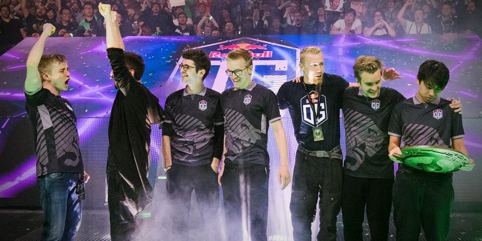
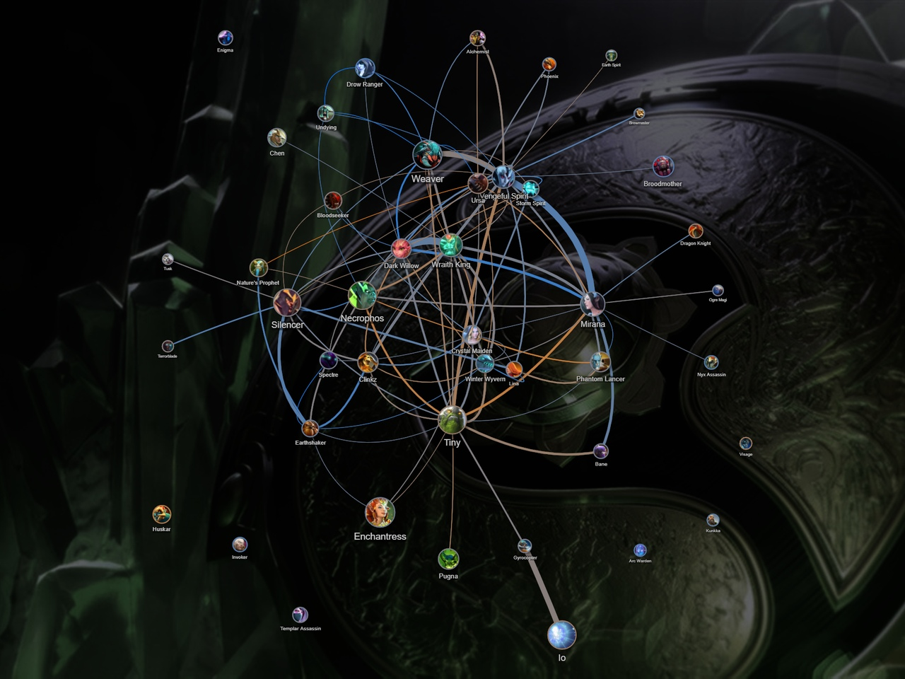

Published: https://vk.com/@spectraldota-the-international-2018-istorii-etogo-goda-analiz-mety-statis

---

# The International 2018: Истории этого года, анализ меты и 7.19b

Вот уже две недели как завершился главный турнир по Dota 2 в этом году — The International 2018 (*хотя изначально эта статья писалась сразу после завершения турнира*). Главной темой этого турнира стало сообщество: многочисленные вставки между матчами рассказывали о разных игроках в разных частях света, их буднях, проблемах и радостях. The International и без этого всегда объединял фанатов по всему миру и превращался в своего рода "Новый Год для дотеров", однако эта тема помогла многим почувствовать эту связь, понять, что они — часть одной большой семьи.

Помимо этого турнир многим запомнился и удивительной историей чемпионов. Для многих игроков было загадкой, кто же одержит победу в этом году: восточная команда, продолжая старую традицию, или же западная, разорвав порочный круг. Почти все прогнозисты ставили фаворитами Virtus.рro, лидеров соревновательного сезона, или PSG.LGD, сильнейшую команду Китая. Кто-то даже ожидал чемпионами Team Liquid, надеясь на защиту их титула. *Впрочем, мало кто смог угадать правильный ответ.*

Чемпионами этого года стала команда OG. Судьба коллектива была непростой: прямо перед квалификациями на TI из команды ушли два игрока, объяснив своё решение словами "В таком составе OG не выиграть". В кратчайшие сроки OG нашли новых игроков, после чего отправились на открытые квалификации, а следом и закрытые квалификации, и забрали себе место на турнире. Даже после этого никто не ждал от них хорошего исполнения. Даже когда они вышли в числе лидеров группового этапа, даже когда они прошли до финала по верхней сетке — многие не верили в их победу. История "тёмной лошадки", пробравшейся к вершине сквозь все возможные препятствия, мало кого оставила равнодушным: кто-то вдохновился успехами команды, кто-то до сих пор считает эту победу незаслуженной случайностью. Параллельно исполнение команд-фаворитов многих расстроило из-за высоких ожиданий. В этом нет ничего удивительного, однако многие также забывают, что 7-ое, 6-ое, 5-ое или, скажем, 3-е места — всё ещё достойный результат, учитывая уровень турнира. ~~Да, СНГ фанаты VP и EG, я смотрю на вас.~~

TI8 также запомнился шоу-матчами с OpenAI, продемонстрировавшими поразительный прогресс в развитии проекта, а также анонс двух новых героев: Grimstroke, вышедший сразу же в клиенте игры, и Mars, информация о котором была найдена в файлах игры относительно давно. Впрочем, это не произвело настолько же огромного эффекта, как анонс Monkey King, Dark Willow и Pangolier. Главное, чем запомнился этот The International — его игры, именно из-за них TI8 стал новым "лучшим TI", сместив на этом посту TI3.

## Мета

Хотя во многом этому поспособствовала история чемпионов и очень маленький разрыв по силе между командами (каждый коллектив в этом году был достаточно силён, чтобы игры было интересно смотреть), причины зрелищности были скорее в общей мете, чем в исполнении команд. Та же самая мета, которая вела к засилью серий со счётом 2-0 по ходу турнира, превращала игры в нечто очень интересное для зрителя и не менее интересное для самих же игроков. Хоть эта тема уже раскрывалась в другой статье, хочется более подробно расмотреть мету TI8.

Начать стоит с того, как на протяжении нескольких патчей игру склоняли в сторону "классической" расстановки по лайнам в виде 2-1-2. За последний год игра в целом во многом вернулась к истокам: начиная с мелочей, вроде ботинка за 500 или трёх танго, заканчивая упадком роумеров, двойными боковыми линиями и возвращением "соло мида". Это уже довольно сильно оказывало влияние на игру и меняла то, как она протекала на разных этапах. Стадия лайнинга из старательного баланса на линии превратилась в борьбу за второй уровень и установку доминирующей позиции (из-за чего баланс линии потерял какое-либо значение). Подобные изменения лайнинга сильно склонили игру к ранним дракам и во многих ситуациях ориентироваться на позднюю игру стало просто не выгодно. Итогом тому должна была стать популярность боевых предметов и соответствующих сборок: даже Arc Warden в последние месяцы, когда эта мета уже устоялась, стал чаще пропускать Hand of Midas и Boots of Travel, основные для героя предметы, и уходить в сторону Power Treads и Blade Mail.

Всё перечисленное выше повлияло на пул героев, которых тренировали игроки перед самим турниром. Эти же самые герои, которых можно было видеть в топе трендов рейтинговых матчей на ранге Immortal, в полном составе перекочевали в профессиональную мету TI8.

### Упадок керри

Многие классические "хард керри" герои находятся не в лучшем состоянии на данный момент, во многом из-за их ориентированности на позднюю игру и слабости в начале. В мете, где лидируют герои, доминирующие на линии, и участвующие в драках, герои вроде Anti-Mage и Luna не находят себе места. Juggernaut, казалось бы, должен себя чувствовать комфортно в подобных условиях, однако он не так хорош против двойных линий. Большинство популярных "классических" керри героев были пикнуты редко, а в некоторых случаях ситуация и вовсе поворачивалась в другую сторону: Sven, например, выиграл только те игры, в которых он был взят в качестве саппорта.

На фоне этого отлично себя чувствуют герои, которые хорошо справляются с двойными линиями, дерутся в начале, а также имеют высокую вариативность: Tiny, Ursa, Clinkz, Pugna, Weaver, Necrophos, Mirana, Bloodseeker, Wraith King, Vengeful Spirit. Их всех можно поставить на разные позиции (в некоторых случаях -- и вовсе на любую позицию), да и сами по себе герои хороши и на линиях, и в драках, и помимо прочего им не нужно много предметов, чтобы быть полезными или наносить много урона. К тому же, каждый из них был благословлен IceFrog.

На фоне этого не очень понятно, почему одним из самых популярных керри оказывается Spectre, однако ответ на этот вопрос достаточно очевиден: из всех классических керри героев Spectre больше всего приспособлена к отыгрыванию из отстающей позиции. Она всегда проигрывала линии и двойные линии в сложной почти всегда брались против Spectre. Для неё просто ничего не поменялось, так что когда от этого начали страдать все, а команды начали играть, отталкиваясь от этого, именно Spectre стала тем героем, который получил от этого наибольшее преимущество. Spectre всё также может драться с командой в начале и хочет это делать, имея при этом огромный потенциал в поздней игре чем может похвастаться далеко не каждый герой. Другой жадный герой, который получил достаточно внимания на TI8 — Arc Warden, однако его ситуация несколько любопытнее: по ходу турнира можно было наблюдать четыре разных способа собирать героя (а в реальности их и того больше), каждый из которых подстраивал героя под разные ситуации. Вариативность итембилдов героя позволила Arc Warden также найти своё место в мете.

Другими популярными керри стали Phantom Lancer, Terrorblade и Gyrocopter. Оба не являются достаточно сильными лейнерами, если сравнивать с самыми успешными героями турнира, однако их успешность является достаточно предсказуемой. Да, они слабы против сильного прессинга, но они, как и Arc Warden или Spectre, очень вариативны в своих сборках, а также могут достаточно рано начинать драться с командой, что делает их отличными кандидатами для пика в современной мете. К тому же, Phantom Lancer и Terrorblade также были благословлены IceFrog.

Конечно, возможно с патчем 7.19b мы увидим чуть больше классических керри в списке популярных героев. Возможно, Anti-Mage и Luna просто нуждаются в новом способе ими играть, который ещё никто не открыл. В играх на ранге Immortal в игру даже начал возвращаться Juggernaut, экспериментировать с которым начал Gorgc.

### Герои на "плюс один"

Другая сторона боковых линий — популярные саппорты, зачастую являющихся основой победы на линии. Самыми популярными подобными героями для "+1" стали Vengeful Spirit, Silencer, Crystal Maiden, Dark Willow, а также Grimstroke, но уже в пабах после завершения TI8. Идея достаточно простая: все эти герои хороши в раннем давлении, чего зачастую достаточно, чтобы "включить" своего кора и выбить ресурсы из оппонентов. Выбор героя в пару обычно зависит от общего плана на игру при выборе кора: Vengeful Spirit, например, лучше смотрится с корами, у которых нет надёжного дизейбла, но много "белого" урона (Mirana, Weaver), а Dark Willow хороша в паре с героем, которому не нужно усилять его урон и который может сделать достаточный сетап для дизейблов (Wraith King, Vengeful Spirit, Tiny) и так далее.

Также стоит отметить Io, исполнявшего подобную роль раньше, но нынче появляющегося почти исключительно в комбинации с Gyrocopter. Причиной тому вряд ли стал нерф Relocate (во всяком случае, многие опытные игроки на Io сошлись на том, что это изменение не так значимо, как может показаться), скорее всего из-за нерфа Spirits он стал выглядеть слабее на линии, нежели альтернативы.

### Центр старой школы

Из-за изменений, установивших новые правила на боковых линиях, игра на центральной линии превратилась в классическое противостояние "1 на 1" за редкими исключениями. Этому же способствуют другие изменения прошлых патчей: спуск на речку стал уже, вышки стали ближе к реке, а роумить стало просто неэффективно. Из-за этого вмешательства в "честное PvP" двух игроков на центре стали намного реже и обычно происходят только потому что на других линиях всё уж слишком хорошо. И даже в таких случаях вмешательство в ход игры на центре — вещь достаточно редкая.

Это повлекло за собой популярность героев, отлично стоящих 1 на 1, но страдавших в мете роумеров. Конечно, лучше всего себя показывают герои, которые длительное время получали баффы: Broodmother, Clinkz, Storm Spirit. Впрочем, есть и более любопытные в этом плане герои: Lina (35 матчей, 60% побед), Invoker (23, 69%; впрочем, стиль его игры также поменялся для соответствия мете: сначала он перестал собирать Hand of Midas и плавно перешёл к дешёвым статовым предметам, а потом и вовсе основная масса игроков переключилась на Quas-Wex билд), Arc Warden (7, 57%), Alchemist (23, 52%).

### Ща буит мясо

Самое интересное в современной мете — адаптация героев.

Эту тему я уже затронул вскользь чуть выше. Многие герои, которые традиционно были ориентированы на позднюю игру, были вынуждены адаптироваться к мете, в которой необходимо постоянно драться. Явно можно заметить повальную покупку Ring of Aquila на всех героях (связанную с дешевизной предмета, отличными характеристиками и огромной регенерацией маны) и отказ от Hand of Midas (из-за возросшего темпа игры). Интереснее всего наблюдать, как герои, традиционно ориентированные на позднюю игру, начинают выкручиваться и адаптироваться: Invoker, переключившийся на ингру через Quas-Wex и дешёвые предметы на статы, Arc Warden, переключившийся к покупке ранних статовых предметов и предметов для драки, сильно откладывающий или вообще отказывающийся от Hand of Midas, Spectre, зачастую откладывающая ранее модный Radiance "на 20" в пользу предметов для драки (начиная от Blade Mail, заканчивая Manta Style), а то и вовсе отказываясь от него.

Здесь же встаёт интересный вопрос: должна ли дота быть такой или же так не было задумано изначально? Во втором случае нас ждёт сильное изменение меты и возвращение "долгих" героев. В первом же -- многие герои будут вынуждены точно также адаптироваться: Anti-Mage придётся как-то найти способ не терять актуальности, но сильно отложить или вовсе опустить покупку Battle Fury, а слабые лейнеры, ориентированные на позднюю игру, будут вынуждены искать способы усилить свою раннюю игру (и, возможно, получать соответствующие баффы). Делать какие-либо выводы на этот счёт смысла мало: нужно ждать следующего крупного обновления, которое будет, скорее всего, с выходом Mars.

### Влияние 7.19b

Самым важным изменением пост-TI8 патча стало изменение формулы штрафа времени после выкупа: вместо 25% от оставшегося времени теперь добавляется всегда 25 секунд. Из популярных героев патча это сильнее всего ударило по Spectre: это именно тот герой, который практикует выкупы до поздней игры (потому что может присоединиться к драке с Haunt) и сильно страдает от увеличения таймера до воскрешения. Конечно, это также ударило по саппортам в целом, потому как они чаще пользовались ранними выкупами, Tinker и другим героям с возможностью оказаться снова в драке после выкупа. Впрочем, только Spectre после этого изменения потеряла до 4% побед на ранге Immortal.

Также изменения формулы штрафного времени могли коснуться и Necrophos. Впрочем, ему и без того изрядно досталось: в первую неделю патча 7.19b на ранге Immortal он потерял 4.8% побед.

Впрочем, кроме этого, мало что изменилось в мете, что в целом не удивительно для минорного обновления. Судя по процентам побед популярных героев, ослабление Spectre сильно сказалось на успехе героев, страдавших против неё: проценты побед ряда героев, ориентированных на ранние драки и доминирование в мидгейме, после патча подросли, в том числе и некоторые из тех героев, что получили ослабления в патче 7.19b. Впрочем, все эти изменения не сделали актуальных героев менее актуальными. Два героя, которые сильнее всех выделяются на общем фоне — Wraith King, занявший второе место по популярности на ранге Immortal и удерживающего 55.8% побед, а также Grimstroke, ставший самым выбираемым и самым запрещаемым среди всех героев.

### А где же моя статистика?

Данная статья не была изначально задумана как какой-то материал с кучей неинтересных чисел. Впрочем, на тему статистики TI8, а также патча 7.19 на ранге Immortal у меня уже были два материала, ссылки на которые будут располагаться в самом конце.

## Послесловие

Вообще этим материалом мне хотелось подвести своеобразную черту соревновательного сезона и меты, а так как анализ первого сезона Pro Circuit уже был, то стоило уделить внимание The International 2018.

Впрочем, не стоит думать, что на этом материалы, связанные с TI8 заканчиваются. Я ещё планирую сделать несколько переводов прекрасных статей с Reddit, разбирающих другие аспекты турнира и его статистики. Помимо этого, как уже упоминалось выше, вы можете ознакомиться и с другими материалами, включающими в себя статистику прошедших патча и турнира.

В последние две недели, к сожалению, я был совершенно неработоспособен, из-за чего этот материал и так задержался. Впрочем, волноваться не стоит: я снова в строю. В ближайшие пару месяцев вас также может ждать один очень любопытный анонс, ну а пока же — в новый соревновательный сезон с новыми идеями. Нас ждёт много работы

— *Илья «Leamare» Силаков*

Прочие материалы:

- Immortal Rank Meta Trends — 7.19 Edition — https://www.reddit.com/r/DotA2/comments/9cskst/immortal_rank_meta_trends_719_edition/
- The International 2018 Stats and Trends — https://www.reddit.com/r/DotA2/comments/9amzvb/the_international_2018_stats_and_trends/
- Pro Circuit Season 1 stats — https://www.reddit.com/r/DotA2/comments/8qa662/pro_circuit_season_1_stats/
- Полный отчёт с статистикой патча 7.19 на ранге Immortal — https://spectralalliance.ru/reports/?league=imm_ranked_719
- Обновляемый отчёт с статистикой патча 7.19b на ранге Immortal — https://spectralalliance.ru/reports/?league=imm_ranked_719b
- Полное собрание отчётов, связанных с The International 2018 — https://spectralalliance.ru/reports/?cat=ti8