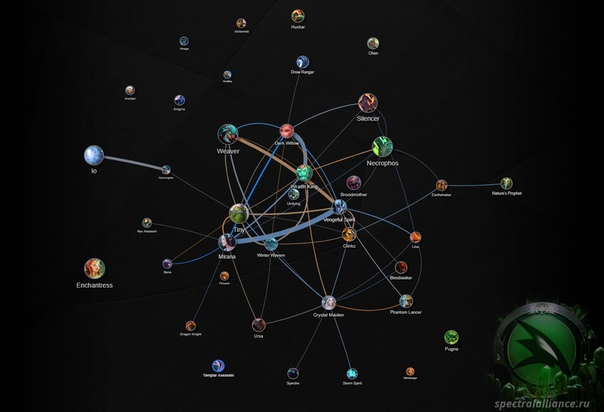
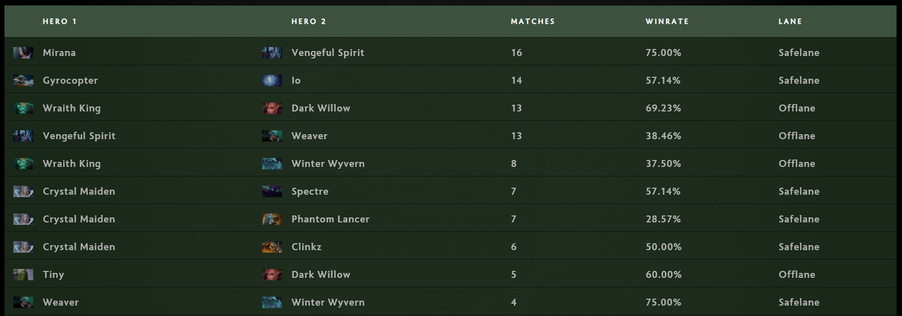
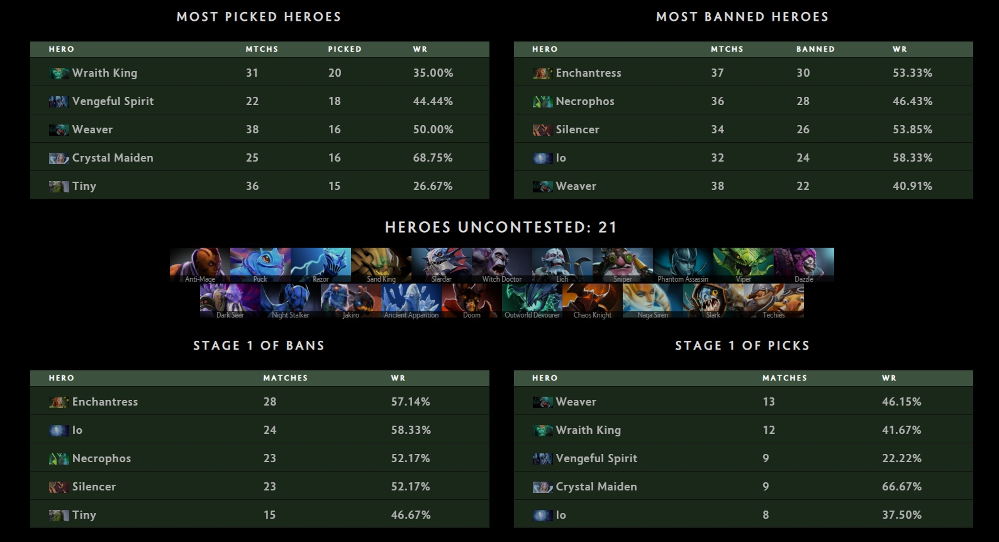
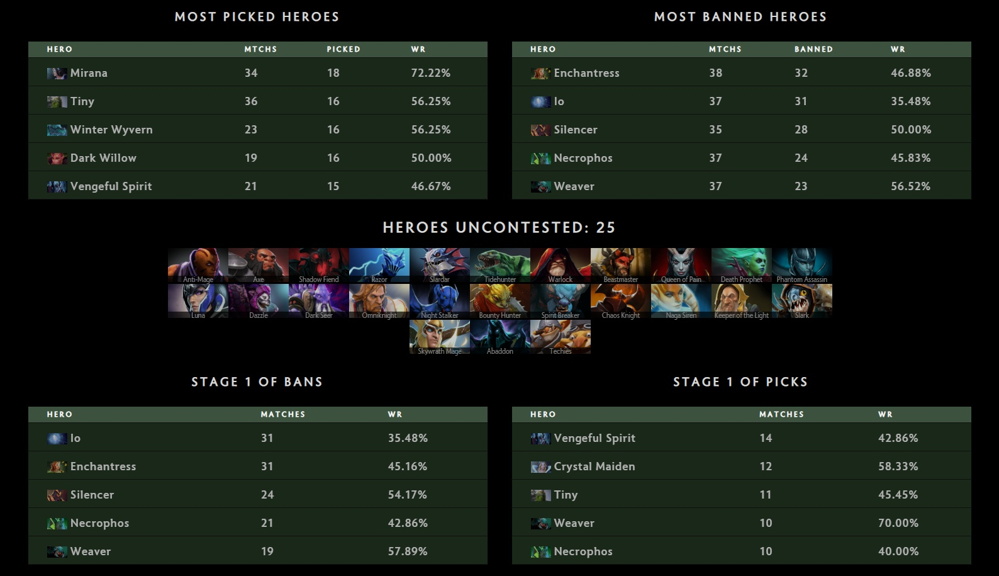
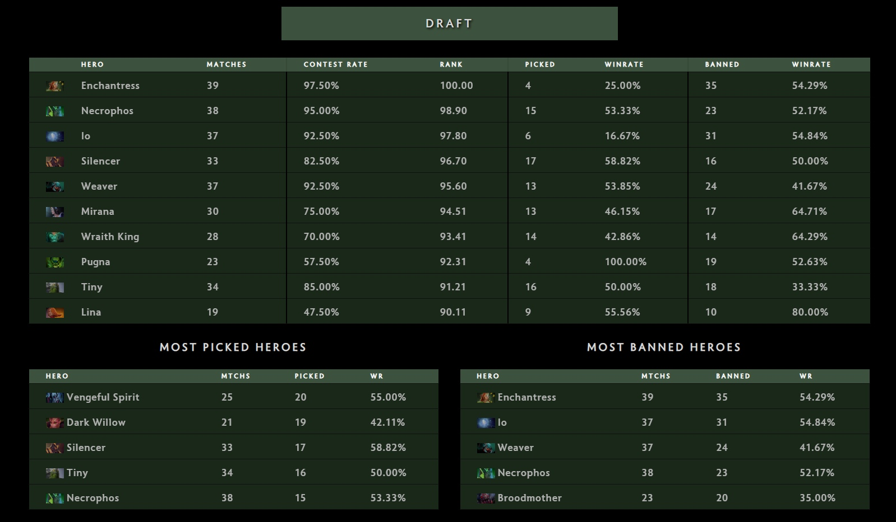
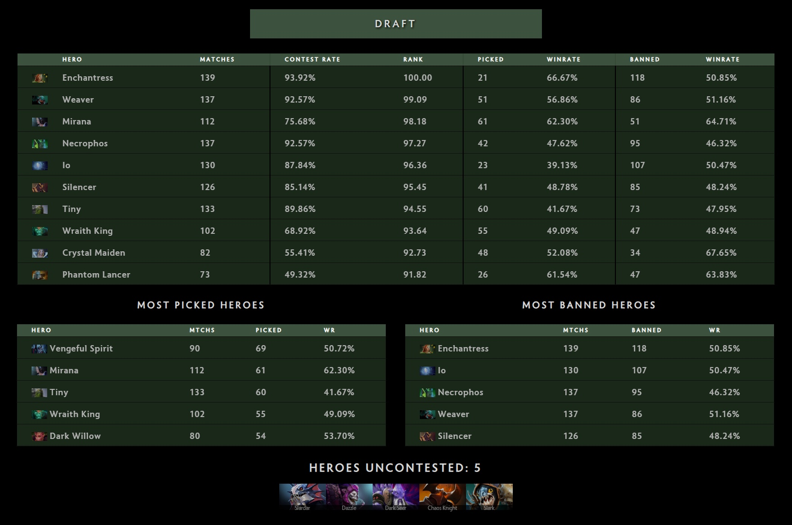

Published: https://vk.com/@spectraldota-ti8-obzor-mety-gruppovogo-etapa

---

# TI8: Обзор меты группового этапа

Завершился групповой этап The International 2018, а значит настало время немного пробежаться по данным, которые я собрал.

По просьбе товарища, помимо основного отчёта в тестовом хабе появились отчёты по каждому отдельному дню (а также итоговый отчёт по всему групповому этапу). Вы можете их найти по ссылке в конце статьи, пока же отмечу, что они потом переедут в основной хаб. Сейчас же они послужат материалом для небольшого анализа.

Основной темой последнего года стало сдвижение игры к старым геймплейным элементам из DotA All-Stars. Это отметили многие с возвращением вещей "как в первой доте" (вроде 3 танго или ботинка за 500), но что было не так заметно, так это сдвиг меты к более статичным линиям 2-1-2. Это произошло по ряду причин: гангать центральную линию стало значительно сложнее, руны богатства появлялись теперь каждые 5 минут и стали даввть сильно меньше, стоять на сложной линии стало невыносимо сложно. И если в прошлый год (и ещё год до этого) мы чувствовали себя замечательно с метой 2-1-1-1 (где один герой с первого уровня собирал руны и/или гулял по линиям), а ещё раньше классикой считался лайнап 3-1-1, то сейчас и тройные линии не так эффективны сами по себе, и оффлейн из-за этого страдает. Лайнап 2-1-2 в таком случае позволяет "включить" две линии сразу, а заодно и "надавить" на противника.

Это привело к нескольким неожиданным последствиям. Во-первых, многие "роумеры" начали переквалифицироваться в керри или оффлейнеров. Во-вторых, игра на "лёгкой линии" стала очень сложной и начала сводиться к "терпи и не слишком много умирай". Как следствие этого, изменились и цели на стадии лайнинга: если ранее было важно держать баланс линии как можно ближе к себе, то теперь он потерял ключевое значение, а на первый план вышло получение второго уровня раньше оппонентов, чтобы впоследствии "отвоевать" линию назад. Главным же результатом такого подхода стала смена идеи оффлейнеров: если раньше это были герои, которые давали много пользы команде, зачастую за счёт инициации или каких-либо полезных способностей, а также могли обходиться малым количеством фарма или могли фармить лес, то сейчас ситуация обстоит иначе.

> Самые популярные связки на линии по итогам группового этапа — https://spectralalliance.ru/reports/?league=ti8&mod=heroes-combos-lane_combos

Новый порядок линий в большинстве случаев можно описать следующим образом: в качестве керри на лёгкую линию, вместе с саппортом пятой позиции, отправляется герой, который ориентирован на более позднюю игру (хотя грань тут может зачастую стираться), на центре – более-менее самостоятельный кор, но чувствительный к уровням, а на сложной – ещё один керри, но ориентированный на сильную линию или среднюю игру, в паре с саппортом-четвёркой, который зачастую может быть одним из тех героев, которых мы привыкли видеть в качестве оффлейнеров ранее. Подобные стратегии уже довольно часто были актуальны на ранге Immortal в рейтинговых матчах, в частности пары героев вроде Axe + Skywrath Mage, Crystal Maiden + Ursa, Vengeful Spirit + Ogre и подобные. По схожим причинам, помимо прочих баффов, поднялась Spectre: герой, который практически всегда проигрывал линию и сталкивался с подобным давлением, но имеющий встроенные механики для возвращения в игру, почувствовал все эти изменения меты меньше всех прочих подобных героев.

Вся эта мета рейтинговых игр последних патчей перекочевала и на TI8. Первый день взорвался статегией с Wraith King на третьей позиции – настолько эффективной, что её начали повторять все команды, даже если они не тренировали её и не умели с ней играть (что на общем фоне быстро привело к падению процента побед Wraith King с 100% за 7 матчей до 35% к концу первого игрового дня. С такой силой пришлось считаться, из-за чего герой быстро стал одним из самых пикаемых героев на первой стадии, а также стал одним из самых востребованных героев всего группового этапа: 55 пиков с 49% побед (все в первой стадии) и 47 банов. Также не стоит и забывать о связке Wraith King + Dark Willow (19 матчей и 58% побед). Помимо того, что Dark Willow комфортно себя чувствует на сложной линии и любит давить оппонентов, Wraith King любит подобную компанию. Ну а его присутствие на третьей позиции не только открывает возможность для присутствия в игре дополнительного "лейтового" кора, но также и заставляет противников выбирать в драке, что они хотят сделать. Wraith King в любом случае имеет достаточно много урона из-за своих способностей, он в любом случае будет полезен в драке, он в любом случае будет усилять всю команду своим присутствием. Если бы он был героем первой позиции, вопрос траты на него ключевых способностей даже не возникал, но в данном случае на героя третьей позиции не хочется тратить ключевые способности (ведь иначе драка будет проиграна), но в таком случае подобная цель будет умирать слишком долго. В конечном итоге, как выразился один из англоязычных кастеров, "Либо ты убиваешь Wraith King, но за это время умирает вся твоя команда, либо ты его не убиваешь, но вся твоя команда умирает". Добавим сюда ещё и недавние баффы самого героя, в итоге получаем страшного монстра, с которым тяжело воевать.

> Герои первого дня группового этапа

Ещё подобными связками, начавшими укреплять свои позиции уже во второй день, стали Mirana + Dark Willow и Mirana + Vengeful Spirit. Mirana, как и Wraith King, получила несколько сильных баффов, но не могла найти своё место в мете и игре в целом. Подобный сдвиг меты в сторону пары "мидгейм кор + сильный на линии саппорт" в сложной позволил включиться и этому герою, да ещё как: к концу группового этапа Mirana стала также одним из самых пикаемых героев (61 пик, 62% побед, а также 51 бан). Тут же можно вспомнить и возвращение Tiny. Впрочем, не только сложные линии хороши своими связками. На лёгкой линии можно выделить пары Crystal Maiden + Spectre (7 матчей, 57% побед), Gyrocopter + Io (15 матчей при ожидаемом количестве матчей около 2, 53% побед).

> И герои второго дня группового этапа

В подобных стратегиях многие хорошие саппорты (зачастую даже с выходом в дополнительного кора), получавшие ранее баффы, начали набирать популярность. Так вспомнились и Vengeful Spirit (69 пиков, 51% побед), и Ogre Magi (13 пиков, 62% побед), и Silencer (41 пиков, 49% побед), а в качестве подобных "мидгейм-утилити-коров" – Necrophos (42 пика, 48% побед), Enchantress (21 пик, 67% побед и 118 банов), Weaver (51 пик, 57% побед, 86 банов), озвученные ранее Tiny, Mirana, Wraith King, Ursa.

К слову, стоит отметить Broodmother, выделяющуюся на общем фоне героев на центральной линии. Помимо гибкоти героя в плане выбора линии, она также является одним из сильнейших героев в противостоянии 1 на 1, из-за чего герой стал одним из самых востребованных и страшных на всём групповом этапе.

В то время, как топы банов каждый день практически не менялись, самые популярные герои для пика устаканились лишь к последнему дню. Как уже было сказано ранее, первый день был полностью захвачен Wraith King, в компанию к которому заскочили Weaver, Vengeful Spirit, Crystal Maiden и Tiny. На второй день группового этапа популярность Wraith King сильно поугасла, во многом из-за того, что его чаще начали запрещать, ну а общий топ героев немного сдвинулся из-за появления новых героев: Mirana, Winter Wyvern и Dark Willow.

> Третий день группового этапа

Пики третьего дня также немного отличались: первое место заняла Vengeful Spirit, следом укрепилась Dark Willow, однако далее последовал Silencer, который до этого чаще уходил в бан, уже знакомый Tiny, а на закуску – Necrophos. Стоит также отметить, что большинство перечиленных героев (каждого дня) уходят на первой стадии драфта. К концу четвёртого дня уже выявились лидеры меты, которые так или иначе были популярны в какой-то из дней: Vengeful Spirit, Mirana, Tiny (единственный был в топе пиков каждый день), Silencer и Wraith King.

>  Самые востребованные герои за весь групповой этап

Хоть мета и, судя по всему, уже устоялась, стоит отдать должное: в такой мете многие герои могут найти себе место, причём для них это будет значительно проще, чем раньше. В подтверждение этому можно отметить и количество задействованных героев (109 героев побывали в пике), причём лишь 13 героев имеют меньше 2 матчей. Более того, подобная расстановка линий также способствует гибкости героев: за последние дни мы успели увидеть и Winter Wyvern третьей позиции, и Weaver на 1, 3 и 4 позициях, и керри Riki. Впрочем, вряд ли нас кто-то уже удивит чем-то кроме пика Techies: уже за групповой этап мы успели увидеть почти всех героев, как они работают, а также понять, почему они работают.

## Матчи

В качестве же завершения хотелось бы перечислить самые интересные матчи каждого дня с необычными стратегиями или рекордами

#### День 1

- Кровавая баня - Матч [4061952570](https://dotabuff.com/matches/4061952570/) — OG против Team Liquid
- Щемление дня - Матч [4061742840 ](https://dotabuff.com/matches/4061742840/)— Fnatic против Team Liquid со счётом 39-1

#### День 2

- Самый длинный матч с самым крупным камбеком дня и самым большим суммарным количеством убийств - Матч [4063266100 ](https://dotabuff.com/matches/4063266100/)— Fnatic против Mineski
- Матчи [4063600107](https://dotabuff.com/matches/4063600107/), [4063490254](https://dotabuff.com/matches/4063490254/), [4063413580](https://dotabuff.com/matches/4063413580/), [4063266100](https://dotabuff.com/matches/4063266100/), [4063131418](https://dotabuff.com/matches/4063131418/) — Оффлейн кор Winter Wyvern от paiN.tavo, Serenity.XinQ, VP.9pasha, Fnatic.Universe и снова paiN.tavo соответственно
- Support Sven от VGJ.S.MSS- — Матч [4063600107](https://dotabuff.com/matches/4063600107/)

#### День 3

- Support Wraith King от KuroKy — Матч [4065260154](https://dotabuff.com/matches/4063600107/)

#### День 4

- “Как законтрить паукана” — Матч [4066517897](https://dotabuff.com/matches/4066517897/) - VP против VG
- “Как надо бить башенки” — Матч [4066926568](https://dotabuff.com/matches/4066926568/) - Secret против Newbee
- Support Ursa и 672 крипа у Sccc — Матч [4066822873](https://dotabuff.com/matches/4066822873/) - Secret против Newbee
- Riki от Miracle- — Матч [4066775838](https://dotabuff.com/matches/4066775838/)

## Дополнительно

- Support Ursa от Newbee.kaka и VG.LaNm — Матчи [4063667075](https://dotabuff.com/matches/4063667075/), [4066517897](https://dotabuff.com/matches/4066517897/), [4066822873](https://dotabuff.com/matches/4066822873/) и [4066823822](https://dotabuff.com/matches/4066823822/)

Не забудьте поделиться этой статьёй в VK и рассказать о нашей группе!

---

**Сайт Spectral Alliance**: https://spectralalliance.ru/

**Группа VK**: https://vk.com/spectraldota

**Основной отчёт TI8**: https://spectralalliance.ru/reports/?league=ti8

**Immortal Rank Meta Trends — 7.19**: https://spectralalliance.ru/reports/?league=imm_ranked_719

Спасибо Speedy Gonzales за подписку на Patreon — подобная поддержка помогает нам продолжать работу.