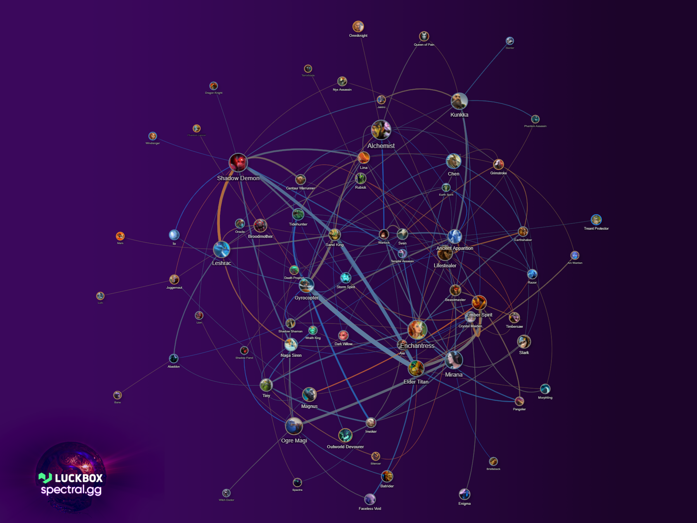
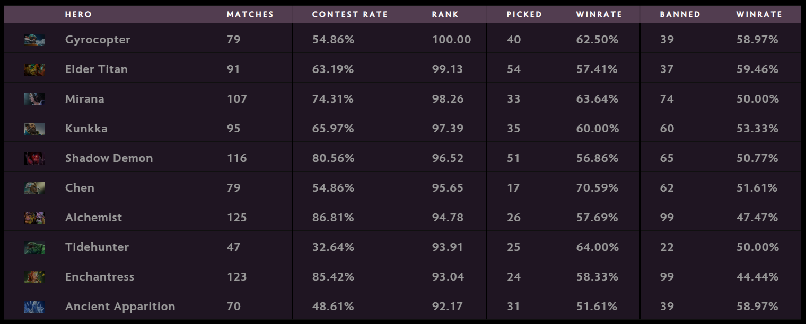
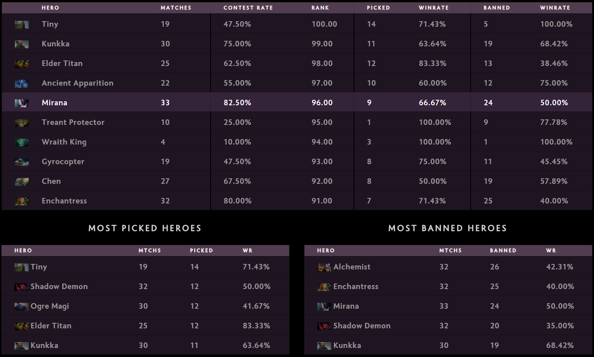
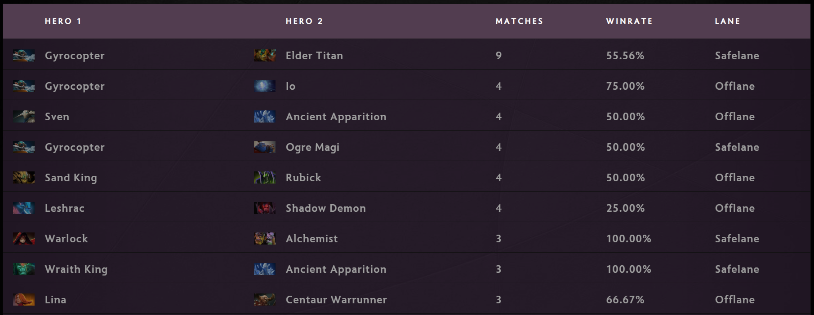

Published:

---

# Group Stage Review TI9

Madness of the TI Group Stage has ended and the dust has settled. Now we have a great time to look back and see what the meta of TI9 looks like.

Main idea of matches didn’t change too much, comparing to competitive meta trends of the past months. However, active hero pool has changed. It was possible to predict those changes, I guess: a lot of these trends were either mentioned in our Ranked Meta Trends reports for patches 7.22e and 7.22f or could be briefly seen in the stats. But it’s not TI if there are no surprises.

The main theme of TI9 is Alchemist, as well as heroes who can confront or accompany him. The hero became the most banned (which is rare to see for a position 1/2 hero), holding at high win rate mark as well: 57.69% wins in 26 matches with 99 bans.

Alchemist popularity gave additional boost to three already strong heroes: Enchantress (58.33% wins in 24 matches with 99 bans), Ancient Apparition (51.61% wins in 31 matches with 39 bans) and Shadow Demon (56.86% wins in 51 matches with 65 bans). There are also some other heroes who start accelerating relatively early and who require some kind of intervention to their early game (which, just like in Alchemist’s case, may be extremely hard to do). We already saw some Naga Siren (15, 60%), Medusa (6, 66.7%) and Templar Assassin (12, 66.7%).

Before TI the go-to carry heroes were Sven and (a little bit) Ember Spirit. While still being viable picks, they fade compared to the new challenger who, traditionally, becomes popular at TI – Gyrocopter. The hero was rare to see picked without Io during this Pro Circuit season (and sometimes Gyro wasn’t contested at all, aside from being picked with Io). This time it’s a bit different: while Io was picked only 10 times (and won 7 games) and banned 21 times, Gyrocopter holds fourth place in picks and is relatively successful with 62.5% wins over 40 matches (and having 39 bans).

Ogre Magi is another interesting addition of TI9. The hero was already briefly seen as one of the most interesting trends of the late 7.22f meta. At TI, however, he started dominating in picks since day one, taking the “universal” hero niche and being effectively the aura carrier (or “the walking items wardrobe”). It’s hard to say Ogre Magi is successful: the hero has only 45.1% wins over 51 matches with 50 bans. However, the hero is still extremely useful and fits a lot of lineups, which may be the reason of his low win rate.

> Day 1 draft stats

It’s worth to mention that meta didn’t really change that much after the first day. The main additions to appear later on are Mirana and Tiny during the third day of the group stage.

> Day 3 draft stats

## Combos

A lot of lane combos (as well as hero combos in general) are pretty much the same as in the end of the competitive season. The most interesting additions of TI9 meta are probably combos based around Elder Titan, who is also one of the most interesting heroes of the tournament as well. It seems like the hero is capable of fitting most of lineups and strategies, while also being extremely useful at any stage of the game.

> Lane combos

## What’s next?

The meta isn’t going to change a lot going into the Main Event. However, we, probably, won’t see that much of Alchemist, Elder Titan, Shadow Demon, Enchantress and Chen. With the bans list settled and as diverse meta in which there are only two heroes (Riki and Night Stalker) are uncontested, it’s worth hoping to see some new ideas based around this meta specifically, like Carry Io or Midlane Core Earth Spirit.

However, in meta that values interrupting opponent’s initial acceleration the most successful teams are going to be the ones who focus on map control in their strategies. It may also lead to the rise of “anti-carry” heroes, like Legion Commander or Timbersaw. Enchantress an Ancient Apparition are fitting this category as well, but these cards were already played and became too obvious to allow them to be played.

---

And for the desert I’d like to share the Editor’s Pick of the most interesting matches of the Group Stage too look over.

## Day 1

* Stomp of the day (50k gold) – 2nd match of Fnatic vs Vici Gaming – [4968187584](https://dotabuff.com/matches/4968187584)
* The biggest comeback (23k gold) – 2nd match of KEEN Gaming vs TNC Predator – [4967655141](https://dotabuff.com/matches/4967655141)
* The longest game (1:22:14) – 2nd match of Evil Geniuses vs Natus Vincere – [4968150000](https://dotabuff.com/matches/4968150000)
* Megacreeps comeback – 1st match of Alliance vs Team Secret – [4967602648](https://www.dotabuff.com/matches/496760264)

## Day 2

* Arteezy rampage as Lifestealer – 2nd game of Evil Geniuses vs Vici Gaming – [4969903576](https://www.dotabuff.com/matches/4969903576)
* Crazy slaughter between Virtus.pro and Natus Vincere – [4969499647](https://www.dotabuff.com/matches/4969499647) + [4969405346](https://www.dotabuff.com/matches/4969405346)

## Day 3

* Flawless performance by YawaR as Anti-Mage – 2nd match of Alliance vs Newbee – [4970923784](https://dotabuff.com/matches/4970923784)
* The longest match (1:26:28), the biggest comeback of the day (19.6k) and all-time TI hero damage record (128k) – 2nd match of TNC Predator vs Chaos – [4971343154](https://dotabuff.com/matches/4971343154)
* Bloodbath with 82 total kills – 1st match of Team Liquid vs KEEN Gaming – [4971602368](https://www.dotabuff.com/matches/4971602368)

## Day 4

* Bloodbath with 82 total kills and 104k hero damage Enchantress – 1st match of Team Liquid vs TNC Predator – [4973040677](https://www.dotabuff.com/matches/4973040677)
* Comeback of Virtus.pro in a match against Evil Geniuses – [4972964911](https://www.dotabuff.com/matches/4972964911)
* And another Virtus.pro comeback, but against Fnatic – [4973234250](https://www.dotabuff.com/matches/4973234250)