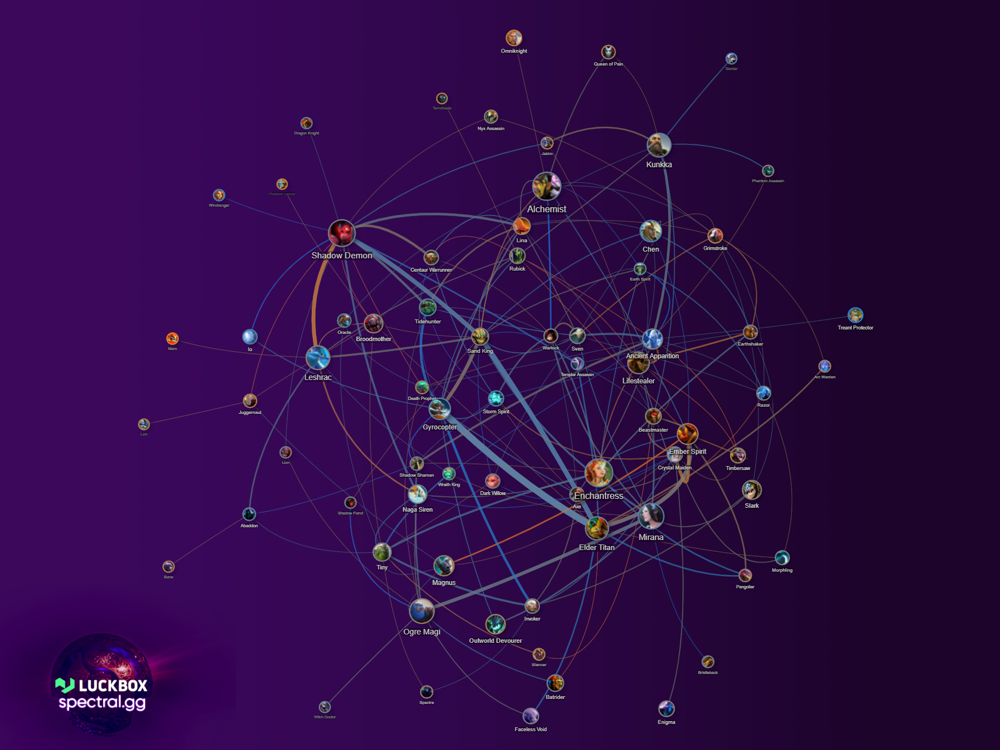
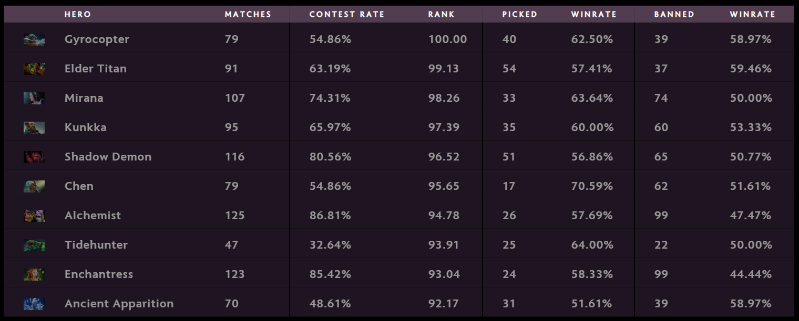
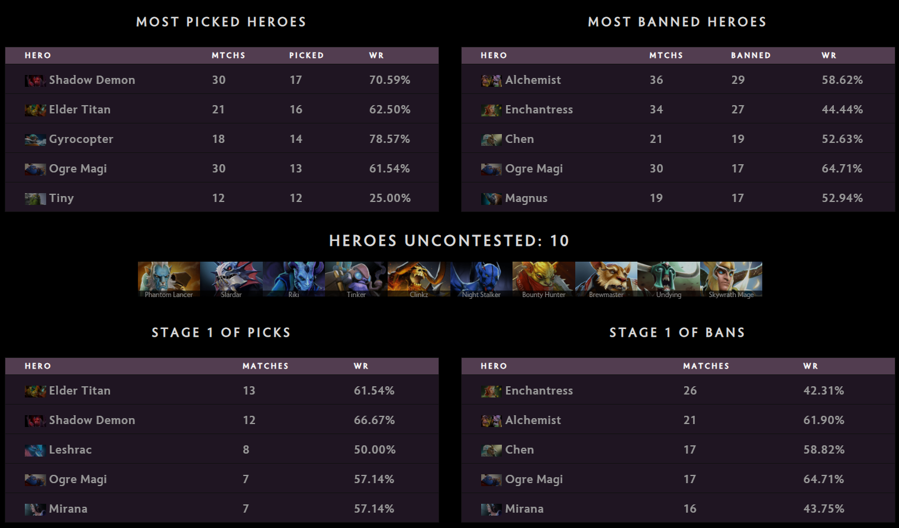
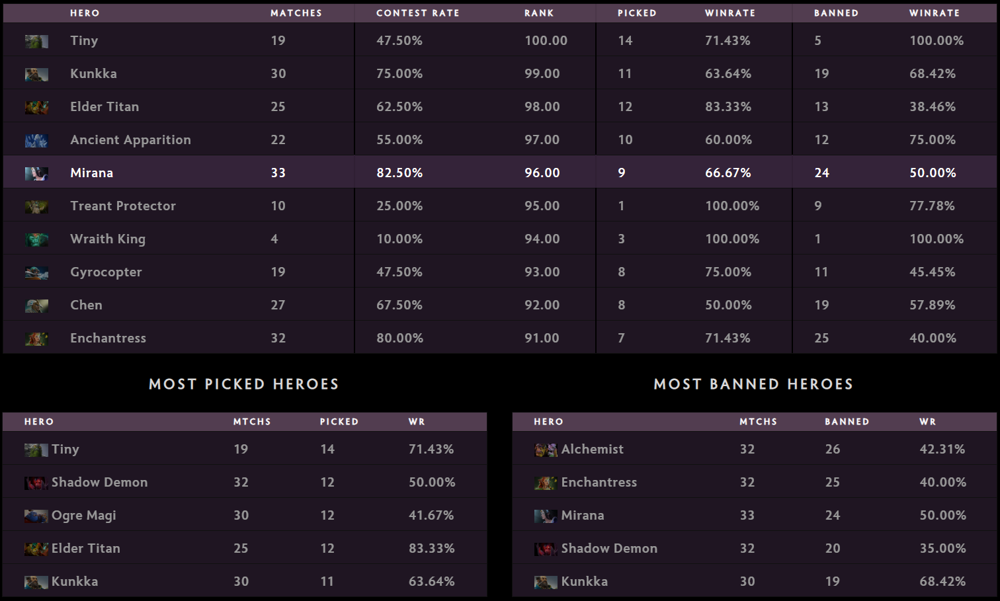
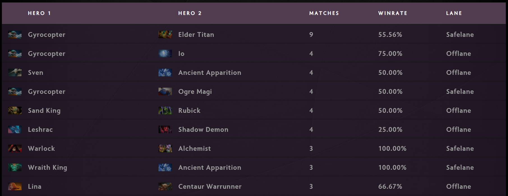
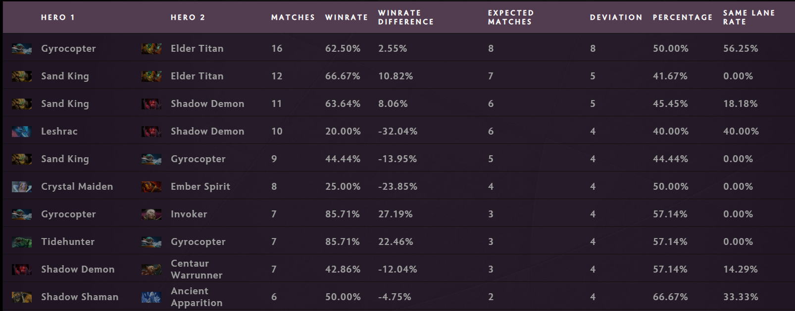

Published:

---

# Group Stage Review TI9

Пыль безумного группового этапа наконец улеглась и, наконец, мы можем сделать взгляд назад и посмотреть, какой стала мета TI9.

Основное направление игр не сильно изменилось по сравнению с соревновательной метой в последние месяцы, да и год назад тоже. Однако, само собой, изменился пул актуальных героев. Пожалуй, предугадать, что так получится, можно было уже глянув на отчёты по мете на ранге Immortal: многие из наработок уже успели активно всплывать (и о них уже была речь в материалах с анализом патчей 7.22e и 7.22f). Впрочем, стоит признать, без сюрпризов всё же не обошлось.

Главным мотивом этого TI стал Alchemist, а также герои, способные ему противостоять или хорошо работающие с ним в паре. Этот герой стал самым запрещаемым, что достаточно большая редкость для героев второй позиции, удерживая при этом достаточно высокий процент побед: 57.69% побед за 26 матчей и 99 запретов.

Популярность Alchemist дала дополнительный толчок популярности трём сильным героям: Enchantress (58.33% побед за 24 матча и 99 запретов), Ancient Apparition (51.61% прбед за 31 матч, 39 запретов) и Shadow Demon (56.86% побед за 51 матч и 65 запретов). Вместе с этим в игру подключились и некоторые герои, которые достаточно быстро начинают разгоняться и которым необходимо активно мешать: как и в случае с Alchemist, как оказалось, зачастую это достаточно тяжело сделать. Так мы успели увидеть и Naga Siren (15, 60%), и Medusa (6, 66.7%), и Templar Assassin (12, 66.7%). 

До TI самым метовым керри можно было легко назвать Sven и, пожалуй, Ember Spirit, однако на TI их популярность и успехи меркнут перед другим героем, которого традиционно вспоминают во время TI – Gyrocopter. По ходу соревновательного сезона (да и в рейтинговых матчах) герой редко появлялся без сопровождения в виде Io (а то и вовсе не выбирался, если Io был в бане), но в этот раз картина совсем иная. В то время как Io был выбран 10 раз (и выиграл 7 игр), а также запрещён 21 раз, Gyrocopter занимает четвёртое место по количеству пиков. При этом герой также остаётся довольно успешным: 62.5% побед при 40 пиках (и ещё 39 банов).

Ещё одним интересным открытием этого TI стал оффлейн Ogre Magi. Он также был одним из интересных трендов в рейтинговых матчах 7.22f, но проявился достаточно поздно. На TI, впрочем, как и Gyrocopter он уже с первого дня начал своё шествие по турниру заняв нишу “универсального” героя и вешалки для предметов. Нельзя сказать, что Ogre Magi был очень успешен: 45.1% побед за 51 матч и 50 запретов. Впрочем, это не отменяет универсальности героя и удобства его пика во множестве различных ситуаций, что во многом и влияет на его успешность.

> Статистика драфтов по первому дню группового этапа

Стоит отметить, что мета не сильно изменилась с первого игрового дня. Главными изменениями стали активное появление Mirana и Tiny во время третьего игрового дня.

> Статистика драфтов за третий игровой день

## Комбинации

Многии комбинации героев на линиях (как и комбинации героев в целом) остались примерно теми же, что и в конце соревновательного сезона. Новыми интересными дополнениями, впрочем, стали пары с Elder Titan, также ставшим открытием для этого турнира. Как оказалось, этот герой прекрасно способен списаться в множество стратегий, оставаясь при этом полезным на любой стадии игры.

> Комбинации на линиях

## Что можно ждать дальше?

С переходом к основной части турнира мета вряд ли кардинально изменится. Впрочем, мы уже вряд ли будем активно видеть Alchemist, Elder Titan, Shadow Demon, Enchantress и Chen. С устоявшимся костяком банов и столь разнообразной метой, в которой лишь два героя (Riki и Night Stalker) остались невостребованными, можно надеяться на более активное появление новых идей, эффективно работающих в рамках данной меты, вроде керри Io или мидового Earth Spirit. Однако в мете, где так сильно ценится способность помешать противнику получить начальный разгон, скорее всего всё более успешными станут команды, делающие большой акцент на контроль карты в своих стратегиях. Также может случиться и расцвет “антикерри” героев, вроде Legion Commander или Timbersaw (Enchantress и Ancient Apparition также попадают в эту категорию, но эти карты уже слишком очевидны и вряд ли будут разыграны).

---

А на сладкое – хотелось бы перечислить самые интересные матчи каждого дня с необычными стратегиями или рекордами.

## День 1

* Щемление дня (50 тысяч золота) – Вторая игра Fnatic vs Vici Gaming – [4968187584](https://dotabuff.com/matches/4968187584)
* Самый крупный камбек (23 тысячи золота) – Вторая игра KEEN Gaming vs TNC Predator – [4967655141](https://dotabuff.com/matches/4967655141)
* Самая долгая игра (1:22:14) – Вторая игра Evil Geniuses vs Natus Vincere – [4968150000](https://dotabuff.com/matches/4968150000)
* Камбек против мегакрипов – Первая игра Alliance vs Team Secret – [4967602648](https://www.dotabuff.com/matches/496760264)

## День 2

* Буйство от Arteezy на Lifestealer – Вторая игра Evil Geniuses vs Vici Gaming – [4969903576](https://www.dotabuff.com/matches/4969903576)
* Безумная заруба Virtus.pro и Natus Vincere – [4969499647](https://www.dotabuff.com/matches/4969499647) + [4969405346](https://www.dotabuff.com/matches/4969405346)

## День 3

* Безупречное исполнение от YawaR на Anti-Mage – Вторая игра Alliance против Newbee – [4970923784](https://dotabuff.com/matches/4970923784)
* Самый долгий матч (1:26:28), самый большой камбек дня (19.6k) и рекорд урона по героям на TI (128k) – Вторая игра TNC Predator vs Chaos – [4971343154](https://dotabuff.com/matches/4971343154)
* Кровавая баня с 82 убийствами в сумме – Первая игра Team Liquid vs KEEN Gaming – [4971602368](https://www.dotabuff.com/matches/4971602368)

## День 4

* Кровавая баня с 82 убийствами в сумме, Enchantress с 104к урона по героям (рекорд дня) – Первая игра Team Liquid против TNC Predator – [4973040677](https://www.dotabuff.com/matches/4973040677)
* Безумный камбек Virtus.pro против Evil Geniuses – [4972964911](https://www.dotabuff.com/matches/4972964911)
* И ещё один камбек Virtus.pro, но уже против Fnatic – [4973234250](https://www.dotabuff.com/matches/4973234250)