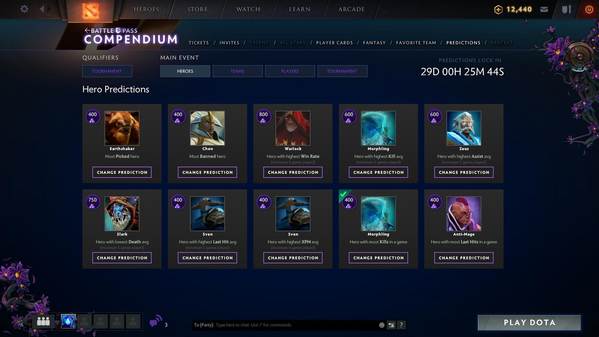
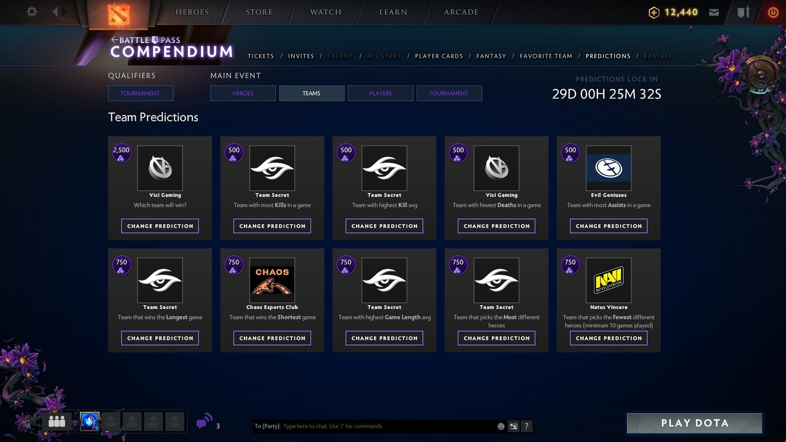
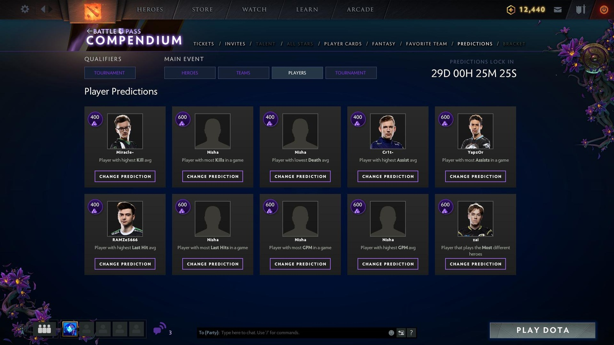
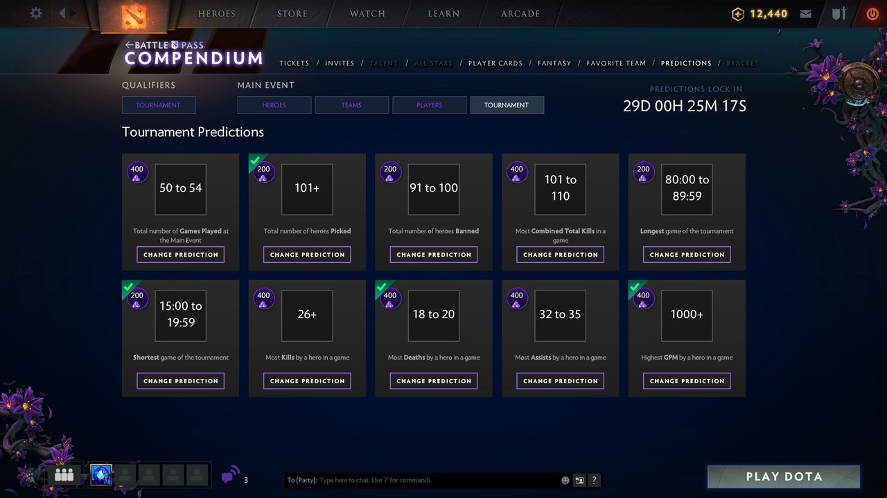

Published: 

---

# И ещё раз про прогнозы — TI9 Edition

Все уже, конечно, видели мои предикшены в компендиуме, которые я сделал месяц назад. С тех пор я их не менял, но господа-товарищи с Luckbox попросили написать очень подробно о том, почему я сделал такие выборы, какие есть альтернативы, а заодно сделали [компиляцию предсказаний от медийных личностей](https://luckbox.com/esports-news/article/ti9-battle-pass-predictions?tags=dota-2,ti9).

Ну а ниже будут подробные объяснения моих предсказаний, потому что почему бы и нет (спойлер: в основном всему виной статистика). И передейте большой привет Косте «Kelson», он всю мою дичь перевёл на великий и могучий.

## Герои

### Наиболее выбираемый герой

**Мой выбор:** Earthshaker

**Альтернативы:** Grimstroke, Sand King, Spirit Breaker

Наиболее часто выбираемым героем обычно становится тот, кто очень полезен в разных сценариях, а это, как правило, четвёртая позиция. Обычно больше всего пиков доставалось Grimstroke, что сделало его самым популярным саппортом сезона. Впрочем, популярность и процент побед этого героя значительно уменьшились за последние несколько месяцев. При этом Earthshaker кажется очень уверенным выбором, плюс к этому он обычно довольно популярен во время TI.

### Наиболее запрещаемый герой

**Мой выбор:** Chen

**Альтернативы:** Io, Spirit Breaker

На данный момент Chen является, по сути, тем же, чем был Io на предыдущих TI. Несмотря на то, что Io всё ещё остается довольно устрашающим героем в соревновательной Доте, его всё же очень много нерфили в последние месяцы, тогда как Chen, после того, как его переработали, кажется, полностью занял нишу Io. Я не вижу Io в качестве победителя этой номинации, да и по статистике Chen ­– лучший кандидат в этой категории.

### Герой с наивысшим процентом побед

**Мой выбор:** Warlock

**Альтернативы:** Broodmother, Arc Warden, Visage

Лучшими в этой категории обычно оказываются «грязные» герои. Но не стоит забывать очень важную деталь: герой должен быть пикнут не меньше 5 раз. Да, альтернативные варианты появятся хотя бы раз, но я всё ещё не до конца уверен, что они будут пикнуты достаточно, чтобы учитываться в категории. Можно подойти с другой стороны и выбрать просто хорошего героя, который с большей долей вероятности будет побеждать в большинстве игр, при этом не появляясь слишком уж часто. Warlock кажется неплохим выбором, но, конечно, далеко не идеальным. В этом отношении довольно сложно предсказать, кто же станет лучшим.

### Наибольшее количество убийств в среднем

**Мой выбор:** Morphiling

**Альтернативы:** Clinkz, Templar Assassin, Storm Spirit, Ursa

По статистике Morphiling – лучший выбор в этой категории и, скорее всего, он будет появляться достаточно часто. Другие распространенные варианты в этой категории – ожидаемо, герои-убийцы, у которых могут возникнуть проблемы, чтобы быть пикнутыми достаточное количество раз.

### Наибольшее количество помощи в среднем

**Мой выбор:** Zeus

**Альтернативы:** Clinkz, Templar Assassin, Storm Spirit, Ursa

Здесь та же идея, что и в прошлой категории. В последние месяцы Zeus – довольно частый пик, как на среднюю линию, так и на 4 позицию. Поэтому не станет сюрпризом, что Zeus будет выбран достаточное количество раз и при этом наберёт свои сладенькие ассисты. С другой стороны, Spirit Breaker тоже выглядит довольно неплохим кандидатом в этой категории, так как этой герой даже популярнее и просто создан для того, чтобы устраивать кровавую баню по всей карте.

### Наименьшее количество смертей

**Мой выбор:** Slark

**Альтернативы:** Broodmother, Anti-Mage, Morphling, Arc Warden, Naga Siren

Тогда как Broodmoher статистически лучший выбор для этой категории, она может не пройти условие по количеству пиков. И хотя Morphling или Arc Warden кажутся хорошим выбором, я всё же сделаю ставку на Сларка.

### Наибольшее количество добиваний в среднем

**Мой выбор:** Sven

**Альтернативы:** Medusa, Anti-Mage, Arc Warden, Naga Siren

Традиционно борьбу в этой категории между собой ведут Medusa, Anti-Mage, Naga Siren, а также Arc Warden. Лучшим выбором тут, впрочем, будет не только тот герой, который много фармит, но и тот, кто будет выбран достаточное количество раз и имеет более высокий шанс на долгую игру. Sven выглядит безопасной ставкой, учитывая его популярность в качестве керри в текущей мете, тогда как Medusa, Anti-Mage и Arc Warden – более ситуативные герои. Также неплохим выбором может стать Naga Siren.

### Наивысший показатель XPM в среднем

**Мой выбор:** Sven

**Альтернативы:** Meepo, Templar Assassin, Naga Siren

Герои в категории XPM, как правило, встречаются всё с той же проблемой. Хоть Meepo и самый очевидный выбор, довольно сомнительно, что он появится 5 раз. По статистике второй герой с самым быстрым получением опыта – Sven.

### Наибольшее количество убийств в одной игре

**Мой выбор:** Morphiling

**Альтернативы:** Ursa, Storm Spirit, Outworld Devourer, Zeus

Так как здесь речь больше не идёт о средних значениях, всё становится намного интереснее: появляется больше вариантов, на которые стоит обратить внимание. Я думаю, что Morphiling – наиболее безопасный выбор потому, что он появляется довольно часто, чтобы установить рекорд, а также он держит наибольшее количество рекордов по убийствам в соревновательных матчах.

### Наибольшее количество добиваний в одной игре

**Мой выбор:** Anti-Mage

**Альтернативы:** Naga Siren, Arc Warden, Sven

Ах, традиционный залётный Anti-Mage, который добивает немыслимо много крипов! Как правило, эта категория довольно рандомна, ведь тут всё зависит от того, кому «повезёт» быть пикнутым в самой длинной игре турнира. Однако, наиболее вероятно, что это всё же будут Anti-Mage, Naga Siren или Sven.

В категориях с командами и игроками я не особо подробно расписывал, что и почему выбирал, потому что причиной выбора в основном была голая статистика. Впрочем, некоторые пояснения всё равно стоит сделать.

## Команды

### Победитель The International 2019

**Мой выбор:** Vici Gaming

**Альтернативы:** Team Secret

Я выбирал команду-победителя по большей части основываясь на разных ранкингах. Vici Gaming и Team Secret — два титана, которые по статистике выше всех остальных и имеют самые высокие шансы на победу. К тому же, для VG это «домашний турнир», что делает их победу ещё более вероятной.

### Команда с самым большим количеством убийств в игре

**Мой выбор:** Team Secret

**Альтернативы:** Team Liquid

### Команда с самым большим средним количеством убийств

**Мой выбор:** Team Secret

**Альтернативы:** TNC Predator

### Команда с самым маленьким количеством смертей в игре

**Мой выбор:** Vici Gaming

**Альтернативы:** Team Secret

### Команда с самым большим количеством ассистов в игре

**Мой выбор:** Evil Geniuses

**Альтернативы:** OG, Team Secret, Team Liquid

Хоть OG и Team Secret по статистике лучшие команды с позиции ассистов, EG часто набирают рекорды по ассистам во время своих игр. Хоть самой безопасной ставкой, пожалуй, будут OG, я всё равно предпочту сделать ставку на EG.

### Команда, которая выиграет в самой долгой игре

**Мой выбор:** Team Secret

**Альтернативы:** OG, Alliance

### Команда, которая выиграет в самой короткой игре

**Мой выбор:** Chaos Esports Club

**Альтернативы:** Team Liquid, Virtus.pro, Vici Gaming

Хороший выбор в этой категории — команда либо достаточно опытная, либо играющая через «давящие» пики. Chaos, кажется, попадают под обе категории из-за MATUMBAMAN, благодаря его опыту соревновательной игры на высоком уровне и пулу героев для оказания давления. Впрочем, Team Liquid точно также попадают под обе категории и могут быть отличным выбором.

### Команда с самой высокой средней продолжительностью игр

**Мой выбор:** Team Secret

**Альтернативы:** OG

### Команда с самым большим пулом героев

**Мой выбор:** Team Secret

**Альтернативы:** Virtus.pro

### Команда с самым маленьким пулом героев

**Мой выбор:** Natus Vincere

**Альтернативы:** Newbee, Infamous

Команды для этой категории как правило выходят в плей-офф, но вылетают довольно рано с турнира. Лучшие выборы — одни из слабейших команд, а Natus Vincere ещё и не блистают большим разнообразием героев, судя по матчам команды.

## Игроки

### Игрок с самым большим количеством убийств в среднем

**Мой выбор:** Miracle-

**Альтернативы:** Nisha, SumaiL, RAMZeS666

### Игрок с самым большим количеством убийств в игре

**Мой выбор:** Nisha

**Альтернативы:** Miracle-, SumaiL

### Игрок с самым малым количеством смертей в среднем

**Мой выбор:** Nisha

**Альтернативы:** Miracle-, Paparazi

### Игрок с самым большим количеством ассистов в среднем

**Мой выбор:** Cr1t-

**Альтернативы:** YapzOr, zai, Fade

### Игрок с самым большим количеством ассистов в игре

**Мой выбор:** YapzOr

**Альтернативы:** Cr1t-

Cr1t- иYapzOr — два игрока, которые скорее всего соберут все рекорды по ассистам для себя и своих команд, так как обычно они далеко впереди по этим категориям. Впрочем, между ними сложно сделать выбор. Обычно у Team Secret игры в среднем дольше, так что я, пожалуй, сделаю ставку на YapzOr.

### Игрок с самым большим количеством добиваний в среднем

**Мой выбор:** RAMZES666

**Альтернативы:** Nisha, Arteezy

### Игрок с самым большим количеством добиваний в игре

**Мой выбор:** Nisha

**Альтернативы:** Arteezy, Miracle-, RAMZeS666

### Игрок с самым высоким GPM в игре

**Мой выбор:** Nisha

**Альтернативы:** SumaiL, Miracle-, Maybe, Abed

### Игрок с самым высоким GPM в среднем

**Мой выбор:** Nisha

**Альтернативы:** SumaiL, Paparazi

С рекордами по крипам всё более-менее очевидно, а вот с средний и рекордный GPM будут скорее всего взяты мидерами. Причина тому — возросшая популярность Alchemist, которая скорее всего сильно повлияет на статистику и сдвинет мидеров на первые места по GPM.

### Игрок с самым большим пулом героев

**Мой выбор:** zai

У этого парня нет равных на TI9, если говорить о разнообразии пула героев. При этом Team Secret скорее всего сыграют достаточно много матчей на TI, что даст zai много возможностей проявить себя.

## Турнир

Ну и на последок — предсказания по турниру. Если с GPM всё и так ясно (Алхимик же), всё остальное по большей части основано на опыте прошлых лет и уровне схожести данных прошлого года и этого года, пре-TI статистики и рекордов.

And the last piece of predictions is tournament ones. While highest GPM record is obvious because of Alchemist popularity, all the other predictions are mostly based on experience of previous years of compendium predictions and similarity of data of previous year competitions, pre-TI stats and records.

**Всего игр в мейн ивенте:** 50-54
**Всего героев Выбрано:** 101+
**Всего героев Запрещено:** 91-100
**Больше всего убийств в сумме в одной игре:** 101-110
**Самая долгая игра:** 80:00 — 89:59
**Самая короткая игра:** 15:00 — 19:59
**Больше всего убийств у героя в одной игре:** 23 — 25
**Больше всего смертей у героя в одной игре:** 18 — 20
**Больше всего помощи у героя в одной игре:** 36+
**Самый высокий GPM у героя:** 1000+